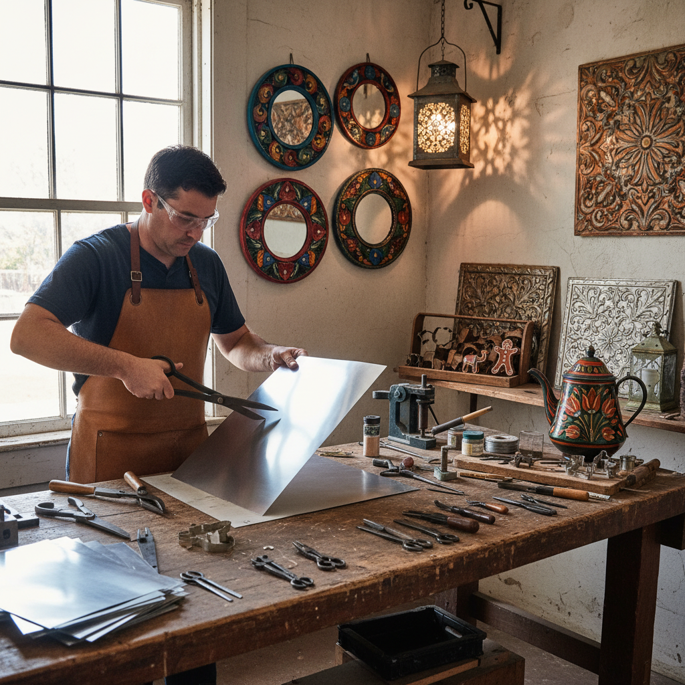

# Tinsmithing Art 锡器艺术

> "Tin is the democratic metal — affordable, workable, bright as silver when polished, and endlessly recyclable. The tinsmith transforms flat sheets into lanterns that cast starlight patterns on walls, into cookie cutters that shape holiday traditions, into roofing that shelters generations. Where gold speaks of kings and silver of merchants, tin speaks of the common hearth and the ingenuity of ordinary hands." — Unknown

## 概述

锡器艺术（Tinsmithing Art）是以锡或镀锡铁皮为主要材料，通过剪切、折叠、焊接、冲压和装饰等技法创造器物和装饰品的金属工艺——包括锡器皿、锡灯笼、锡装饰品和锡制玩具的制作。锡器工艺在历史上是最普及的金属工艺之一，为普通家庭提供了实用而美观的金属制品。

锡器艺术的实践包括：1）锡器皿——锡制的杯、盘、壶等；2）锡灯笼——穿孔锡灯笼；3）锡装饰——锡制的装饰品和天花板瓦片；4）锡制玩具——锡制的玩具和模型；5）锡箔工艺——锡箔的装饰应用；6）墨西哥锡艺——墨西哥传统锡器装饰；7）当代锡艺——将锡作为当代艺术媒介的创作。

## 核心特征

| 特征 | 描述 |
|------|------|
| 明亮 | 银白色的明亮光泽 |
| 轻薄 | 可加工成极薄的片材 |
| 经济 | 相对廉价的材料 |
| 可塑 | 容易剪切和折叠 |
| 防腐 | 良好的防腐蚀性 |
| 民间 | 强烈的民间工艺特色 |

## 视觉特征

- **银白**：明亮的银白色表面
- **穿孔**：装饰性的穿孔图案
- **折叠**：精确的折叠和接缝
- **冲压**：冲压形成的浮雕纹样
- **光斑**：穿孔灯笼的光影效果
- **几何**：几何图案的装饰

## 代表作品

| 作品 | 艺术家/文化 | 年代 | 意义 |
|------|-------------|------|------|
| *Paul Revere lanterns* | 美国殖民地 | 18世纪 | 穿孔锡灯笼 |
| *Mexican tin mirrors* | 墨西哥传统 | 19世纪至今 | 墨西哥锡镜框 |
| *Tin ceiling tiles* | 美国维多利亚 | 19世纪 | 装饰锡天花板 |
| *Tin toys* | 德国/日本 | 19-20世纪 | 锡制玩具 |
| *Folk art tinware* | 美国民间 | 18-19世纪 | 彩绘锡器 |

## 历史时间线

| 时期 | 事件 |
|------|------|
| 古代 | 锡的发现和早期使用 |
| 中世纪 | 锡器行会的建立 |
| 18世纪 | 殖民地锡器工艺繁荣 |
| 19世纪 | 工业化锡制品生产 |
| 当代 | 锡器工艺的艺术复兴 |

## 中国语境

锡器艺术在中国有独特的传统。中国的锡器制作历史悠久——云南个旧是中国著名的"锡都"，有两千多年的锡矿开采和锡器制作历史。中国传统的锡器以茶叶罐最为著名——锡制茶叶罐因其良好的密封性和防潮性而被认为是储存茶叶的最佳容器。中国的锡器还包括锡制酒壶、锡制香炉和锡制祭器等。中国的一些地区（如潮汕地区）有精美的锡器工艺传统——潮汕锡器以其精细的雕刻和镶嵌工艺著称。中国当代的一些设计师将传统锡器工艺与现代设计相结合——创造出具有现代感的锡制器物。中国的锡器制作技艺已被列入各级非物质文化遗产名录。

## AI生成概念图

## 与其他风格的关系

- **Pewter Art** → 白锡合金艺术
- **Metal Art** → 金属艺术
- **Folk Art** → 民间艺术
- **Coppersmithing** → 铜器艺术
- **Lantern Art** → 灯笼艺术
- **Decorative Art** → 装饰艺术

---

*浮光艺志 | Chronicle of Artistry*
