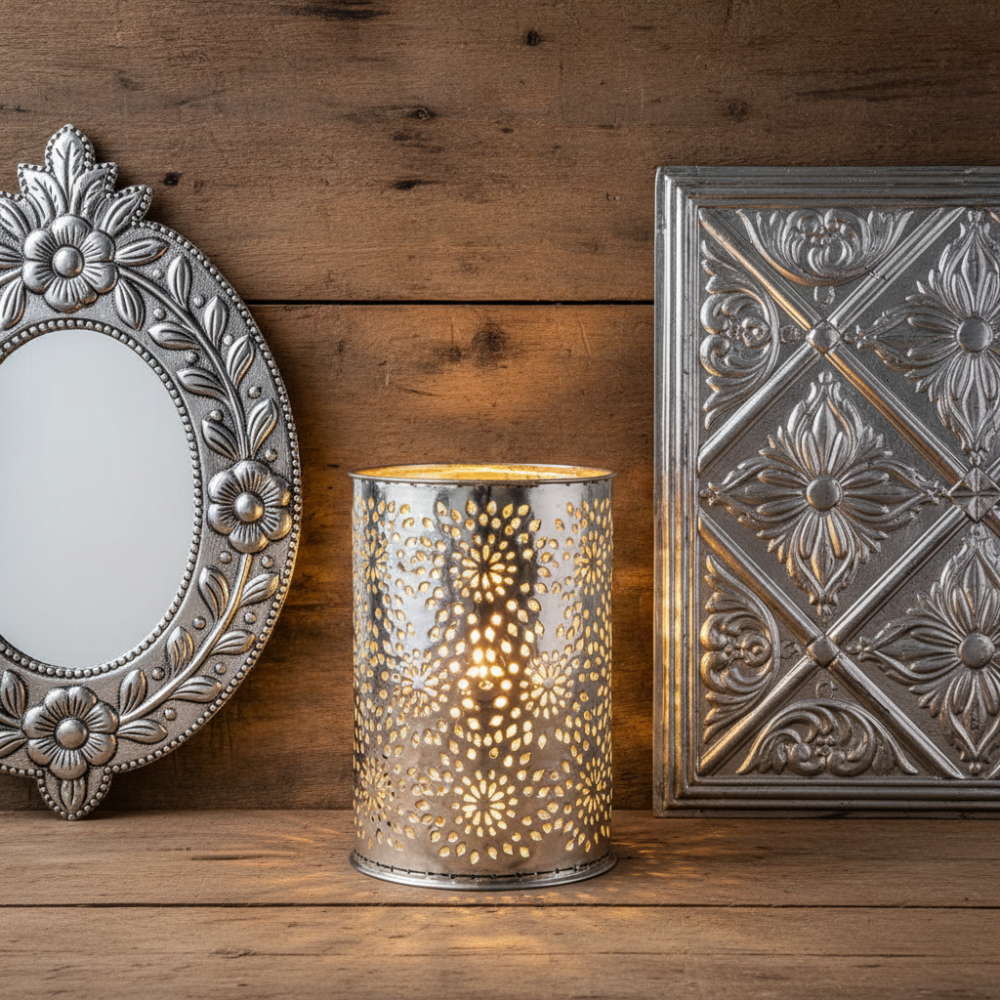

# Tinsmithing 锡匠工艺

> "The tinsmith turns flat sheets into useful beauty — punched, bent, and soldered into the shapes of daily life." — Unknown

## 概述

锡匠工艺（Tinsmithing）是以镀锡铁皮（马口铁/tinplate）为主要材料的金属加工工艺。锡匠通过剪切、弯折、锤打、焊接和冲压等技法，将薄金属板制作成各种日用品和装饰品——从灯笼到水壶，从屋顶到装饰面板。在塑料出现之前，锡匠制品是普通家庭最常见的金属用品。锡匠工艺的独特之处在于它的"折纸"特性——将平面的金属板通过折叠和连接变成三维的器物。

锡匠工艺的魅力在于：平面到立体的魔法——一张薄薄的金属板，通过巧妙的剪裁和折叠，变成了有用又美丽的器物。

## 核心特征

| 特征 | 描述 |
|------|------|
| 薄板 | 以薄金属板为材料 |
| 剪折 | 剪切和折叠成形 |
| 焊接 | 锡焊连接 |
| 冲压 | 装饰性冲压图案 |
| 实用 | 高度实用的器物 |
| 民间 | 民间工艺传统 |

## 视觉特征

- **光亮**：镀锡的明亮光泽
- **折痕**：可见的折叠痕迹
- **冲压**：装饰性的冲压图案
- **几何**：几何化的形态
- **轻薄**：轻薄的金属质感
- **民间**：朴素的民间美感

## 代表作品

| 作品 | 艺术家 | 年代 | 意义 |
|------|--------|------|------|
| *Punched tin lanterns* | 匿名 | 殖民地时代 | 冲孔锡灯笼 |
| *Mexican tin art* | 匿名 | 传统 | 墨西哥锡艺术 |
| *Tin ceiling panels* | Various | 19世纪 | 美国锡天花板 |
| *Folk art tinware* | 匿名 | 18-19世纪 | 民间锡器 |
| *Contemporary tin art* | Various | 当代 | 当代锡艺术 |

## 历史时间线

| 时期 | 事件 |
|------|------|
| 14世纪 | 马口铁的发明（波西米亚） |
| 17-18世纪 | 锡匠行业的繁荣 |
| 殖民地时代 | 美国锡匠传统 |
| 19世纪 | 锡天花板和装饰面板 |
| 20世纪 | 塑料和铝的竞争 |
| 当代 | 作为民间艺术的传承 |

## 中国语境

中国传统的"白铁匠"（锡匠/白铁工）是民间重要的手工艺人——制作水桶、水壶、烟囱、通风管等日用品。中国的锡匠工艺在20世纪中叶仍然非常活跃，几乎每个城镇都有白铁铺。随着塑料和不锈钢的普及，传统锡匠逐渐减少。但在一些地区，锡匠工艺作为非物质文化遗产得到保护。墨西哥的锡艺术（hojalata）与中国民间锡器有相似的朴素美学。

## AI生成概念图

## 与其他风格的关系

- **Pewter** → 锡器工艺的铸造版本
- **Coppersmithing** → 铜匠的薄板版本
- **Folk Art** → 民间工艺传统
- **Mexican Art** → 墨西哥锡艺术
- **Sheet Metal** → 薄板金属工艺
- **Punched Metal** → 冲孔装饰

---

*浮光艺志 | Chronicle of Artistry*
