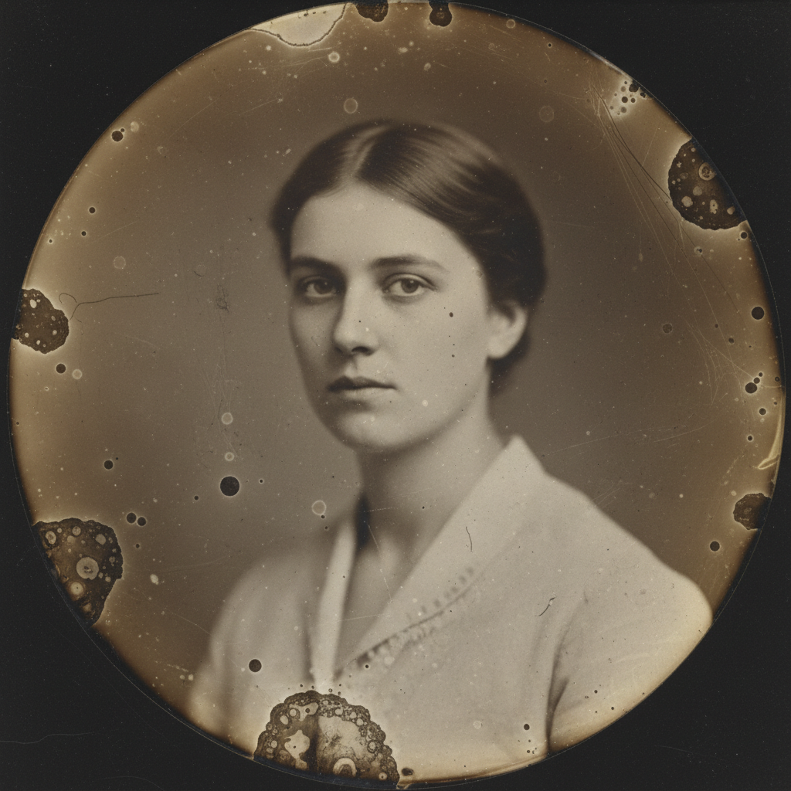

# Tintype Art 锡版摄影

> **时期：** 1856年–至今（复兴）  
> **关键词：** 湿版火棉胶、金属底片、复古肖像、暗房工艺、独一无二

## 概述

Tintype（锡版照片，实为铁版）是19世纪中期的摄影工艺，将感光乳剂涂布在薄铁片上直接曝光成像。每张照片都是独一无二的正像，无法复制。21世纪以来，锡版摄影经历了显著的艺术复兴，当代摄影师被其独特的金属质感、浅景深、柔和的色调范围和不可重复性所吸引。

## 风格特征

- **金属质感**：铁板表面的独特光泽和反射
- **浅景深**：大光圈镜头的极浅焦平面
- **色调范围**：有限但富有韵味的灰度层次
- **边缘瑕疵**：药液流淌的自然边缘效果
- **独一无二**：每张都是不可复制的原作

## 代表人物与作品

- 维多利亚时代肖像摄影师（历史）
- 迈克尔·沙因布鲁姆（当代锡版风景）
- 格里·雅各布斯（当代锡版肖像）
- 邦尼·兰宁（湿版工艺教育者）

## 概念图

