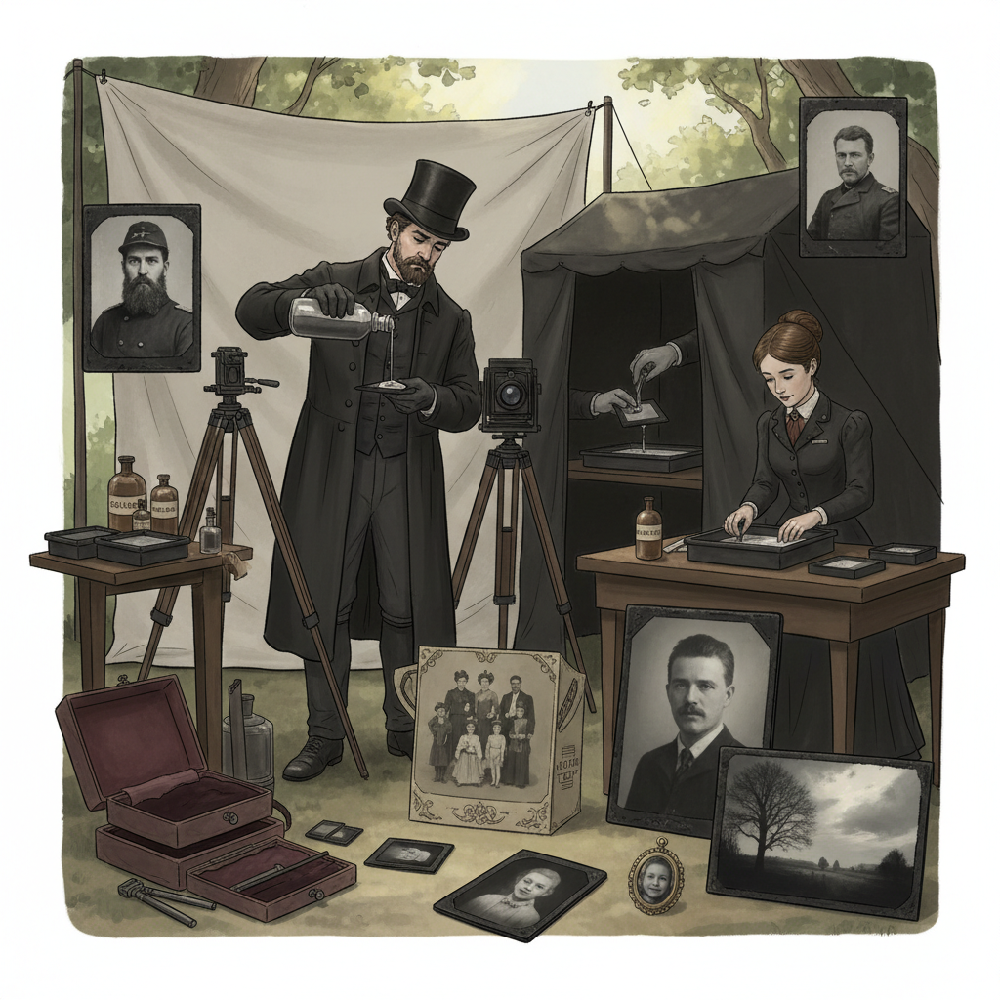

# Tintype Photography 锡版摄影

> "Tintype is photography made democratic and portable — a direct positive image on a thin iron plate, developed in minutes at fairs and street corners, cheap enough for anyone, durable enough to survive in a soldier's pocket through war, each plate a one-of-a-kind mirror of a moment." — Unknown

## 概述

锡版摄影（Tintype Photography，也称Ferrotype/Melainotype）是一种在薄铁板（涂有黑色或深棕色漆）上直接制作正像的摄影工艺。尽管名为"锡版"（tintype），实际上使用的是铁板而非锡板。锡版摄影由Hamilton Smith在1856年获得专利，因其快速、廉价和耐用的特点，在19世纪下半叶极为流行——特别是在美国。

锡版摄影的过程：在涂有黑漆的薄铁板上涂布火棉胶（collodion）和银盐乳剂，在湿润状态下曝光和显影（湿版工艺），或使用干版乳剂。由于铁板的黑色背景，薄薄的银影像看起来是正像（而非负像）。锡版照片不需要印刷步骤——每张都是独一无二的原版。锡版摄影因其即时性和低成本，在街头摄影师、集市摄影师和战地摄影中广泛使用。

## 核心特征

| 特征 | 描述 |
|------|------|
| 铁板 | 薄铁板作为载体 |
| 直接正像 | 直接产生正像 |
| 独一无二 | 每张都是原版 |
| 快速 | 快速制作 |
| 廉价 | 成本极低 |
| 耐用 | 金属板耐用 |

## 视觉特征

- **金属质感**：金属板的质感
- **暗色调**：整体偏暗的色调
- **独特**：每张独一无二
- **历史感**：强烈的历史感
- **直接**：直接正像的即时感
- **质朴**：质朴的美感

## 代表作品

| 作品 | 艺术家 | 年代 | 意义 |
|------|--------|------|------|
| *Civil War tintypes* | Various | 1860s | 美国内战锡版 |
| *Street photographer tintypes* | Various | 1860-1900s | 街头锡版摄影 |
| *Contemporary tintypes* | Various | 当代 | 当代锡版摄影 |
| *Tintype portraits* | Various | 当代 | 当代锡版肖像 |

## 历史时间线

| 时期 | 事件 |
|------|------|
| 1856年 | Hamilton Smith获得专利 |
| 1860-70年代 | 锡版摄影的黄金时代 |
| 1880-1900年代 | 逐渐被胶卷取代 |
| 1930年代 | 最后的商业锡版摄影师 |
| 当代 | 锡版摄影的艺术复兴 |

## 中国语境

锡版摄影在中国的历史记录较少——19世纪中国的摄影主要使用蛋白印刷和火棉胶玻璃版。当代中国的替代摄影社区中，锡版摄影作为一种"即时的、独一无二的"摄影方式受到关注。中国的一些摄影工作室和艺术家开始实践锡版摄影——在婚纱摄影、肖像摄影和艺术创作中使用锡版工艺。中国的摄影节和艺术展览中偶尔可以看到锡版摄影的展示和体验活动。

## AI生成概念图

## 与其他风格的关系

- **Ambrotype** → 安布罗版
- **Daguerreotype** → 达盖尔版
- **Wet Plate Collodion** → 湿版火棉胶
- **Alternative Photography** → 替代摄影
- **Portrait Photography** → 肖像摄影
- **Historical Photography** → 历史摄影

---

*浮光艺志 | Chronicle of Artistry*
