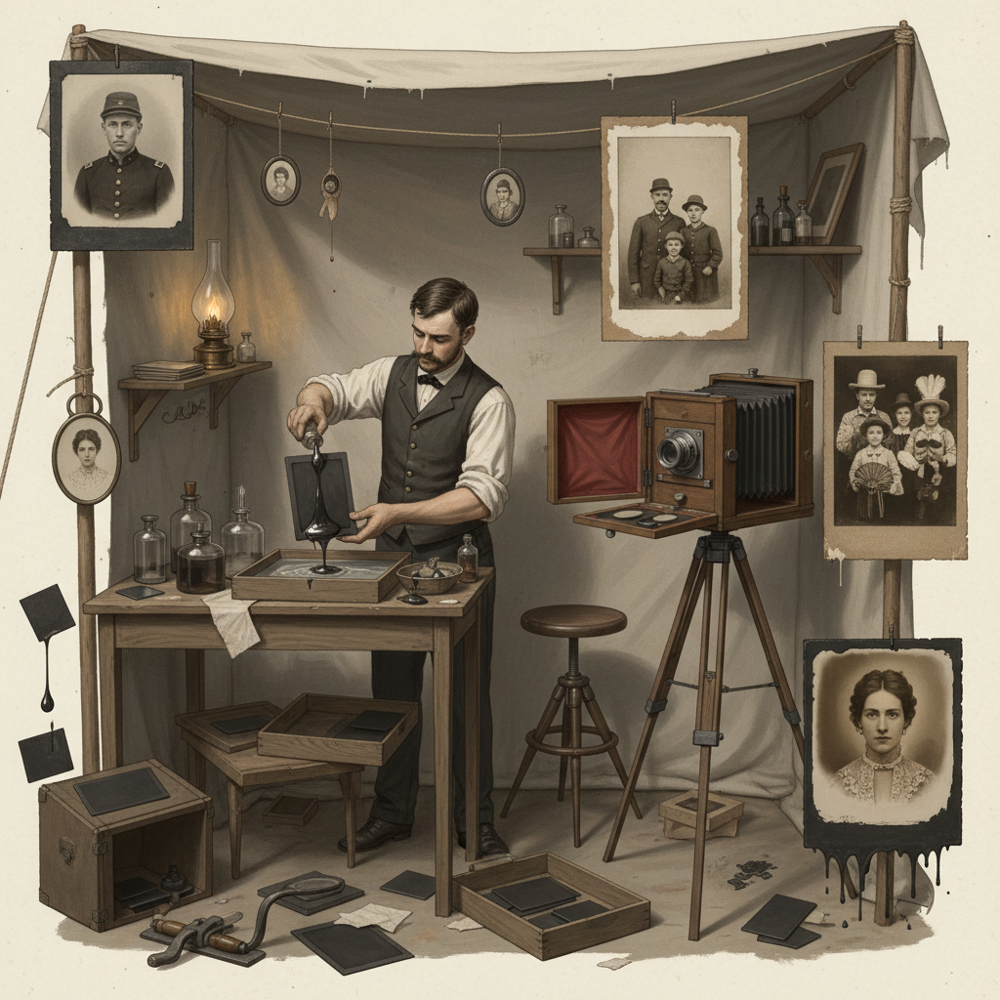

# Tintype 锡版摄影

> "The tintype was democracy's photograph — cheap, fast, and durable enough for soldiers to carry into battle, immigrants to send home, and carnival-goers to pocket as souvenirs, putting portraiture within reach of every class." — Unknown

## 概述

锡版摄影（Tintype / Ferrotype）是一种将火棉胶感光乳剂涂布在薄铁板（而非玻璃）上的摄影工艺——尽管名为"锡版"，实际使用的是涂有黑色或巧克力色漆的薄铁板。由汉密尔顿·史密斯（Hamilton Smith）于1856年获得专利。锡版摄影的优势在于：成本低廉、不易碎（相比玻璃版）、可以快速制作（几分钟内完成）、耐久性强。

锡版摄影在美国内战期间极为流行——士兵们随身携带锡版肖像作为纪念。锡版摄影也是19世纪后半叶美国街头摄影和游乐场摄影的主要形式。锡版摄影一直延续到20世纪初，是持续时间最长的早期摄影工艺之一。当代锡版摄影作为一种艺术媒介经历了强劲的复兴——许多当代摄影师使用锡版法创作肖像和艺术作品。

## 核心特征

| 特征 | 描述 |
|------|------|
| 铁板 | 涂漆薄铁板 |
| 廉价 | 成本低廉 |
| 快速 | 制作快速 |
| 耐久 | 不易碎裂 |
| 大众 | 大众化的摄影 |
| 直接 | 直接正像 |

## 视觉特征

- **暗调**：深色的背景基调
- **银色**：银灰色的影像
- **质感**：金属的质感
- **瑕疵**：边缘的不规则
- **直接**：直接正像的效果
- **古典**：古典的氛围

## 代表作品

| 作品 | 艺术家 | 年代 | 意义 |
|------|--------|------|------|
| *Civil War soldier portraits* | Various | 1860s | 内战士兵肖像 |
| *Street photography tintypes* | Various | 1860s-1900s | 街头锡版摄影 |
| *Carnival tintypes* | Various | 19世纪末 | 游乐场锡版 |
| *Contemporary tintypes* | Various | 当代 | 当代锡版艺术 |
| *Celebrity tintypes* | Victoria Will | 2010s | 名人锡版肖像 |

## 历史时间线

| 时期 | 事件 |
|------|------|
| 1856 | Hamilton Smith获得锡版专利 |
| 1860s | 美国内战中的广泛使用 |
| 1860s-1900s | 街头和游乐场锡版摄影 |
| 1900s-1930s | 锡版摄影的逐渐衰落 |
| 1990s | 当代锡版摄影的复兴开始 |
| 当代 | 锡版摄影的艺术复兴 |

## 中国语境

锡版摄影在中国的当代摄影艺术圈中有一定的关注度。中国的一些摄影工作室和艺术家开始尝试锡版摄影创作。中国的摄影节和艺术展览中偶尔可见锡版摄影作品。中国的摄影教育中，锡版摄影作为摄影史的重要内容被介绍。中国的一些城市有提供锡版摄影体验的工作室，为公众提供独特的摄影体验。

## AI生成概念图

## 与其他风格的关系

- **Wet Plate Collodion** → 湿版火棉胶
- **Daguerreotype** → 达盖尔银版法
- **Ambrotype** → 安布罗法
- **Street Photography** → 街头摄影
- **Portrait Photography** → 肖像摄影
- **Alternative Process** → 替代工艺

---

*浮光艺志 | Chronicle of Artistry*
