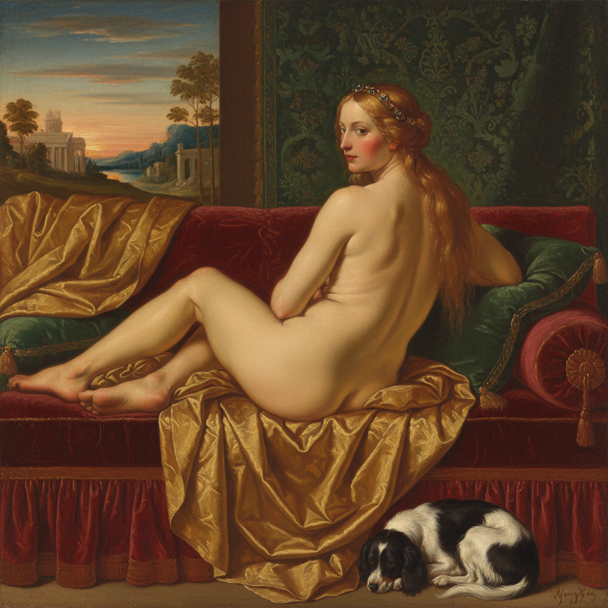

# Titian 提香

> "He who follows others will never get ahead." — Titian

## 概述

提香·韦切利奥（Tiziano Vecellio，约1488–1576）是威尼斯画派最伟大的画家，也是西方艺术史上对色彩运用最具革命性的大师之一。他以长达近70年的创作生涯横跨了从乔尔乔内的诗意到矫饰主义的整个16世纪，被同时代人称为"色彩之王"。

提香彻底改变了油画的可能性——他证明了色彩可以独立于素描成为绘画的主导力量，他晚期越来越自由的笔触预示了此后四百年的绘画发展方向。

## 核心特征

| 特征 | 描述 |
|------|------|
| 色彩至上 | 色彩而非素描是绘画的核心 |
| 威尼斯色调 | 温暖的金色调——"提香红"和"提香金" |
| 晚期自由 | 晚年笔触越来越粗犷自由，近乎抽象 |
| 肉体表现 | 西方绘画中最伟大的肉体描绘者 |
| 心理肖像 | 深刻的心理洞察力 |
| 多层技法 | 从精细底层到自由表层的多层建构 |

## 视觉特征

- **色彩**：温暖的金色调——深红、金褐、翡翠绿
- **肉体**：温暖的、有血色的、活生生的肌肤
- **笔触**：早期精细，晚期粗犷自由
- **光线**：温暖的威尼斯金光
- **构图**：动态的对角线构图
- **质感**：丝绸、天鹅绒、金属的极致表现

## 代表作品

| 作品 | 年代 | 意义 |
|------|------|------|
| *Assumption of the Virgin* | 1516-18 | 威尼斯绘画的新纪元 |
| *Venus of Urbino* | 1538 | 西方裸体画的典范 |
| *Bacchus and Ariadne* | 1520-23 | 色彩的交响曲 |
| *Portrait of Charles V at Mühlberg* | 1548 | 骑马肖像画的典范 |
| *Pietà* | 1575-76 | 最后的杰作——未完成的悲悯 |
| *The Flaying of Marsyas* | c.1570-76 | 晚期最自由的笔触 |

## 真实作品（公共领域）

| 作品 | 来源 |
|------|------|
| *Assumption of the Virgin* | [Wikimedia](https://commons.wikimedia.org/wiki/File:Titian_-_Assumption_of_the_Virgin_-_WGA22770.jpg) |
| *Venus of Urbino* | [Uffizi](https://www.uffizi.it/en/artworks/venus-of-urbino) |
| *Bacchus and Ariadne* | [National Gallery](https://www.nationalgallery.org.uk/paintings/titian-bacchus-and-ariadne) |

> ⚠️ 本条目优先使用真实作品。

## AI生成概念图

## 与其他风格的关系

- **Venetian School** → 威尼斯画派的最高代表
- **Colorito vs Disegno** → 色彩派对素描派的胜利
- **Rubens** → 鲁本斯直接继承了提香的色彩传统
- **Velázquez** → 委拉斯开兹深受提香影响
- **Impressionism** → 晚期自由笔触预示了印象派
- **Impasto** → 晚期厚涂技法的先驱

---

*浮光艺志 | Chronicle of Artistry*
