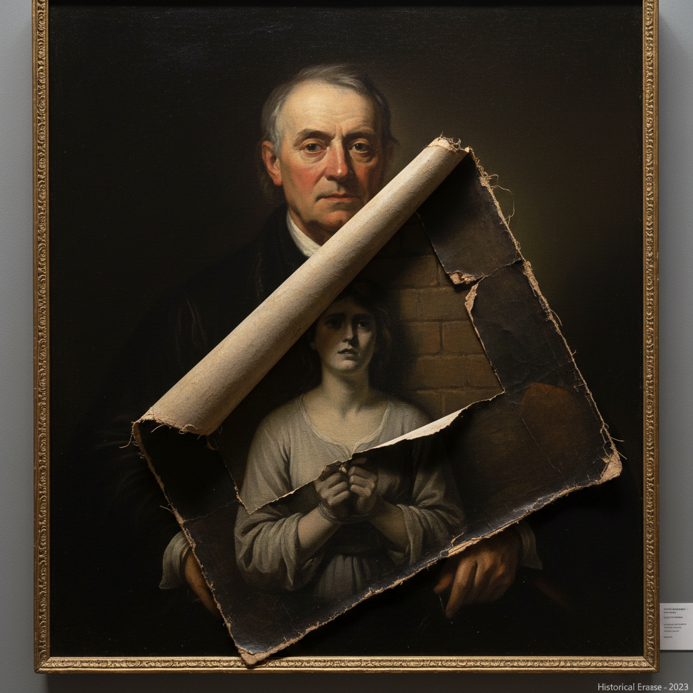

# Titus Kaphar 泰特斯·卡法尔

> **时期：** 1976–至今  
> **关键词：** 历史修正、画布切割、殖民叙事解构、当代具象

## 概述

Titus Kaphar 是美国当代艺术家，以对西方经典绘画的物理性干预闻名。他通过切割、折叠、撕裂和覆盖画布，揭示被传统艺术史遮蔽的黑人存在。他的作品不是简单的破坏，而是一种"修正"——让被忽视的人物重新浮现。

## 风格特征

- **画布切割与折叠**：直接在完成的油画上进行物理操作，将白人主体折叠或切除，露出下方的黑人形象
- **古典技法**：以学院派写实功底为基础，色调模仿伦勃朗、委拉斯凯兹等大师
- **历史重构**：重新诠释经典构图，将缺席者置于画面中心
- **材料实验**：使用焦油、白色颜料覆盖等手法制造"消失"与"显现"的张力

## 代表作品

- *Behind the Myth of Benevolence*（2014）
- *Shifting the Gaze*（2017）
- *The Jerome Project*（2014–ongoing）

## 历史意义

Kaphar 的工作将艺术史批评从文字转化为视觉行动，他在 TED 演讲中现场切割画作的举动震撼了全球观众，使"谁被画进历史"成为公共议题。

## 概念图

