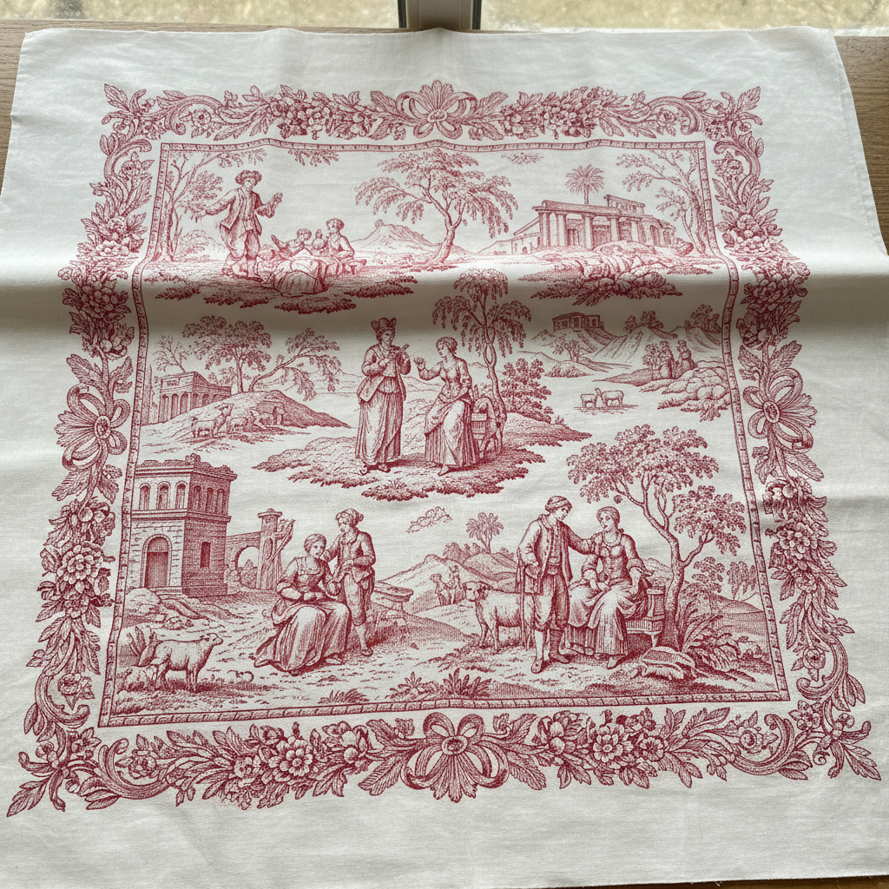

# Toile de Jouy 茹伊印花布 | Toile de Jouy

> **"法国乡村的田园牧歌——单色铜版印花讲述18世纪的优雅故事。"**

## 概述

茹伊印花布（Toile de Jouy / 意为"茹伊的布"）是18世纪法国的传统铜版印花棉布，以其单色（通常是红色或蓝色）在白色或米色底布上印制的田园风景和叙事场景著称。1760年，德国出生的克里斯托夫-菲利普·奥贝坎普夫（Christophe-Philippe Oberkampf）在巴黎近郊茹伊昂若萨斯（Jouy-en-Josas）建立了印花布工厂，生产的布料迅速风靡法国贵族和资产阶级。Toile de Jouy至今仍是法式优雅和乡村风格的代名词，广泛用于室内装饰。

## 核心特征

- **单色印花**：通常是红、蓝、黑或紫色在白底上
- **铜版印刷**：使用雕刻铜版滚筒印刷
- **叙事场景**：讲述完整的故事或场景
- **田园主题**：牧羊人、花园、乡村生活
- **重复图案**：场景在布面上重复排列
- **精细线条**：铜版雕刻的精细线条效果

## 经典题材

| 题材 | 特征 |
|------|------|
| 田园牧歌 | 牧羊人、农民、乡村 |
| 中国风 | 18世纪的东方想象 |
| 神话故事 | 希腊罗马神话 |
| 历史事件 | 革命、战争、庆典 |
| 花卉 | 自然主义的花卉 |
| 狩猎 | 贵族狩猎场景 |

## 视觉特征

- 单色在白底上的清晰对比
- 精细的铜版雕刻线条
- 叙事性的场景描绘
- 田园风景的优雅构图
- 重复排列的图案单元
- 18世纪法式优雅感

## 与其他风格的关系

| 风格 | 关系 |
|------|------|
| 中国风 Chinoiserie | 18世纪互相影响 |
| 英国Chintz | 共享印花棉布传统 |
| Delft Blue | 共享蓝白单色美学 |
| 法式乡村风格 | Toile是核心元素 |
| 当代室内设计 | Toile持续流行于装饰 |

## 概念图

---

*浮光艺志 | Chronicle of Artistry*
