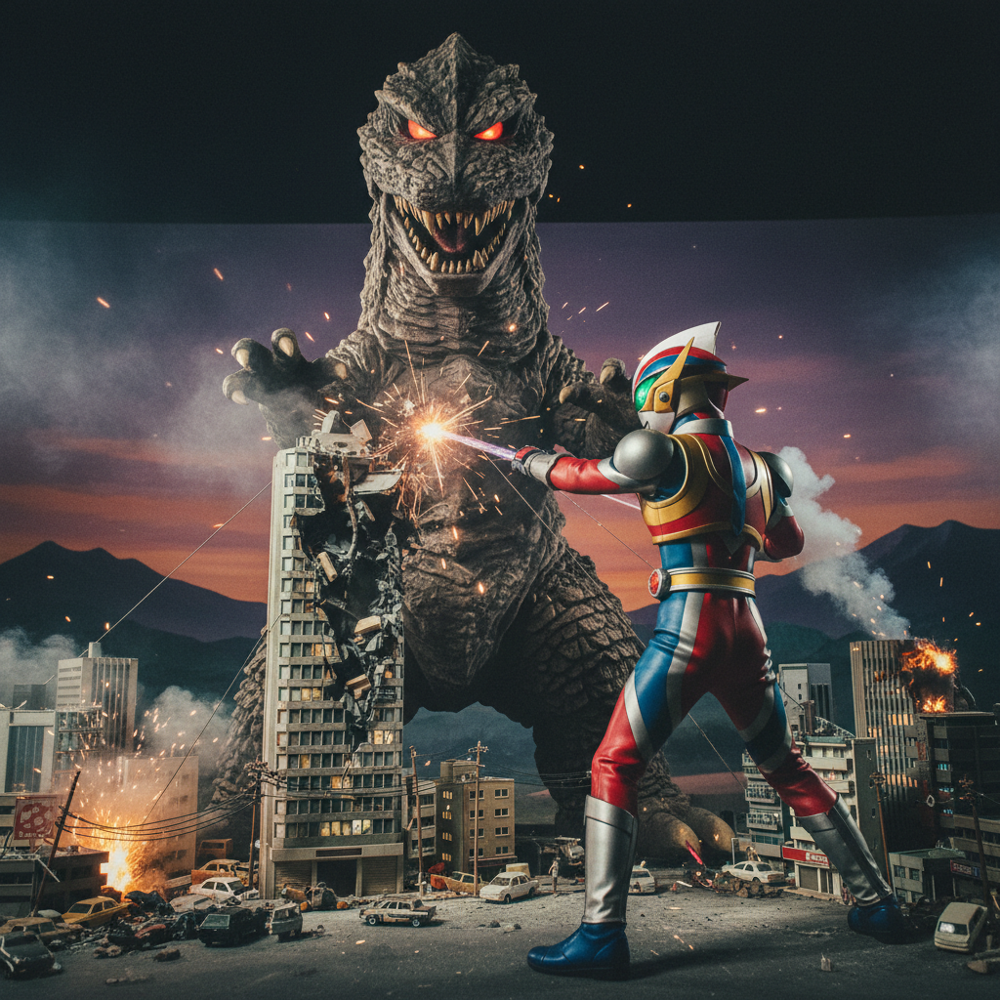

# Tokusatsu Art 特摄美术

> **时期：** 1950年代–至今  
> **关键词：** 微缩模型、怪兽设计、变身英雄、实体特效、日本科幻

## 概述

Tokusatsu（特撮，特殊摄影）是日本独特的实体特效影视传统，从圆谷英二的《哥斯拉》开始，发展出一套完整的视觉美学体系——微缩城市模型、橡胶怪兽皮套、变身英雄造型设计——这些"手工"特效创造了一种独特的质感和魅力，即使在CG时代依然拥有强大的文化影响力。

## 风格特征

- **微缩模型**：精密的城市和场景缩小模型
- **怪兽设计**：有机形态与机械元素的融合
- **变身造型**：色彩鲜明的英雄战斗服设计
- **光线技法**：光束、爆炸等实体光效
- **皮套表演**：演员穿戴的实体怪兽/英雄服装

## 代表人物与作品

- 圆谷英二《哥斯拉》系列
- 成田亨（奥特曼设计）
- 石ノ森章太郎《假面骑士》
- 永井豪《超级战队》系列

## 概念图

