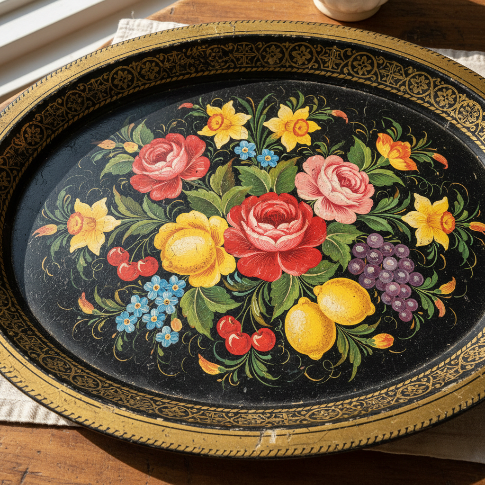

# Toleware Art 铁皮彩绘艺术

> "Toleware is painting on tin — humble sheet iron is japanned with a dark lacquer ground, then decorated with freehand brushwork in bright colors, transforming utilitarian trays, canisters, and coffeepots into cheerful folk art objects that bring flowers, fruits, and birds into the everyday kitchen." — Unknown

## 概述

铁皮彩绘艺术（Toleware Art）是一种在锡铁皮器物上进行彩绘装饰的传统工艺——将铁皮器物先涂上深色底漆（通常为黑色），然后用明亮的颜色进行手绘装饰，常见图案包括花卉、水果、鸟类和几何纹样。铁皮彩绘将实用的日常器物转化为色彩鲜艳的装饰品，是欧美民间艺术的重要组成部分。

铁皮彩绘艺术的实践包括：1）底漆——在铁皮器物上涂深色底漆；2）手绘——用画笔进行自由手绘；3）笔触技法——特定的装饰性笔触；4）花卉图案——花卉和植物的装饰图案；5）描金——金色线条和装饰；6）清漆——涂清漆保护画面；7）当代铁皮彩绘——将传统技法与现代设计结合的创作。

## 核心特征

| 特征 | 描述 |
|------|------|
| 铁皮 | 在铁皮器物上绘制 |
| 手绘 | 自由手绘装饰 |
| 明亮 | 明亮鲜艳的色彩 |
| 花卉 | 花卉为主的图案 |
| 实用 | 装饰实用器物 |
| 民间 | 民间艺术传统 |

## 视觉特征

- **深底**：深色（通常黑色）底色
- **鲜花**：鲜艳的花卉图案
- **笔触**：流畅的装饰性笔触
- **金色**：金色的描边和装饰
- **对比**：深底与亮色的强烈对比
- **欢快**：欢快明朗的整体感觉

## 代表作品

| 作品 | 艺术家/文化 | 年代 | 意义 |
|------|-------------|------|------|
| *Pontypool ware* | 英国威尔士 | 18世纪 | 庞蒂普尔铁皮器 |
| *Pennsylvania Dutch toleware* | 美国 | 18-19世纪 | 宾夕法尼亚荷兰人铁皮彩绘 |
| *French tôle peinte* | 法国 | 18-19世纪 | 法国彩绘铁皮 |
| *Russian Zhostovo trays* | 俄罗斯 | 19世纪 | 俄罗斯若斯托沃托盘 |
| *Contemporary toleware* | 国际 | 当代 | 当代铁皮彩绘 |

## 历史时间线

| 时期 | 事件 |
|------|------|
| 17世纪 | 铁皮彩绘在欧洲兴起 |
| 18世纪 | 庞蒂普尔和法国的发展 |
| 18-19世纪 | 美国殖民地的铁皮彩绘传统 |
| 19世纪 | 俄罗斯若斯托沃的发展 |
| 当代 | 铁皮彩绘作为装饰艺术的延续 |

## 中国语境

铁皮彩绘与中国的漆器彩绘有一定的可比性。中国的漆器彩绘——在漆器表面进行装饰绘画，与铁皮彩绘有相似的装饰理念。中国的搪瓷彩绘——在搪瓷器物上进行装饰，是类似的工艺形式。中国的民间彩绘——在各种器物上进行装饰绘画的传统。中国当代的手绘装饰——在各种材质上进行手绘装饰的实践。中国的工艺美术教育中，铁皮彩绘作为西方民间装饰艺术——在相关课程中介绍。

## AI生成概念图

## 与其他风格的关系

- **Folk Art** → 民间艺术
- **Japanning** → 仿漆工艺
- **Rosemaling** → 玫瑰彩绘
- **Decorative Painting** → 装饰绘画
- **Zhostovo** → 若斯托沃
- **Lacquerware** → 漆器

---

*浮光艺志 | Chronicle of Artistry*
