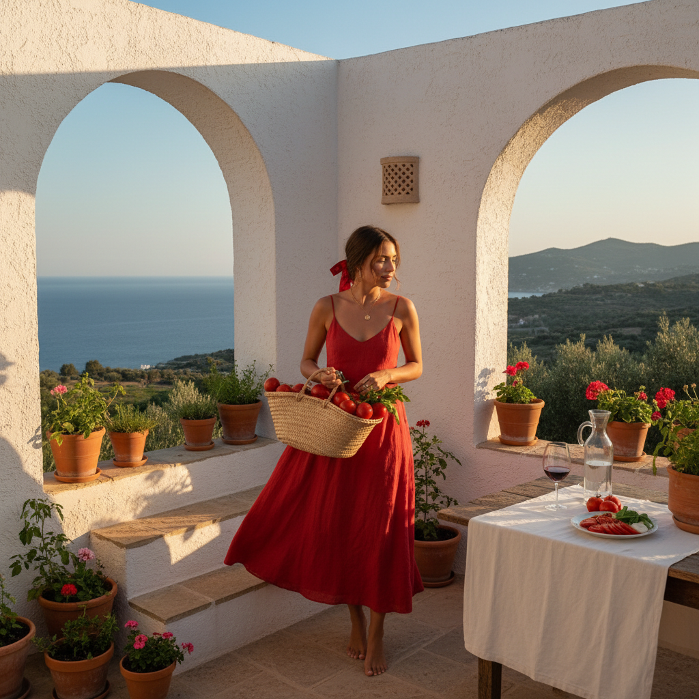

# Tomato Girl 番茄女孩



> **"红色亚麻裙、草编篮、地中海阳光——像意大利电影里走出来的女孩。"**

## 概述

| 维度 | 描述 |
|------|------|
| 时期 | 2023–至今 |
| 别名 | Tomato Girl, Mediterranean Summer, Italian Summer |
| 核心色彩 | 番茄红、白色、橄榄绿、陶土色、阳光黄 |
| 关键元素 | 红色连衣裙、草编配饰、亚麻面料、地中海 |
| 代表人物 | Monica Bellucci、《托斯卡纳艳阳下》 |
| 关联风格 | Coastal Grandmother, Quiet Luxury, Boho, Old Money |

---

## 历史脉络

### 从意大利到 TikTok

| 年份 | 事件 |
|------|------|
| 永恒 | 意大利/地中海生活方式 |
| 1960s | 意大利电影黄金时代 |
| 2022 | "Italian Summer" 美学在 Pinterest 流行 |
| 2023年夏 | TikTok #TomatoGirl 爆发 |
| 2023 | 成为夏季最热门美学之一 |

### 核心哲学

Tomato Girl 的精神是**"慢生活、阳光、简单的美好"**：
- 不需要很多——一条红裙子就够了
- 食物是美学的一部分
- 阳光是最好的滤镜
- "我在意大利小镇的市场买番茄"的幻想
- 简单 ≠ 无聊——简单 = 自信

---

## 视觉语法

### 色彩系统

```
主色：
  番茄红 (#FF6347) — 核心色
  白色 (#FFFFFF) — 亚麻、衬衫
  橄榄绿 (#808000) — 植物、橄榄
  陶土 (#CC7722) — 建筑、陶器
  阳光黄 (#FFD700) — 向日葵、柠檬

辅色：
  天蓝 (#87CEEB) — 地中海
  米色 (#F5F5DC) — 草编
  深绿 (#006400) — 藤蔓

质感：
  亚麻 — 裙子、衬衫
  草编 — 帽子、篮子
  陶土 — 餐具、花盆
  棉布 — 轻薄、透气
```

### 标志性元素

| 类别 | 元素 |
|------|------|
| 服装 | 红色亚麻裙、白色衬衫、碎花裙 |
| 配饰 | 草编帽、草编篮、金色耳环 |
| 食物 | 番茄、橄榄、柠檬、面包、红酒 |
| 场景 | 地中海小镇、市场、露台、橄榄园 |
| 氛围 | 午后阳光、慢节奏、简单快乐 |

---

## 与千禧怀旧的关系

### 对"忙碌文化"的反叛
- 2023 = "我不想再卷了"
- Tomato Girl = "我想在意大利晒太阳"
- 是一种生活方式的幻想
- 与 Quiet Luxury 共享"从容"的精神

---

## 中国语境

- "地中海风"/"意大利度假风"在小红书的流行
- 与"法式风"/"度假风"的交叉
- 中国版：红裙+草帽+海边/古镇
- 大理/厦门/青岛 = 中国的地中海

---

## 设计应用

| 场景 | 应用方式 |
|------|----------|
| 品牌 | 暖色调+手写字体+食物元素+阳光 |
| 餐饮 | 地中海配色+陶器+新鲜食材 |
| 空间 | 白墙+陶土+植物+阳光 |
| 时尚 | 红色+亚麻+草编+简约 |

---

## 相关风格

← [Coastal Grandmother 海岸祖母](coastal-grandmother.md) | [Quiet Luxury 静奢](quiet-luxury.md) →

↑ [返回千禧怀旧目录](README.md) | [返回总目录](../README.md)
