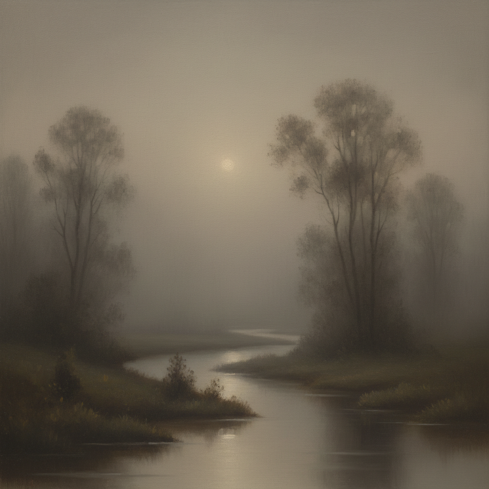

# Tonalism 调性主义



> **"像音乐一样画画——用色调唤起情感，用朦胧捕捉诗意。"**

## 概述

| 维度 | 描述 |
|------|------|
| 时期 | 1880–1915 |
| 别名 | Tonalism, 调性主义, 色调主义, American Tonalism |
| 核心色彩 | 灰色、棕色、蓝色、暮色金——统一的低饱和色调 |
| 关键元素 | 朦胧氛围、统一色调、柔和光线、诗意风景 |
| 代表人物 | George Inness, James McNeill Whistler, Thomas Dewing, Dwight Tryon |
| 关联风格 | Impressionism, Symbolism, Barbizon School, Luminism |

---

## 历史脉络

| 年份 | 事件 |
|------|------|
| 1880s | 美国画家开始用统一色调描绘风景——调性主义萌芽 |
| 1870s | Whistler用"夜曲"命名画作——将绘画比作音乐 |
| 1890s | 调性主义鼎盛——George Inness晚期作品达到巅峰 |
| 1894 | George Inness去世——调性主义失去核心人物 |
| 1890s末 | 美国评论家正式使用"Tonalism"一词 |
| 1900s | 调性主义影响摄影——Stieglitz的画意摄影 |
| 1910s | 印象派和现代主义兴起——调性主义逐渐衰落 |

### 核心哲学

调性主义的精神是**"绘画不是记录——是唤起情感的音乐"**：
- Whistler："艺术应该独立于一切废话——它应该独自站立，像音乐一样吸引审美感"
- George Inness："真正的目的不是模仿自然——而是表达精神状态"
- "色调统一 = 情感统一 = 诗意统一"
- "朦胧不是模糊——是精神的深度"
- "风景画不是地形图——是灵魂的肖像"

---

## 视觉语法

### 色彩系统

```
主色调：
  暮色灰 (#8B8682) — 朦胧、沉思
  深棕 (#5C4033) — 大地、温暖
  暮蓝 (#4A5568) — 夜曲、宁静
  金暮 (#B8860B) — 落日、诗意

辅色：
  雾白 (#F5F5DC) — 光线、空气
  橄榄 (#6B8E23) — 远景、自然
  靛蓝 (#2F4F4F) — 深夜、神秘

规则：
  - 整幅画统一在一个色调中
  - 笔触柔和——边缘消融
  - 光线是弥漫的——不是聚焦的
  - 细节消失在氛围中
  - 色彩服务于情绪——不是描述
```

### 标志性元素

| 类别 | 元素 |
|------|------|
| 题材 | 暮色风景、月夜、雾中树林、宁静水面 |
| 光线 | 弥漫、柔和、暮色、月光 |
| 空间 | 模糊的远景、消融的边缘、大气透视 |
| 笔触 | 柔和、薄涂、层叠 |
| 情绪 | 沉思、宁静、忧郁、诗意 |
| 态度 | 内省、精神性、反物质主义 |

---

## 与千禧怀旧/当代的关系

### Lo-fi美学的祖先
- Lo-fi hip hop的视觉 = 调性主义的数字版本
- "朦胧、温暖、统一色调" = 两者共享的美学DNA
- Instagram滤镜的"褪色感" = 调性主义的大众化

### 对当代摄影/电影的影响
- Terrence Malick电影的暮色摄影 = 调性主义精神
- "Golden Hour"摄影 = 调性主义的当代延续
- VSCO滤镜 = 数字时代的调性主义

---

## 设计应用

| 场景 | 应用方式 |
|------|----------|
| 摄影 | 画意摄影+暮色+统一色调 |
| 品牌 | 高端+沉静+精神性 |
| 空间 | 冥想空间+柔和照明 |
| 数字 | Lo-fi界面+温暖滤镜 |

---

## 相关风格

← [Impressionism 印象派](impressionism.md) | [Luminism 光辉主义](luminism.md) →

↑ [返回千禧怀旧目录](README.md) | [返回总目录](../README.md)
