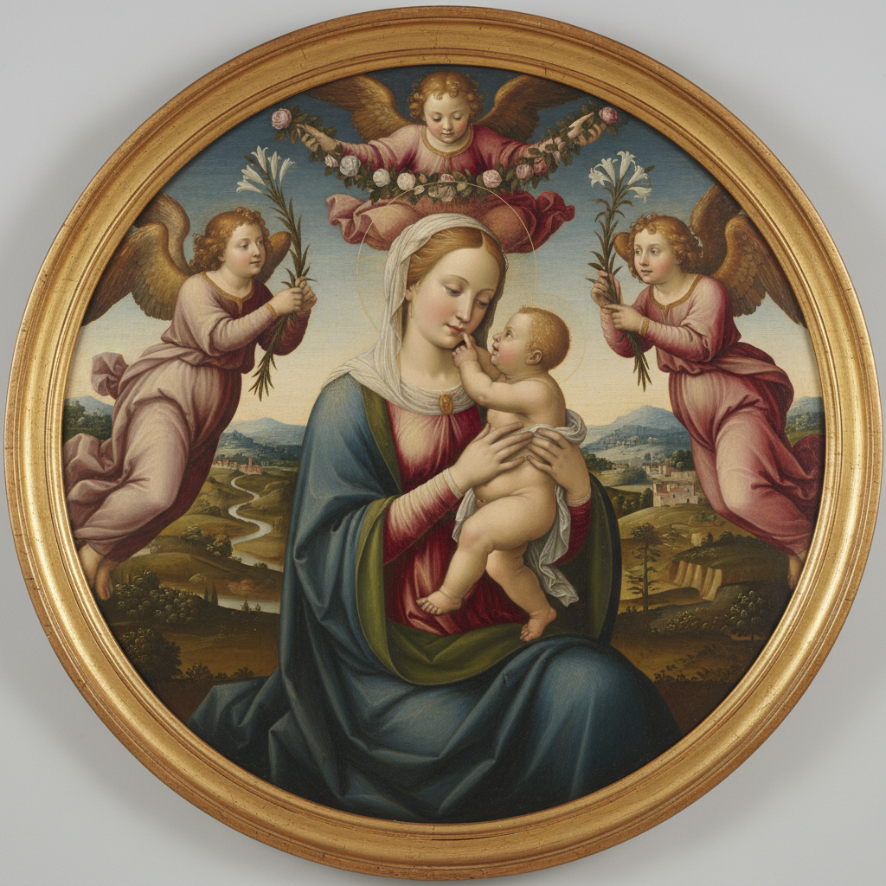

# Tondo Painting 圆形画

> **时期：** 15世纪–至今  
> **关键词：** 圆形画面、文艺复兴、圣母子、装饰性、构图挑战

## 概述

Tondo（圆形画）是以圆形画面为特征的绘画形式，在15世纪佛罗伦萨文艺复兴时期尤为流行。圆形构图要求艺术家重新思考人物安排和空间关系——没有角落可以藏拙，每一个元素都必须与圆弧和谐共处。米开朗基罗的《多尼圆形画》和拉斐尔的《椅中圣母》是这一形式的巅峰。

## 风格特征

- **圆形构图**：人物和空间适应圆弧边界
- **向心力**：视觉元素向中心聚拢
- **装饰性**：常用于家具和建筑装饰
- **亲密感**：圆形暗示完整和温暖
- **技术挑战**：在非矩形空间中平衡构图

## 代表人物与作品

- 米开朗基罗《多尼圆形画》
- 拉斐尔《椅中圣母》
- 波提切利《石榴圣母》
- 当代：圆形画布的复兴

## 概念图

