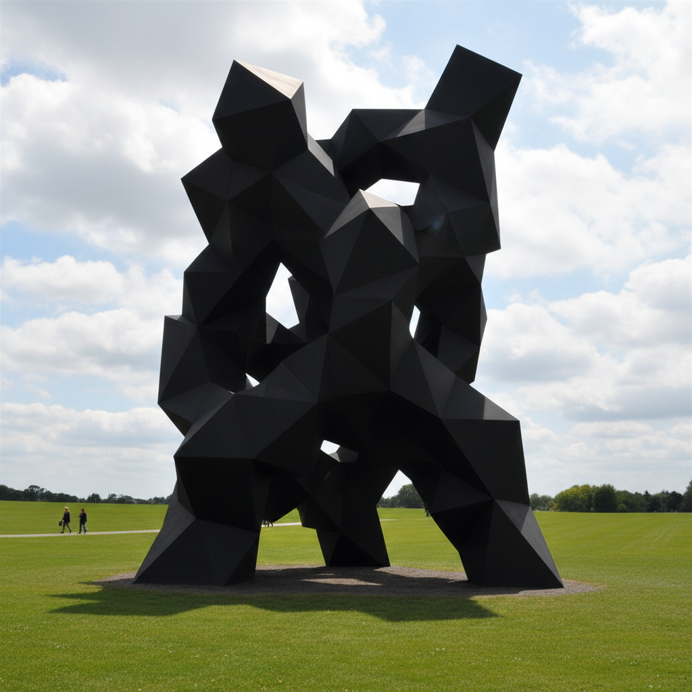

# Tony Smith 托尼·史密斯

> **时期：** 1912–1980  
> **关键词：** 黑色几何雕塑、极简主义先驱、建筑性体量、夜间高速公路

## 概述

Tony Smith 是美国雕塑家和建筑师，以大型黑色几何钢铁雕塑闻名。他的作品将简单的几何模块（四面体、八面体）组合为复杂的、具有建筑尺度的黑色体量，既严谨又神秘。他著名的"夜间高速公路"体验——在未完工的新泽西收费公路上驾车——被视为极简主义和大地艺术的精神起源之一。

## 风格特征

- **黑色钢铁**：所有雕塑统一为哑光黑色，消除表面细节
- **几何模块**：基于四面体和八面体的数学组合
- **建筑尺度**：作品常具有建筑般的体量，可以进入或环绕
- **地面存在**：雕塑直接放置在地面，没有底座
- **夜间感性**：黑色表面在不同光线下呈现不同的体量感

## 代表作品

- *Die*（1962，6英尺立方体）
- *Smoke*（1967）
- *Gracehoper*（1971）
- *Free Ride*（1962）

## 历史意义

Smith 是从抽象表现主义到极简主义的过渡人物，他的"夜间高速公路"叙述成为极简主义和大地艺术的神话性起源故事。他证明了雕塑可以具有建筑的尺度和存在感，而不需要建筑的功能性。

## 概念图

