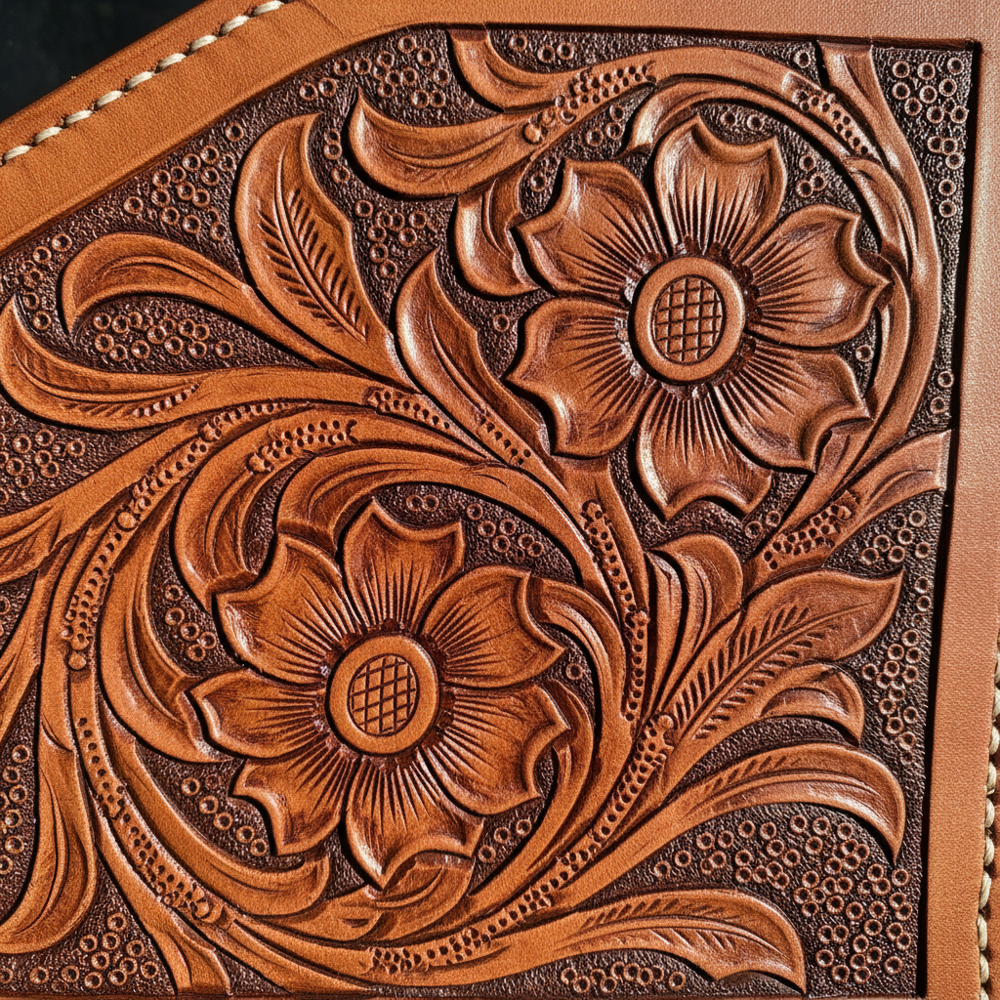

# Tooling Leather Art 皮雕艺术

> "Leather tooling is drawing with pressure — a dampened hide receives the impression of every stamp, swivel cut, and beveled edge as permanent marks that will last for centuries. The leather remembers every touch, every strike, every careful incision. Unlike paper or canvas, leather pushes back against the tool, requiring the artist to negotiate with the material rather than simply impose upon it." — Unknown

## 概述

皮雕艺术（Tooling Leather Art）是一种在湿润的植鞣革表面使用各种工具进行雕刻、压印和装饰的传统皮革工艺——通过旋转刻刀切割轮廓线，用各种印花工具压出纹理和图案，创造出精美的浮雕效果。皮雕是最古老的皮革装饰技法之一，在马具、书籍封面、皮带和各种皮革制品中都有广泛应用。

皮雕艺术的实践包括：1）湿润——将植鞣革湿润使其可塑；2）描线——用旋转刻刀切割轮廓线；3）压边——用压边工具使图案凸起；4）印花——用各种印花工具压出纹理；5）背景处理——用背景工具压低背景；6）染色——用皮革染料着色；7）当代皮雕——将传统技法与现代设计结合的创作。

## 核心特征

| 特征 | 描述 |
|------|------|
| 湿革 | 在湿润皮革上工作 |
| 压印 | 用工具压印图案 |
| 永久 | 永久性的装饰 |
| 浮雕 | 创造浮雕效果 |
| 实用 | 装饰实用器物 |
| 传统 | 数百年的传统 |

## 视觉特征

- **浮雕**：皮革表面的浮雕效果
- **质感**：丰富的压印纹理
- **温暖**：皮革的温暖色调
- **细节**：精细的工具痕迹
- **深度**：图案的深度变化
- **古典**：古典优雅的气质

## 代表作品

| 作品 | 艺术家/文化 | 年代 | 意义 |
|------|-------------|------|------|
| *Western saddle tooling* | 美国西部 | 19世纪起 | 西部马鞍皮雕 |
| *Medieval book covers* | 欧洲 | 中世纪 | 中世纪书籍封面 |
| *Sheridan style tooling* | 美国 | 20世纪 | 谢里丹风格皮雕 |
| *Japanese leather craft* | 日本 | 当代 | 日本皮革工艺 |
| *Contemporary leather art* | 国际 | 当代 | 当代皮雕艺术 |

## 历史时间线

| 时期 | 事件 |
|------|------|
| 古代 | 皮革装饰的起源 |
| 中世纪 | 书籍装帧皮雕的发展 |
| 19世纪 | 美国西部马具皮雕的繁荣 |
| 20世纪 | 谢里丹风格的确立 |
| 当代 | 皮雕的艺术化和全球化 |

## 中国语境

皮雕艺术在中国近年来获得了快速发展。中国的手工皮具爱好者群体迅速增长——各种皮雕工具和材料在电商平台热销。中国的一些皮雕艺术家在国际比赛中获奖——展示了中国皮雕创作的水平。中国传统的皮革工艺中有类似的装饰技法——如蒙古族的皮革压花和藏族的皮革装饰。中国当代的皮雕设计师将中国传统图案与皮雕技法结合——创造出具有中国文化特色的皮雕作品。中国的一些城市有专业的皮雕工作室和培训机构——推广皮雕技法和文化。中国的文创产业中，手工皮雕制品作为高端手工艺品——以其独特的手工价值和个性化定制受到欢迎。

## AI生成概念图

## 与其他风格的关系

- **Leather Craft** → 皮革工艺
- **Relief Carving** → 浮雕
- **Western Art** → 西部艺术
- **Bookbinding** → 书籍装帧
- **Saddlery** → 马具制作
- **Folk Craft** → 民间工艺

---

*浮光艺志 | Chronicle of Artistry*
