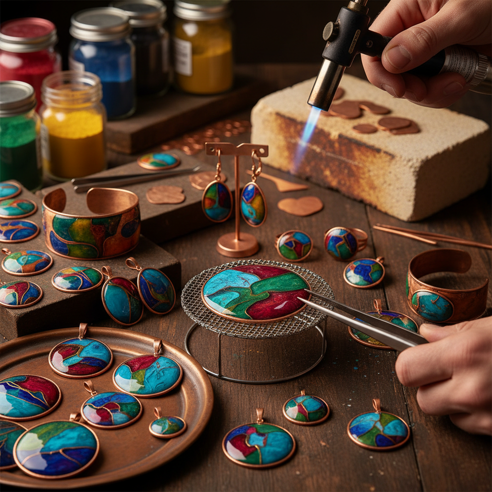

# Torch Enameling 火枪珐琅

> "Torch enameling is immediacy in glass and fire — the handheld flame brings kiln temperatures to the workbench, letting the artist watch color melt and flow in real time, adjusting heat and timing with the intuition of a glassblower." — Unknown

## 概述

火枪珐琅（Torch Enameling）是使用手持丁烷或丙烷喷枪（torch）直接加热金属和珐琅，使珐琅在金属表面熔融的技法。与传统的窑烧珐琅不同，火枪珐琅不需要大型窑炉——只需要一把喷枪就可以在工作台上完成珐琅烧制。

火枪珐琅的优势在于：设备简单便宜、可以实时观察珐琅的熔融过程、适合小型作品（如首饰）、加热速度快。火枪珐琅特别适合首饰制作——艺术家可以在铜片、银片上施加珐琅粉，然后用喷枪从下方加热，观察珐琅从粉末状变为光滑玻璃面的过程。火枪珐琅是许多珐琅爱好者的入门方式——不需要投资昂贵的窑炉。

## 核心特征

| 特征 | 描述 |
|------|------|
| 喷枪 | 使用手持喷枪 |
| 即时 | 即时观察熔融 |
| 简单 | 设备简单 |
| 小型 | 适合小型作品 |
| 入门 | 珐琅的入门方式 |
| 首饰 | 主要用于首饰 |

## 视觉特征

- **色彩**：鲜艳的珐琅色彩
- **有机**：有机的色彩流动
- **小型**：通常为小型作品
- **光泽**：玻璃般的光泽
- **质感**：独特的表面质感
- **即兴**：即兴创作的感觉

## 代表作品

| 作品 | 艺术家 | 年代 | 意义 |
|------|--------|------|------|
| *Torch-fired enamel jewelry* | Various | 当代 | 火枪珐琅首饰 |
| *Enamel pendants* | Various | 当代 | 珐琅吊坠 |
| *Copper enamel earrings* | Various | 当代 | 铜珐琅耳环 |
| *Experimental torch enamel* | Various | 当代 | 实验性火枪珐琅 |
| *Mixed media torch enamel* | Various | 当代 | 混合媒材火枪珐琅 |

## 历史时间线

| 时期 | 事件 |
|------|------|
| 传统 | 珐琅工艺的窑烧传统 |
| 20世纪 | 便携式喷枪的普及 |
| 1990s | 火枪珐琅作为入门技法的推广 |
| 2000s | 在线教程的繁荣 |
| 当代 | 火枪珐琅在DIY社区的流行 |
| 当代 | 火枪珐琅首饰的商业化 |

## 中国语境

火枪珐琅在中国的手工首饰爱好者群体中正在获得关注。中国的一些手工工作坊和首饰学校开设了火枪珐琅课程——作为珐琅入门体验非常受欢迎。中国的电商平台上可以购买到珐琅粉、铜片和丁烷喷枪等材料。社交媒体上（小红书、B站）有中文的火枪珐琅教程。火枪珐琅因其设备简单、上手快、效果即时可见而受到中国手工爱好者的喜爱。

## AI生成概念图

## 与其他风格的关系

- **Enameling** → 珐琅工艺
- **Kiln Enameling** → 窑烧珐琅
- **Jewelry Making** → 首饰制作
- **Metalsmithing** → 金属锻造
- **Glass Fusing** → 玻璃熔合
- **Painted Enamel** → 画珐琅

---

*浮光艺志 | Chronicle of Artistry*
