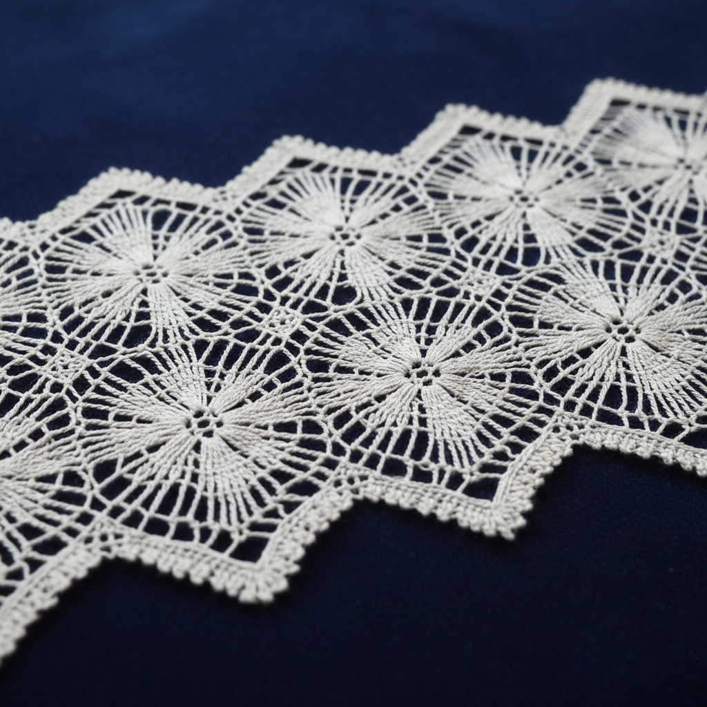

# Torchon Lace Art 粗线蕾丝艺术

> "Torchon lace is bobbin lace at its most honest — geometric patterns worked in sturdy linen thread on a simple grid, creating a fabric that is both beautiful and practical. Unlike the aristocratic point laces of Venice or the gossamer threads of Valenciennes, torchon is the people's lace: bold, geometric, washable, and strong enough for everyday use on tablecloths, pillowcases, and kitchen curtains." — Unknown

## 概述

粗线蕾丝艺术（Torchon Lace Art）是一种使用较粗的线材在简单网格基础上编织的梭芯蕾丝技法——以其几何图案、实用性和相对容易学习的特点著称。Torchon（法语意为"抹布"或"粗布"）蕾丝是最基础和最普及的梭芯蕾丝类型，适合日常使用。

粗线蕾丝艺术的实践包括：1）基础网格——简单的对角网格底纹；2）扇形——经典的扇形边缘图案；3）蜘蛛网——装饰性的蜘蛛网图案；4）叶形——几何化的叶片图案；5）边饰——织物边缘的蕾丝装饰；6）当代粗线蕾丝——将传统技法与现代设计结合的创作。

## 核心特征

| 特征 | 描述 |
|------|------|
| 几何 | 基于网格的几何图案 |
| 实用 | 耐用实用的蕾丝 |
| 入门 | 最易入门的梭芯蕾丝 |
| 粗线 | 使用较粗的线材 |
| 快速 | 相对快速的制作 |
| 普及 | 最普及的蕾丝类型 |

## 视觉特征

- **几何**：清晰的几何图案
- **网格**：规则的对角网格
- **粗犷**：相对粗犷的线条
- **实用**：实用美观的外观
- **重复**：规律重复的图案
- **清晰**：清晰可辨的结构

## 代表作品

| 作品 | 艺术家/文化 | 年代 | 意义 |
|------|-------------|------|------|
| *French torchon* | 法国 | 16世纪至今 | 法国粗线蕾丝 |
| *Cluny lace* | 法国 | 19世纪至今 | 克吕尼蕾丝 |
| *Scandinavian torchon* | 北欧 | 17世纪至今 | 北欧粗线蕾丝 |
| *Spanish torchon* | 西班牙 | 16世纪至今 | 西班牙粗线蕾丝 |
| *Contemporary torchon* | 当代 | 当代 | 当代粗线蕾丝 |

## 历史时间线

| 时期 | 事件 |
|------|------|
| 16世纪 | 粗线蕾丝的起源 |
| 17-18世纪 | 在欧洲各地的普及 |
| 19世纪 | 粗线蕾丝的工业化 |
| 20世纪 | 作为手工艺的传承 |
| 当代 | 粗线蕾丝的教学和复兴 |

## 中国语境

粗线蕾丝艺术在中国有一定的传承和发展。中国的梭芯蕾丝（棒槌花边）传统主要集中在山东和江苏地区——这些地区在19世纪末引入了欧洲蕾丝技法。中国的棒槌花边中有类似torchon的几何图案蕾丝——以其实用性和相对简单的制作而受到欢迎。中国的蕾丝教育中，torchon蕾丝通常作为梭芯蕾丝的入门课程——因为其图案基于简单的网格系统。中国的一些手工艺社区开始推广torchon蕾丝——作为一种放松和冥想的手工活动。中国的蕾丝产业中，torchon风格的机织蕾丝是重要的产品类别——用于家纺和服装装饰。

## AI生成概念图

## 与其他风格的关系

- **Bobbin Lace** → 梭芯蕾丝
- **Lacework** → 蕾丝艺术
- **Cluny Lace** → 克吕尼蕾丝
- **Textile Art** → 纺织艺术
- **Geometric Art** → 几何艺术
- **Folk Art** → 民间艺术

---

*浮光艺志 | Chronicle of Artistry*
