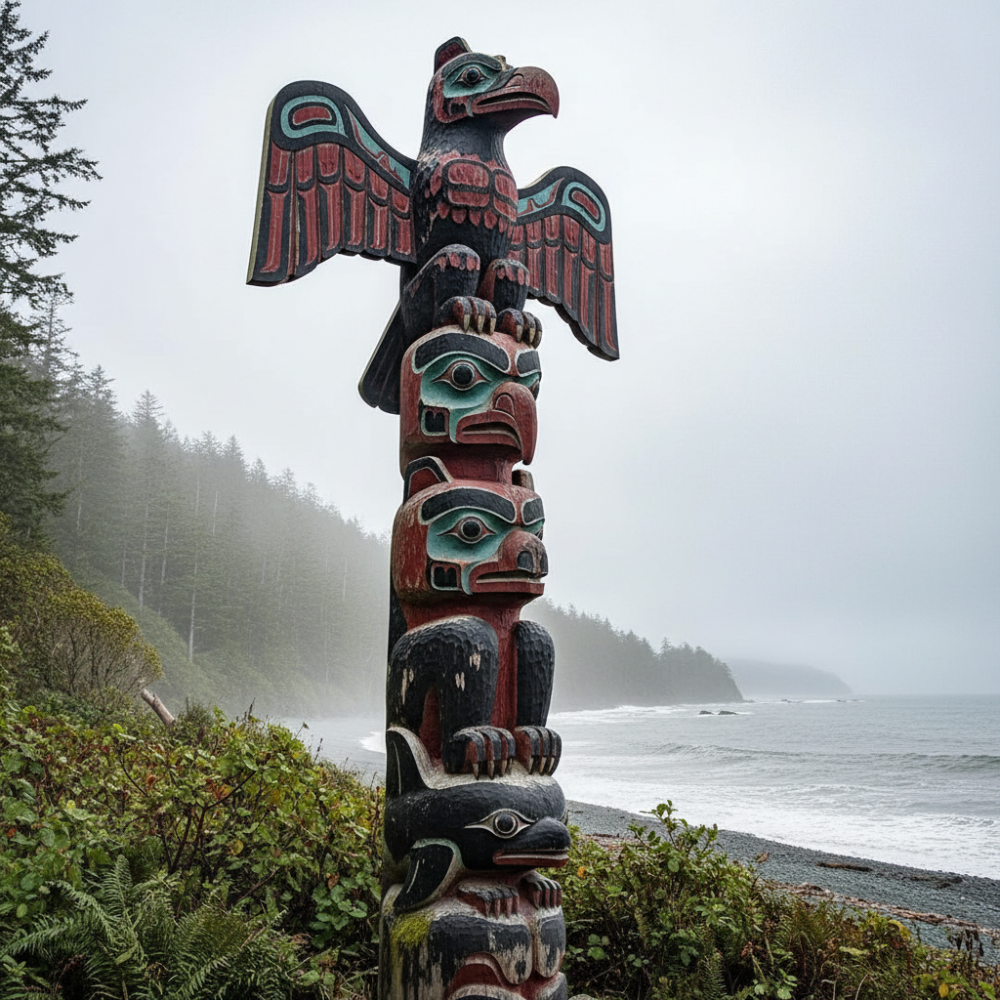

# Totem Pole 图腾柱 | Gyáa'aang / Ts'uu

> **"雪松上的家族史——太平洋西北岸原住民用巨木雕刻出可以仰望的族谱。"**

## 概述

图腾柱（Totem Pole / Gyáa'aang / Ts'uu）是北美太平洋西北岸原住民（海达族Haida、特林吉特族Tlingit、夸夸嘉夸族Kwakwaka'wakw等）的传统木雕艺术，在巨大的红雪松（Red Cedar）上雕刻叠加的动物和人物形象。图腾柱不是"崇拜物"，而是视觉化的家族历史、权利宣言和纪念碑——每一个雕刻的形象都代表一个家族故事、祖先、超自然存在或历史事件。图腾柱可高达20米以上。

## 主要类型

| 类型 | 功能 |
|------|------|
| 家族柱 | 展示家族纹章和历史 |
| 纪念柱 | 纪念重要人物或事件 |
| 耻辱柱 | 公开羞辱欠债者 |
| 门柱 | 房屋入口的装饰 |
| 墓柱 | 安放骨灰的丧葬柱 |
| 欢迎柱 | 迎接来访者 |

## 核心特征

- **红雪松**：使用巨大的红雪松原木
- **叠加形象**：动物和人物垂直叠加
- **家族纹章**：代表家族的动物图腾
- **程式化造型**：高度程式化的动物形象
- **彩色涂装**：红、黑、蓝绿、白
- **巨大尺度**：可高达20米以上

## 常见图腾动物

| 动物 | 含义 |
|------|------|
| 渡鸦 Raven | 创世者、变形者 |
| 鹰 Eagle | 力量、领导 |
| 熊 Bear | 力量、家族 |
| 虎鲸 Orca | 海洋力量 |
| 雷鸟 Thunderbird | 超自然力量 |
| 狼 Wolf | 忠诚、家族 |

## 视觉特征

- 巨大的垂直木雕
- 程式化的动物面孔
- 红黑蓝绿白的经典配色
- 叠加的图腾形象
- 曲线和卵形的造型语言
- 仰望的视觉冲击

## 与其他风格的关系

| 风格 | 关系 |
|------|------|
| Northwest Coast Art | 图腾柱是其核心形式 |
| Maori Carving | 共享太平洋木雕传统 |
| 非洲木雕 | 共享叙事性木雕 |
| 当代原住民艺术 | 图腾柱的现代转化 |
| 公共雕塑 | 图腾柱作为公共艺术 |

## 概念图

---

*浮光艺志 | Chronicle of Artistry*
