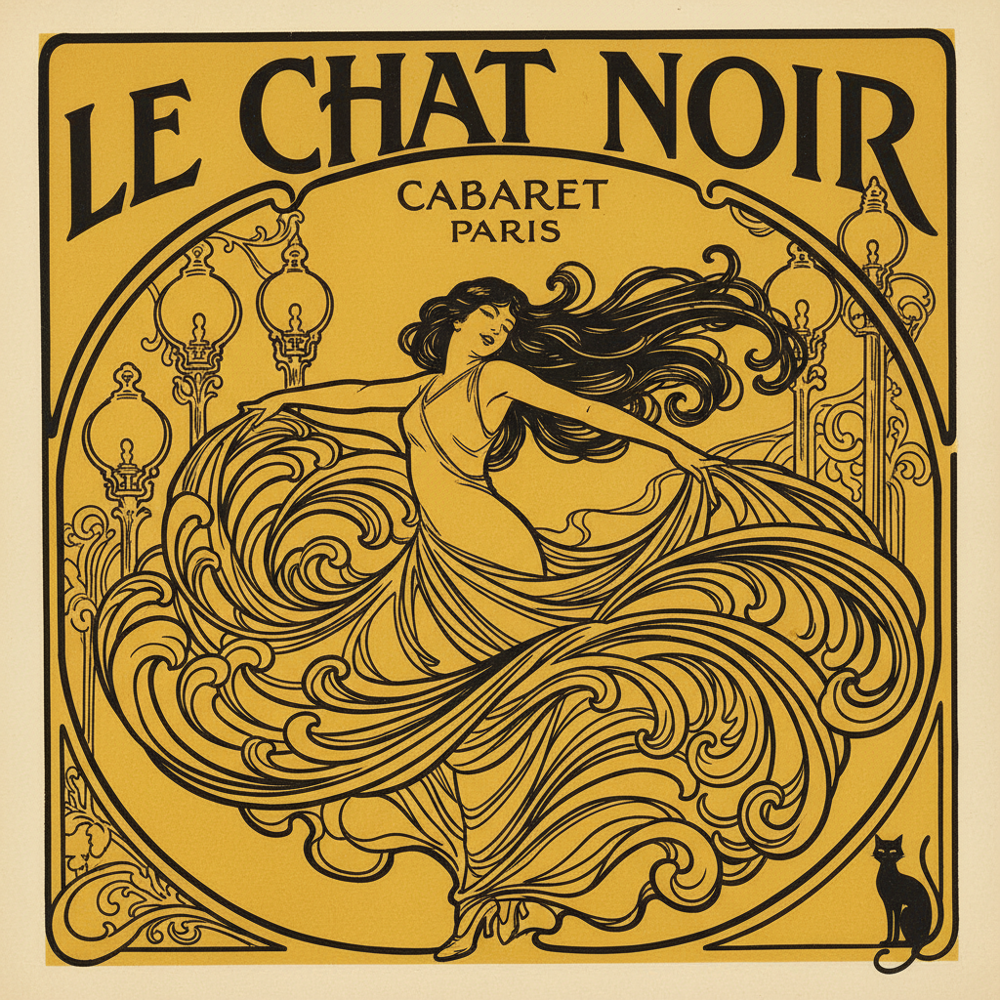

# Henri de Toulouse-Lautrec 图卢兹-劳特累克

> "I paint things as they are. I don't comment." — Henri de Toulouse-Lautrec

## 概述

亨利·德·图卢兹-劳特累克（Henri de Toulouse-Lautrec，1864–1901）是法国后印象派画家和版画家，以描绘巴黎蒙马特夜生活——红磨坊、咖啡馆、舞女和妓院——而闻名。他的石版画海报彻底改变了商业艺术，将广告提升为艺术形式。

## 核心特征

| 特征 | 描述 |
|------|------|
| 夜生活场景 | 歌舞厅、酒吧、妓院的真实记录 |
| 石版画海报 | 革命性的商业艺术 |
| 大胆轮廓线 | 日本版画影响的简洁线条 |
| 平涂色块 | 有限色彩的强烈对比 |
| 动态捕捉 | 舞蹈、表演中的瞬间动作 |
| 讽刺观察 | 不美化也不丑化的诚实目光 |

## 代表作品

| 作品 | 年代 | 意义 |
|------|------|------|
| *Moulin Rouge: La Goulue* | 1891 | 改变海报艺术的里程碑 |
| *At the Moulin Rouge* | 1892–95 | 夜生活的群像 |
| *Jane Avril* | 1893 | 舞者的动态诗意 |
| *In the Salon at the Rue des Moulins* | 1894 | 妓院生活的诚实记录 |

## AI生成概念图

## 与其他风格的关系

- **Post-Impressionism** → 后印象派的独特分支
- **Japonisme** → 深受日本版画构图影响
- **Art Nouveau** → 海报设计影响了新艺术运动
- **Degas** → 共享对舞者和运动的兴趣
- **Graphic Design** → 现代平面设计的先驱
