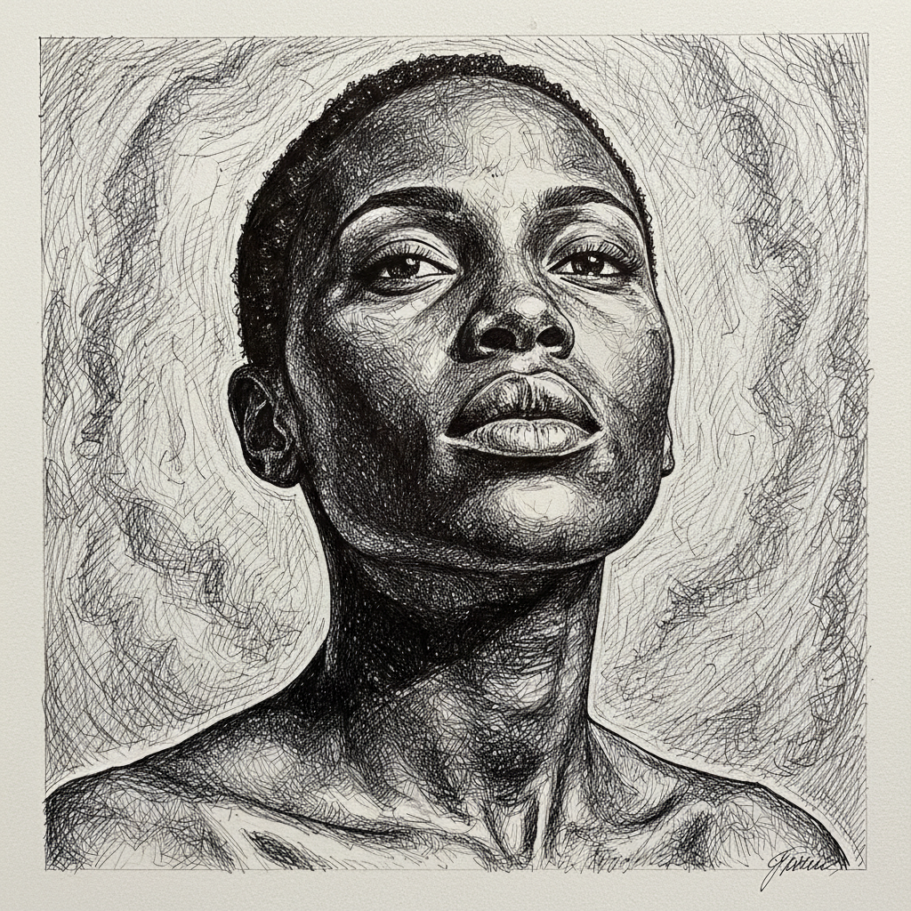

# Toyin Ojih Odutola 托因·奥吉·奥杜托拉

> **时期：** 1985–至今  
> **关键词：** 线条肖像、虚构叙事、黑色皮肤质感、当代非洲散居

## 概述

Toyin Ojih Odutola 是尼日利亚裔美国艺术家，以精密的线条和独特的皮肤质感处理闻名。她早期用圆珠笔和马克笔创造出具有宝石般光泽的黑色皮肤表面，后期转向粉彩和木炭，构建虚构的贵族叙事世界，探索权力、阶级和种族的交叉。

## 风格特征

- **线条密度**：早期作品以密集的圆珠笔线条堆叠，创造出皮肤的光泽和深度
- **皮肤作为地形**：黑色皮肤被处理为复杂的地貌——反光、纹理、层次
- **虚构世界观**：后期作品构建完整的虚构贵族社会，配有详细的背景故事
- **粉彩柔和**：近期作品使用粉彩，色调转向柔和的蓝、绿和金色
- **叙事连续**：作品常以系列形式出现，如同视觉小说的章节

## 代表作品

- *A Countervailing Theory*（2019，惠特尼美术馆）
- *To Wander Determined*（2017，惠特尼美术馆）
- *Untitled (Exquisite Corpse)*（2012）

## 历史意义

Odutola 重新定义了肖像画中"黑色"的视觉可能性，将其从单一色调转化为无限丰富的表面。她的虚构叙事方法也为当代黑人艺术家提供了超越"再现政治"的新路径。

## 概念图

