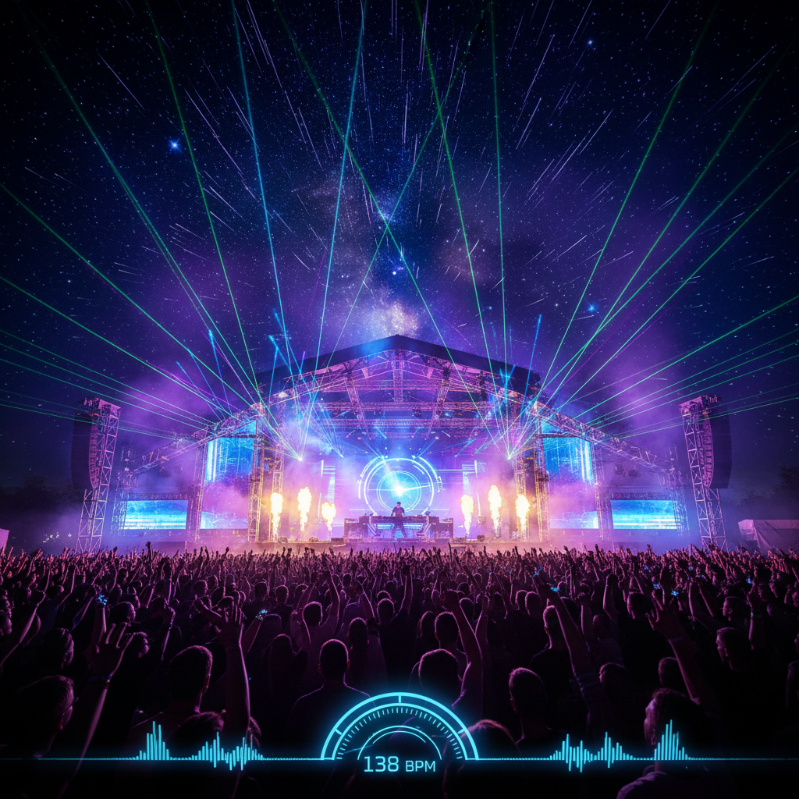

# Trance 迷幻电子



> **"138BPM、渐进式编排、激光与升华——90年代锐舞文化的精神巅峰。"**

## 概述

| 维度 | 描述 |
|------|------|
| 时期 | 1991–至今 |
| 别名 | Trance, Uplifting Trance, Progressive Trance, Psytrance |
| 核心色彩 | 深蓝、紫色、霓虹绿、白色激光 |
| 关键元素 | 138BPM、渐进式build-up、breakdown、激光、升华感 |
| 代表人物 | Tiësto, Armin van Buuren, Paul van Dyk, Above & Beyond |
| 关联风格 | Techno, House, Ambient, Psytrance, EDM |

---

## 历史脉络

| 年份 | 事件 |
|------|------|
| 1991 | 德国法兰克福——Trance 诞生 |
| 1993 | Sven Väth, Eye Q Records——早期 Trance |
| 1997 | Paul van Dyk "For an Angel"——突破 |
| 1999 | Tiësto, Ferry Corsten——荷兰 Trance 黄金时代 |
| 2001 | Tiësto "In Search of Sunrise"——全球化 |
| 2004 | Armin van Buuren "A State of Trance"——电台帝国 |
| 2010 | EDM 浪潮——Trance 被边缘化 |
| 2020s | Trance 复兴——怀旧浪潮 |

### 核心哲学

Trance 的精神是**"音乐是一种精神体验——build-up就是攀登，breakdown就是升华"**：
- 升华 = 核心（"那个breakdown的瞬间——你感觉自己在飞"）
- 渐进 = 结构（"慢慢建立——然后释放"）
- 重复 = 冥想（"重复的旋律让你进入trance状态"）
- 社区 = 宗教（"Trance Family——不只是粉丝，是家人"）
- "Trance 不是音乐类型——是一种精神状态"

---

## 视觉语法

### 色彩系统

```
主色：
  深蓝 (#000066) — 夜空、深邃
  紫色 (#6600CC) — 神秘、精神
  黑色 (#000000) — 夜晚

辅色：
  霓虹绿 (#00FF00) — 激光
  白色 (#FFFFFF) — 激光、光束
  金色 (#FFD700) — 日出、升华

规则：
  - 暗色基底+激光穿透
  - 渐变（代表build-up）
  - 光束/射线
  - 宇宙/星空意象

质感：
  激光 — 光束、穿透
  烟雾 — 俱乐部
  星空 — 宇宙
  水 — 流动、波浪
```

### 标志性元素

| 类别 | 元素 |
|------|------|
| 视觉 | 激光秀、日出、宇宙、光束 |
| 场所 | 大型音乐节、露天舞台、海滩派对 |
| 音乐 | 138BPM、build-up/breakdown、旋律合成器 |
| 厂牌 | Armada, Anjunabeats, Vandit, Black Hole |
| 文化 | Trance Family、ASOT、举手/闭眼 |
| 态度 | 升华、精神、社区、情感、宇宙 |

---

## 与千禧怀旧的关系

### 90年代末/2000年代初的锐舞文化
- Trance = 1999-2004 全球最流行的电子音乐
- Tiësto 2004 雅典奥运会开幕式——Trance 的巅峰
- "2000年的Trance派对 = 那一代人的伍德斯托克"
- A State of Trance 电台 = 2000s 电子音乐的圣经

### 怀旧复兴
- 2020s Trance 复兴——"Classic Trance"回归
- 新一代发现90s/2000s Trance
- "那些旋律从未过时"

---

## 中国语境

- Trance 在中国电子音乐节的地位
- 中国 Trance 社区（ASOT中国）
- 与中国"电音节"文化的关系
- 中国 Psytrance 场景

---

## 设计应用

| 场景 | 应用方式 |
|------|----------|
| 活动 | 激光+暗色+渐变+宇宙+大型 |
| 音乐 | 宇宙+光束+日出+渐变+情感 |
| 品牌 | 升华+精神+社区+情感+能量 |
| 数字 | 激光+渐变+粒子+光束+动态 |

---

## 相关风格

← [Acid House 酸屋](acid-house.md) | [Techno Berlin 柏林科技](techno-berlin.md) →

↑ [返回千禧怀旧目录](README.md) | [返回总目录](../README.md)
