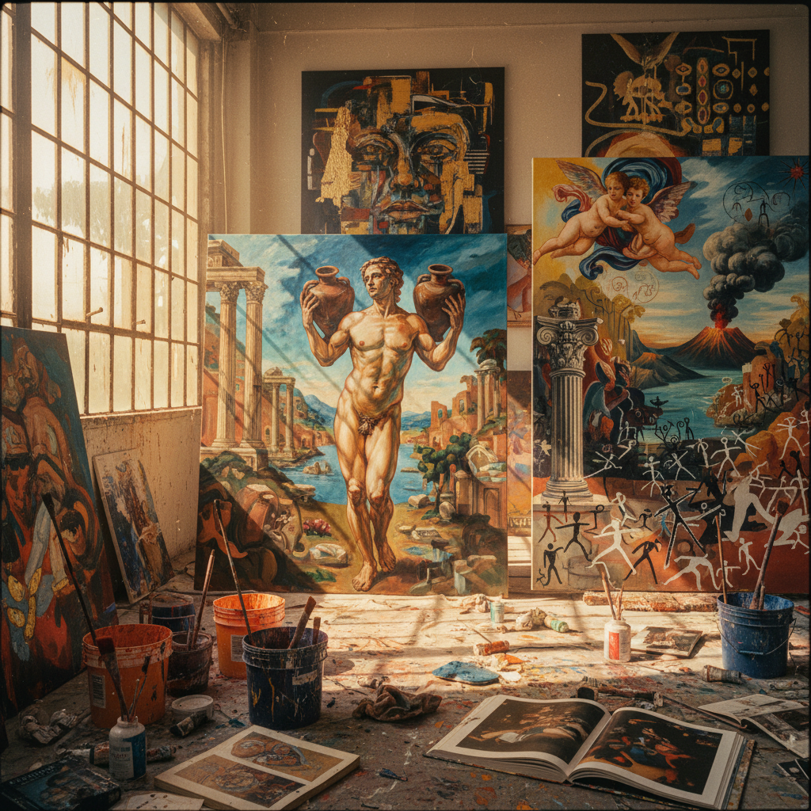

# Transavanguardia Art 超前卫艺术

> "Transavanguardia is the return of painting after its supposed death — a joyful, nomadic, eclectic practice that wanders freely through art history picking up whatever it needs, that refuses the linear progress narrative of the avant-garde and instead moves sideways, backwards, and in spirals, that embraces figuration, myth, local tradition, and subjective expression at a moment when conceptualism declared all of these obsolete, proving that the hand, the brush, and the painted surface still have inexhaustible things to say." — Achille Bonito Oliva

## 概述

超前卫（Transavanguardia / Trans-avant-garde）是意大利艺术评论家阿基莱·博尼托·奥利瓦（Achille Bonito Oliva）在1979年提出的艺术运动，指一群意大利画家对1960-70年代概念艺术和极简主义的反动——回归绘画、具象、神话和主观表达。"Trans-"前缀表示"超越"或"穿越"前卫，意味着不是简单地回到传统，而是自由地穿越艺术史的各个时期和风格。

超前卫的核心艺术家包括五位意大利画家：Sandro Chia、Francesco Clemente、Enzo Cucchi、Nicola De Maria和Mimmo Paladino。他们的作品特征包括：大尺幅的绘画、强烈的色彩、神话和寓言的主题、对意大利艺术传统的引用、以及折衷主义的风格混合。超前卫与同时期的德国新表现主义（Neue Wilde）和美国新表现主义有平行关系，共同构成了1980年代"绘画的回归"潮流。

## 核心特征

| 特征 | 描述 |
|------|------|
| 绘画 | 绘画的回归 |
| 游牧 | 风格的游牧性 |
| 神话 | 神话和寓言 |
| 折衷 | 折衷主义 |
| 主观 | 主观表达 |
| 传统 | 与传统的对话 |

## 视觉特征

- **大尺幅**：大尺度的画布
- **色彩**：强烈的色彩
- **具象**：回归具象
- **神话**：神话人物和场景
- **笔触**：表现性的笔触
- **引用**：对艺术史的引用

## 代表作品

| 作品 | 艺术家 | 年代 | 意义 |
|------|--------|------|------|
| *Water Bearer* | Sandro Chia | 1981 | 超前卫的代表作 |
| *Self-portraits* | Francesco Clemente | 1980年代 | 身份的探索 |
| *Mediterranean landscapes* | Enzo Cucchi | 1980年代 | 意大利风景的神话化 |
| *Untitled works* | Mimmo Paladino | 1980年代 | 原始主义的回归 |
| *Cosmic paintings* | Nicola De Maria | 1980年代 | 宇宙性的色彩 |

## 历史时间线

| 时期 | 事件 |
|------|------|
| 1979 | Oliva提出超前卫概念 |
| 1980 | 威尼斯双年展的展示 |
| 1980年代 | 国际影响力的扩展 |
| 1990年代 | 运动的衰退 |
| 当代 | 历史评价的重新审视 |

## 中国语境

超前卫对中国当代艺术有一定的影响。1980年代中国的"85新潮"运动中，一些艺术家受到了超前卫"回归绘画"理念的启发。中国当代绘画中的一些趋势——如对传统图像的当代重新诠释、对神话和民间故事的视觉化、以及对绘画性本身的强调——与超前卫的精神有共鸣。Francesco Clemente等超前卫艺术家对东方文化（特别是印度）的兴趣，也为中国艺术家提供了一种"东西方对话"的参照模式。中国当代的一些画家在实践着类似的"穿越"策略——自由地在传统水墨、西方油画和当代观念之间游走。

## AI生成概念图

## 与其他风格的关系

- **Neo-Expressionism** → 新表现主义
- **Italian Art** → 意大利艺术传统
- **Conceptual Art** → 概念艺术（反对）
- **Postmodernism** → 后现代主义
- **Figurative Painting** → 具象绘画
- **Arte Povera** → 贫穷艺术

---

*浮光艺志 | Chronicle of Artistry*
