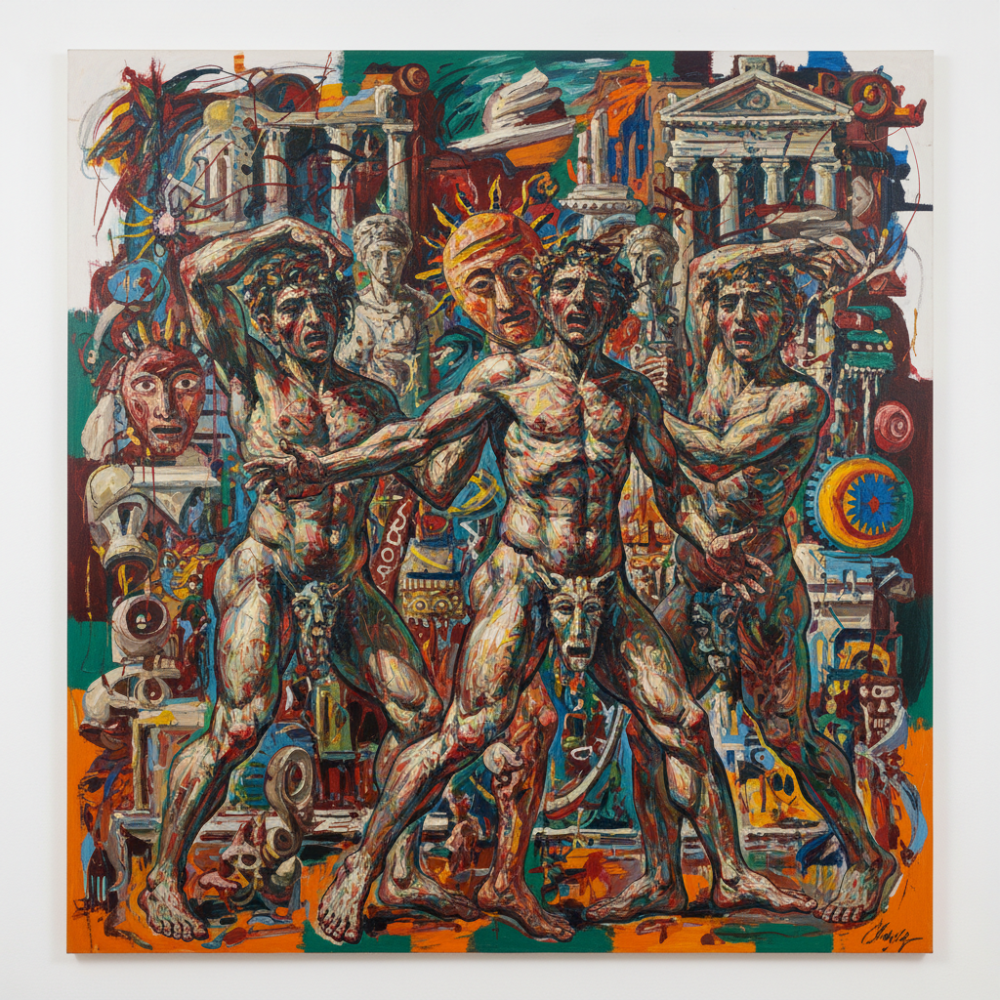

# Transavanguardia 超前卫



> **"回到画布、回到具象——在观念艺术的废墟上重燃绘画的野性与激情。"**

## 概述

超前卫（Transavanguardia）是1979年由意大利艺术评论家阿基莱·博尼托·奥利瓦（Achille Bonito Oliva）提出的后现代主义艺术运动，被视为国际新表现主义浪潮的意大利版本。它主张"文化游牧主义"——在艺术史中自由漫游，回归架上绘画、具象造型与手工性。

## 时代背景

| 维度 | 内容 |
|------|------|
| 提出 | 1979年，奥利瓦在《Flash Art》杂志发表《意大利超前卫》 |
| 活跃期 | 1979–1990年代初 |
| 反对 | 极简主义、贫穷艺术（Arte Povera）、观念艺术 |
| 国际对应 | 德国新表现主义、美国新绘画、英国新精神 |

## 核心五人（"五C"）

| 艺术家 | 特征 |
|------|------|
| Sandro Chia 桑德罗·基亚 | 受未来主义影响，英雄人物与神话叙事 |
| Francesco Clemente 弗朗切斯科·克莱门特 | 身体、情欲、东方神秘主义 |
| Enzo Cucchi 恩佐·库奇 | 原始洞穴画般的质感，大地色调 |
| Nicola De Maria 尼古拉·德·马里亚 | 童真色彩、花卉与宇宙 |
| Mimmo Paladino 米莫·帕拉迪诺 | 符号、面具、原始图腾 |

## 视觉特征

- **大尺幅画布**：回归绘画的物质性与仪式感
- **强烈色彩**：鲜艳、戏剧化的用色
- **具象但非写实**：扭曲、变形的人物与动物
- **神话与符号**：古典神话、原始图腾、宗教意象
- **粗犷笔触**：强调手工性与身体性
- **折衷混搭**：自由引用各历史时期的风格

## 核心理念

### 文化游牧主义（Nomadismo Culturale）

奥利瓦用"游牧"比喻超前卫艺术家的创作态度——他们不固守任何单一传统或前卫立场，而是在整个艺术史中自由穿行，随意借鉴、混合、颠覆。

### 对前卫的超越

"Trans-"前缀意味着"超越"——不是回到前卫之前，也不是继续前卫的线性进步逻辑，而是横向穿越，打破进步史观的束缚。

## 与其他运动的关系

```
贫穷艺术(1960s) ──→ [反叛] ──→ 超前卫(1979)
极简主义(1960s) ──→ [反叛] ──→ 超前卫(1979)
                                      ↕
德国新表现主义 ←→ 超前卫 ←→ 美国新绘画
(Baselitz, Kiefer)         (Schnabel, Basquiat)
```

## 当代影响

- 重新确立绘画在当代艺术中的合法性
- 启发了1980–90年代全球"绘画回归"潮流
- 对中国"85新潮"后的表现性绘画有间接影响
- 当代艺术市场对大尺幅表现性绘画的持续热情

## 多语言名称

| 语言 | 名称 |
|------|------|
| 意大利语 | Transavanguardia |
| 英语 | Trans-avant-garde / Italian Neo-Expressionism |
| 中文 | 超前卫 / 超前卫主义 |
| 法语 | Trans-avant-garde |
| 德语 | Transavantgarde |

## 延伸阅读

- Achille Bonito Oliva《La Transavanguardia Italiana》(1980)
- Palazzo Reale Milano 2011年回顾展
- Tate Gallery "Transavanguardia" 词条

---

*最后更新：2026-07-26*
