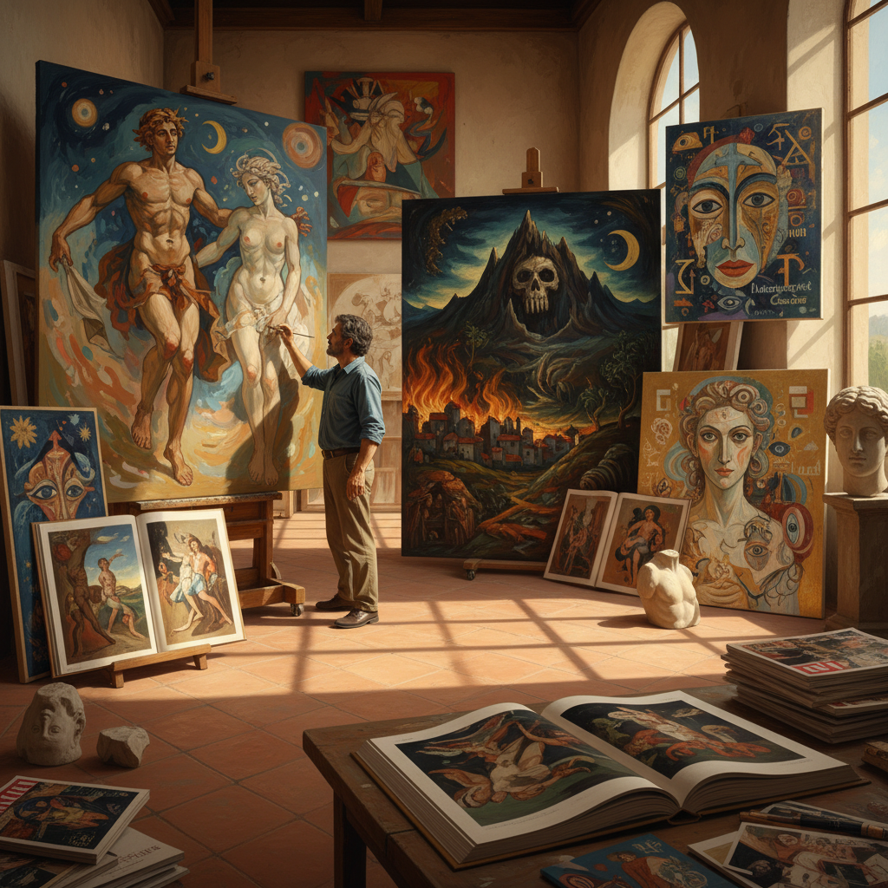

# Transavantgarde Art 超前卫艺术

> "Transavanguardia is the nomadic wandering of painting through history — Italian artists of the 1980s who refused the linear march of progress and instead moved freely between past and present, myth and autobiography, abstraction and figuration, reclaiming the pleasure of paint and the freedom to quote from any tradition without guilt, a joyful declaration that painting could be simultaneously ancient and contemporary, local and universal." — Unknown

## 概述

超前卫（Transavanguardia，意大利语"Trans-avant-garde"，意为"超越前卫"）是1979年由意大利艺术批评家阿基莱·博尼托·奥利瓦（Achille Bonito Oliva）提出的一个艺术运动概念，指1970年代末至1980年代意大利的一批画家回归具象绘画、拥抱主观性和历史引用的创作倾向。超前卫是新表现主义的意大利分支，但有其独特的理论框架。

奥利瓦将超前卫定义为一种"游牧式"的创作态度——艺术家不再遵循前卫艺术的线性进步逻辑，而是自由地在不同的风格、时代和文化之间"游牧"。超前卫的五位核心艺术家是：桑德罗·基亚（Sandro Chia）、弗朗切斯科·克莱门特（Francesco Clemente）、恩佐·库奇（Enzo Cucchi）、尼古拉·德·马里亚（Nicola De Maria）和米莫·帕拉迪诺（Mimmo Paladino）。他们的作品融合了意大利的古典传统、地中海神话、个人叙事和当代感性。

## 核心特征

| 特征 | 描述 |
|------|------|
| 游牧 | 风格的游牧和自由 |
| 回归 | 回归绘画和具象 |
| 引用 | 自由引用历史风格 |
| 主观 | 主观性和个人叙事 |
| 意大利 | 意大利文化根基 |
| 神话 | 神话和象征 |

## 视觉特征

- **具象**：回归具象的人物
- **神话**：神话和寓言主题
- **色彩**：丰富的地中海色彩
- **笔触**：自由的笔触
- **引用**：对古典的引用
- **叙事**：个人化的叙事

## 代表作品

| 作品 | 艺术家 | 年代 | 意义 |
|------|--------|------|------|
| *The Idleness of Sisyphus* | Sandro Chia | 1981 | 基亚的西西弗斯 |
| *Self-portraits* | Francesco Clemente | 1980年代 | 克莱门特的自画像 |
| *Mediterranean paintings* | Enzo Cucchi | 1980年代 | 库奇的地中海 |
| *Skull paintings* | Mimmo Paladino | 1980年代 | 帕拉迪诺的骷髅 |
| *Cosmic paintings* | Nicola De Maria | 1980年代 | 德·马里亚的宇宙 |

## 历史时间线

| 时期 | 事件 |
|------|------|
| 1979 | Oliva提出"超前卫"概念 |
| 1980 | 威尼斯双年展的超前卫展示 |
| 1980-85 | 超前卫的国际鼎盛期 |
| 1982 | 卡塞尔文献展的参与 |
| 1980年代末 | 超前卫的衰退 |

## 中国语境

超前卫在中国当代艺术中有一定影响。1980年代中国的"85新潮"运动与超前卫几乎同时发生，两者都代表了对前卫艺术教条的反叛和对绘画的回归。中国的一些画家（如张晓刚、岳敏君等）在1990年代的创作中体现了类似超前卫的"游牧"态度——自由地在中国传统、社会主义现实主义和当代国际风格之间移动。超前卫对"地方性"和"文化身份"的强调也影响了中国当代艺术对"中国性"的思考。

## AI生成概念图

## 与其他风格的关系

- **Neo-Expressionism** → 新表现主义
- **Italian Art** → 意大利艺术传统
- **Figurative Painting** → 具象绘画
- **Postmodernism** → 后现代主义
- **Arte Povera** → 贫穷艺术
- **Bad Painting** → 坏画

---

*浮光艺志 | Chronicle of Artistry*
