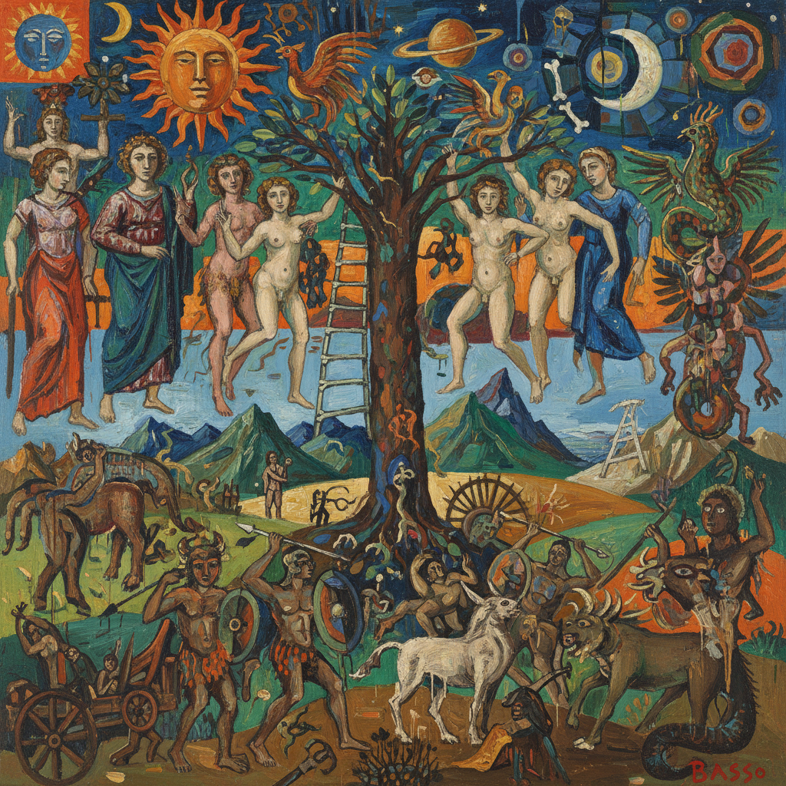

# Transavantgarde 超前卫艺术

> **时期：** 1979年–1990年代  
> **关键词：** 回归绘画、新表现主义、意大利、神话叙事、游牧美学

## 概述

Transavantgarde（超前卫，意大利语Transavanguardia）是意大利艺术评论家阿基莱·博尼托·奥利瓦于1979年提出的艺术运动。它主张回归绘画的快感和叙事性，反对观念艺术的冷漠和极简主义的禁欲，鼓励艺术家在不同风格、文化和历史之间"游牧"——自由借用神话、民间传说和艺术史的图像资源。

## 风格特征

- **回归绘画**：重新拥抱画布和颜料的物质性
- **叙事性**：神话、寓言和个人故事的回归
- **风格游牧**：在不同传统之间自由穿梭
- **表现力**：强烈的色彩和粗犷的笔触
- **文化混合**：古典与当代、东方与西方的融合

## 代表人物与作品

- 桑德罗·基亚《水中的男孩》
- 弗朗切斯科·克莱门特（东方神秘主义）
- 恩佐·库奇（原始主义绘画）
- 米莫·帕拉迪诺（雕塑与绘画）

## 概念图

