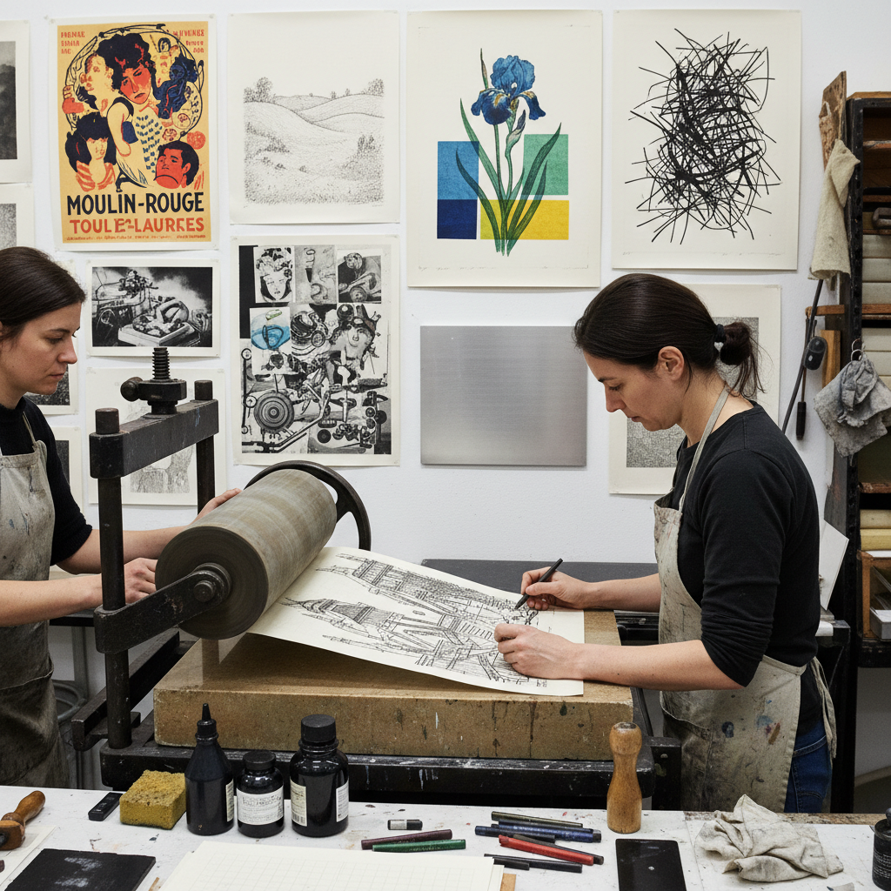

# Transfer Lithography 转印石版

> "Transfer lithography frees the artist from the stone — drawing on paper with greasy materials, then transferring that drawing onto a lithographic stone or plate, preserving the spontaneity of sketching on paper while gaining the multiplicity of the press, each print carrying the intimacy of the original gesture." — Unknown

## 概述

转印石版（Transfer Lithography）是一种石版印刷的变体技法——艺术家不直接在石版或金属版上绘画，而是先在特殊的转印纸上用油性材料（石版蜡笔、油性墨水、油性铅笔等）绘画，然后将纸上的油性图像转印到石版或铝版上进行印刷。转印石版保留了在纸上绘画的自由和自然感，同时获得了石版印刷的复制能力。

转印石版的优势：艺术家可以在任何地方（户外写生、旅途中）在转印纸上绘画，然后回到工作室转印到版上印刷；可以使用更自然的绘画姿势（不需要在沉重的石版上工作）；图像不需要反转（转印过程自动完成镜像翻转）。许多著名的石版画家（如Toulouse-Lautrec、Bonnard等）都使用过转印石版技法。

## 核心特征

| 特征 | 描述 |
|------|------|
| 转印 | 从纸转印到版 |
| 自由 | 纸上绘画的自由 |
| 油性 | 油性绘画材料 |
| 复制 | 可多次印刷 |
| 便携 | 可在任何地方绘画 |
| 自然 | 保留自然笔触 |

## 视觉特征

- **自然**：自然的绘画笔触
- **纸纹**：转印纸的纹理
- **柔和**：柔和的线条边缘
- **即兴**：即兴的绘画感
- **绘画性**：强烈的绘画性
- **亲密**：亲密的手绘感

## 代表作品

| 作品 | 艺术家 | 年代 | 意义 |
|------|--------|------|------|
| *Transfer lithographs* | Toulouse-Lautrec | 1890s | 转印石版的艺术应用 |
| *Bonnard lithographs* | Pierre Bonnard | 1890s | 纳比派转印石版 |
| *Contemporary transfer litho* | Various | 当代 | 当代转印石版 |
| *Photographic transfer litho* | Various | 当代 | 照片转印石版 |

## 历史时间线

| 时期 | 事件 |
|------|------|
| 1796年 | 石版印刷的发明 |
| 19世纪初 | 转印石版技法的发展 |
| 1890年代 | 后印象派艺术家的广泛使用 |
| 20世纪 | 转印石版在艺术教育中的普及 |
| 当代 | 转印石版的持续实践 |

## 中国语境

转印石版在中国的版画教育中有一定的应用。中国的美术学院版画系在石版印刷课程中教授转印技法。转印石版因其"可以在纸上自由绘画"的特点，对中国的版画学生和艺术家有吸引力——特别是对于习惯在纸上工作的中国画家来说，转印石版提供了一种将纸上绘画转化为版画的便捷方式。中国的一些版画艺术家使用转印石版创作具有中国水墨画意味的石版画。

## AI生成概念图

## 与其他风格的关系

- **Lithography** → 石版印刷
- **Kitchen Lithography** → 厨房石版
- **Drawing** → 素描
- **Printmaking** → 版画
- **Poster Art** → 海报艺术
- **Illustration** → 插画

---

*浮光艺志 | Chronicle of Artistry*
