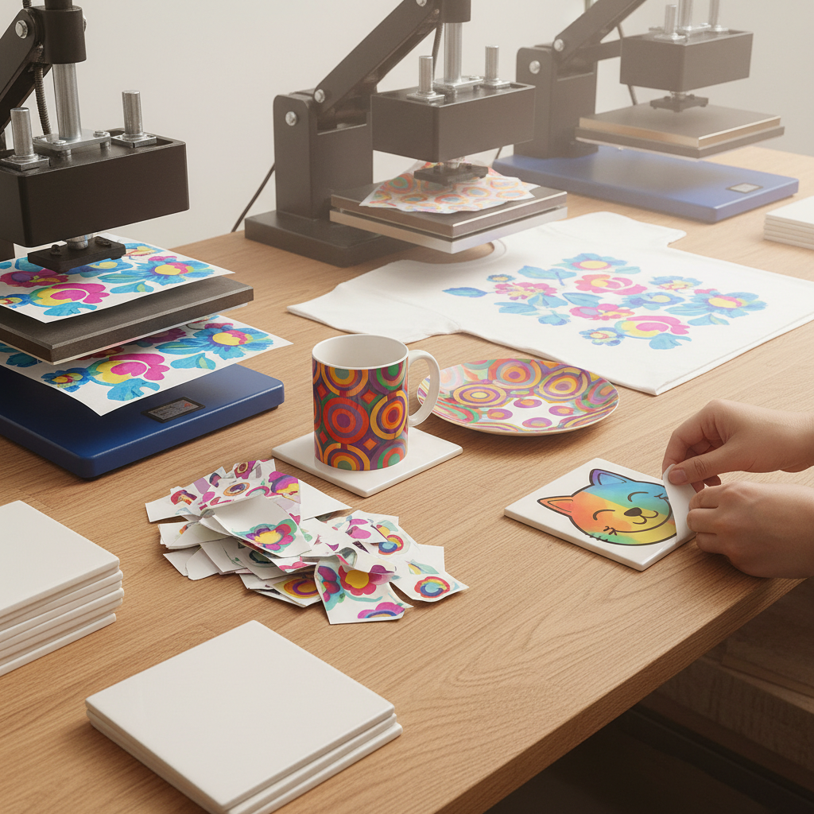

# Transfer Printing Art 转印艺术

> "Transfer printing liberates the image from its original surface — a design created on one medium is lifted and deposited onto another through heat, pressure, solvent, or water, carrying its colors and details intact across the gap between substrates. From ceramic decals to iron-on T-shirts, transfer printing bridges the world of flat imagery and three-dimensional objects." — Unknown

## 概述

转印艺术（Transfer Printing Art）是一种将图像从一个表面转移到另一个表面的印刷技法——通过热、压力、溶剂或水等媒介，将预先印刷在载体上的图像转移到最终的承印物上。转印技术广泛应用于纺织品、陶瓷、金属和塑料等各种材料的装饰。

转印艺术的实践包括：1）热转印（Heat Transfer）——通过热压将图像转移到织物上；2）水转印（Water Transfer）——通过水膜将图像转移到立体物体上；3）升华转印（Sublimation）——通过染料升华转移到聚酯织物上；4）溶剂转印——使用溶剂溶解油墨进行转移；5）陶瓷贴花——将印刷贴花转移到陶瓷上；6）摩擦转印——通过摩擦将图像转移；7）当代转印——将传统技法与数字印刷结合的创作。

## 核心特征

| 特征 | 描述 |
|------|------|
| 转移 | 图像从一个表面转移到另一个 |
| 多材 | 适用于多种材料 |
| 间接 | 间接的印刷方式 |
| 精确 | 精确的图像复制 |
| 多样 | 多种转印方法 |
| 实用 | 广泛的实用应用 |

## 视觉特征

- **精确**：精确的图像复制
- **色彩**：鲜艳的色彩效果
- **平滑**：平滑的表面效果
- **多材**：在各种材料上的效果
- **细节**：精细的细节保留
- **均匀**：均匀的色彩分布

## 代表作品

| 作品 | 艺术家/文化 | 年代 | 意义 |
|------|-------------|------|------|
| *Staffordshire transferware* | 英国 | 18世纪起 | 斯塔福德郡转印陶瓷 |
| *Robert Rauschenberg transfers* | 美国 | 1960年代 | 劳森伯格的溶剂转印 |
| *Sublimation sportswear* | 国际 | 当代 | 升华转印运动服 |
| *Water transfer hydrographics* | 国际 | 当代 | 水转印装饰 |
| *Contemporary transfer art* | 国际 | 当代 | 当代转印艺术 |

## 历史时间线

| 时期 | 事件 |
|------|------|
| 18世纪 | 陶瓷转印的发明 |
| 19世纪 | 转印技术的工业化 |
| 1960年代 | 艺术家开始使用溶剂转印 |
| 1990年代 | 数字热转印的发展 |
| 当代 | 转印技术的多样化发展 |

## 中国语境

转印技术在中国有广泛的工业和艺术应用。中国是全球最大的热转印和水转印产品生产国——在纺织品、手机壳、汽车装饰等领域大量使用。中国的陶瓷产业中，贴花转印是重要的装饰方式——从景德镇到潮州都广泛使用。中国的服装产业中，热转印和升华转印——是T恤和运动服装饰的主要方式。中国当代的艺术家将转印技术作为创作媒介——在版画和混合媒体作品中使用。中国的印刷教育中，转印作为重要的印刷技术——在相关课程中教授。中国的文创产业中，转印技术——被广泛应用于各种定制产品。

## AI生成概念图

## 与其他风格的关系

- **Screen Printing** → 丝网印刷
- **Sublimation** → 升华印刷
- **Ceramic Decal** → 陶瓷贴花
- **Digital Printing** → 数字印刷
- **Printmaking** → 版画
- **Mixed Media** → 混合媒体

---

*浮光艺志 | Chronicle of Artistry*
