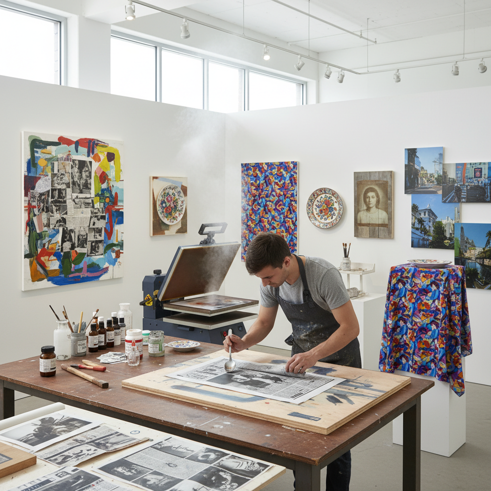

# Transfer Printing 转印技法

> "Transfer printing is the art of migration — images traveling from one surface to another through heat, pressure, or solvent, carrying their likeness intact across the gap between origin and destination like a message passed between worlds." — Unknown

## 概述

转印技法（Transfer Printing）是一种将图像从一个表面转移到另一个表面的印刷/装饰技法——图像先在一个载体（如纸张、薄膜、特殊转印纸）上制作，然后通过热量、压力、溶剂或水的作用转移到最终的承印物（如织物、陶瓷、金属、木材、塑料等）上。转印技法广泛应用于纺织品印花、陶瓷贴花、版画创作和当代艺术中。

转印技法包括多种具体方法：热转印（heat transfer，通过热量和压力转移）、水转印（water transfer/hydrographic printing）、溶剂转印（solvent transfer，使用溶剂溶解墨层后转移）、升华转印（sublimation transfer，染料升华后转移到聚酯纤维）、贴花转印（decal transfer，用于陶瓷和玻璃）等。在版画艺术中，转印法（transfer lithography/monotype transfer）是一种创造独特印迹的方法。

## 核心特征

| 特征 | 描述 |
|------|------|
| 转移 | 图像从一个表面转移到另一个 |
| 多样 | 多种转印方法 |
| 间接 | 间接的印刷方式 |
| 广泛 | 应用范围广泛 |
| 精确 | 精确的图像复制 |
| 多材料 | 适用于多种材料 |

## 视觉特征

- **精确**：精确的图像转移
- **反转**：镜像反转的特征
- **质感**：转印的独特质感
- **层次**：多层转印的层次
- **融合**：图像与材料的融合
- **多样**：多样的视觉效果

## 代表作品

| 作品 | 艺术家 | 年代 | 意义 |
|------|--------|------|------|
| *Transfer lithographs* | Robert Rauschenberg | 1960s | 艺术中的转印创新 |
| *Ceramic decals* | Various | 传统 | 陶瓷贴花转印 |
| *Textile transfer prints* | Various | 当代 | 纺织品转印 |
| *Mixed media transfers* | Various | 当代 | 混合媒介转印 |
| *Photo transfers* | Various | 当代 | 照片转印艺术 |

## 历史时间线

| 时期 | 事件 |
|------|------|
| 18世纪 | 陶瓷贴花转印的发明 |
| 19世纪 | 转印技术的工业化 |
| 1960s | Rauschenberg的艺术转印创新 |
| 1970s | 热转印技术的发展 |
| 1990s | 数字转印技术的出现 |
| 当代 | 转印技法在当代艺术中的多样化应用 |

## 中国语境

转印技法在中国有广泛的应用——中国的陶瓷工业中大量使用贴花转印技术。中国的纺织品印花工业中，热转印和升华转印是重要的生产方式。中国的当代艺术家在创作中使用各种转印技法。中国的版画教育中，转印法作为一种创作手段被教授。中国的DIY文化和手工艺爱好者中，转印技法因其"简单易学、效果多样"的特点而受欢迎。

## AI生成概念图

## 与其他风格的关系

- **Lithography** → 石版画
- **Screen Printing** → 丝网印刷
- **Monotype** → 独幅版画
- **Decal** → 贴花
- **Mixed Media** → 混合媒介
- **Digital Printing** → 数字印刷

---

*浮光艺志 | Chronicle of Artistry*
