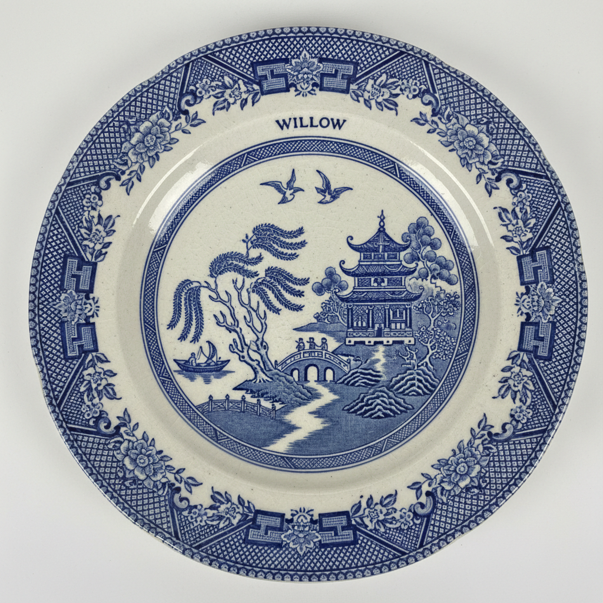

# Transfer Ware Art 转印陶瓷艺术

> "Transfer printing democratized beauty — bringing fine decoration to every table in the land." — English pottery tradition

## 概述

转印陶瓷艺术（Transfer Ware Art）是18世纪英国发明的一种陶瓷装饰技术——通过将铜版雕刻的图案转印到陶瓷表面，实现了精细装饰的大规模生产。转印技术是陶瓷工业革命中最重要的发明之一——它使得原本只有手工绘制才能实现的精细图案可以快速、廉价地复制到大量陶器上，从根本上改变了陶瓷装饰的生产方式和消费模式。

转印技术的原理是：先在铜版上雕刻图案，然后用特制的陶瓷颜料在铜版上印刷到薄纸上，再将湿润的印刷纸贴到陶器表面，图案就转移到了器物上。经过烧制后，图案永久固定在釉面上或釉下。最著名的转印陶瓷是英国的"蓝白转印"（Blue and White Transferware）——蓝色钴料在白色陶器上的转印装饰，其中"柳树图案"（Willow Pattern）是最广为人知的设计。

转印陶瓷艺术的核心要素包括：1）铜版雕刻——精细的铜版图案雕刻；2）纸张转印——从铜版到纸再到陶器的转印过程；3）工业化生产——大规模复制的能力；4）蓝白经典——蓝色转印的经典风格；5）叙事图案——风景、建筑、故事的叙事性图案；6）中国风——大量模仿中国风格的设计；7）民主化——将精美装饰带给普通家庭。

## 核心特征

| 特征 | 描述 |
|------|------|
| 铜版雕刻 | 精细铜版图案雕刻 |
| 纸张转印 | 铜版到纸到陶器转印 |
| 工业化生产 | 大规模复制能力 |
| 蓝白经典 | 蓝色转印经典风格 |
| 叙事图案 | 风景建筑故事叙事 |
| 民主化 | 精美装饰普及家庭 |

## 视觉特征

- **精细线条**：铜版雕刻的精细线条
- **蓝白色调**：经典的钴蓝与白色
- **风景图案**：英国乡村和异国风景
- **中国风**：模仿中国风格的图案
- **边框装饰**：精美的边框花纹
- **均匀一致**：批量生产的均匀品质

## 代表作品

| 作品 | 年代 | 意义 |
|------|------|------|
| *柳树图案* (Willow Pattern) | 1780年代 | 最著名的转印设计 |
| *意大利风景系列* (Italian) | 19世纪初 | Spode经典 |
| *蓝色多瑙河* | 19世纪 | 流行图案 |
| *Spode蓝白转印* | 1784至今 | 品牌经典 |
| *Wedgwood转印* | 18世纪末至今 | 工业先驱 |
| *当代转印陶瓷* | 21世纪 | 传统延续 |

## 历史时间线

| 时期 | 事件 |
|------|------|
| 1750年代 | 转印技术在英国发明 |
| 1780年代 | 蓝白转印陶瓷商业化 |
| 1790年代 | 柳树图案设计 |
| 19世纪初 | 转印陶瓷大规模出口 |
| 19世纪中期 | 多色转印技术发展 |
| 20世纪 | 丝网印刷和贴花取代 |
| 当代 | 收藏和艺术复兴 |

## 中国语境

转印陶瓷与中国陶瓷有着深刻的历史联系。英国转印陶瓷的发明本身就是为了模仿中国青花瓷——18世纪英国对中国瓷器的巨大需求催生了本土替代品的开发，转印技术使得英国陶器可以廉价地模仿中国青花的蓝白效果。最著名的"柳树图案"就是一个想象中的"中国故事"——虽然它从未在中国存在过，却成为了西方人心目中"中国风"的代表。讽刺的是，这种英国发明的"中国风"图案后来又被出口到中国——形成了一个有趣的文化循环。转印技术对中国陶瓷产业也产生了深远影响——景德镇在20世纪引入了贴花技术（转印的现代版本），大大提高了日用瓷的装饰效率。

## 概念图

## 与其他风格的关系

- **Chinese Blue-and-White** → 中国青花瓷（模仿对象）
- **Chinoiserie** → 中国风（设计来源）
- **Wedgwood** → 韦奇伍德（工业先驱）
- **Delft** → 代尔夫特（蓝白传统）
- **Industrial Revolution** → 工业革命
- **Willow Pattern** → 柳树图案

---

*浮光艺志 | Chronicle of Artistry*
