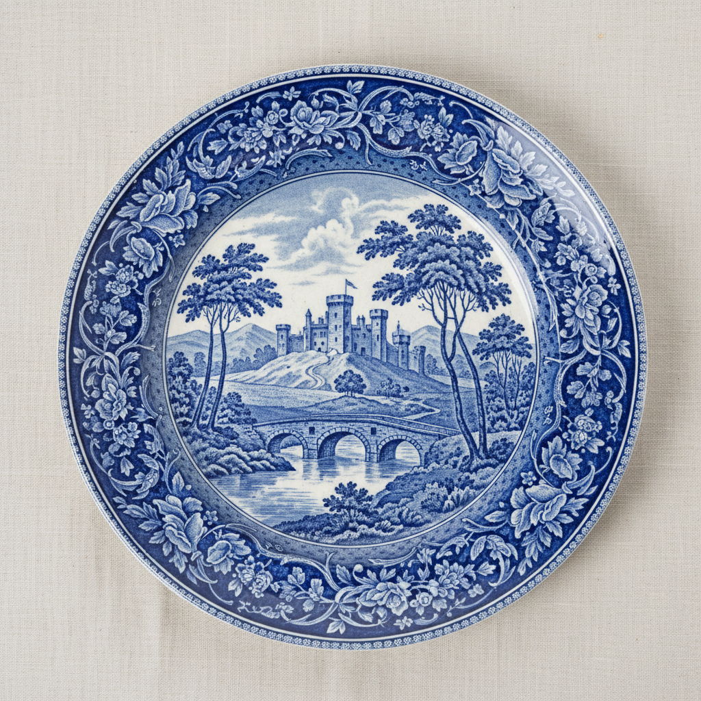

# Transferware Art 转印陶艺术

> "Transferware is printing pressed into clay — an engraved copper plate is inked, printed onto tissue paper, then carefully laid onto a glazed ceramic surface so that the image transfers permanently into the glaze, allowing the mass production of intricately detailed scenes that would take a painter hours to execute by hand, democratizing decorated pottery and filling Victorian homes with blue willow patterns and romantic landscapes." — Unknown

## 概述

转印陶艺术（Transferware Art）是一种将铜版雕刻的图案通过转印纸转移到陶瓷釉面上的装饰技法——先在雕刻好的铜版上涂墨，印在薄纸上，然后将薄纸贴在陶瓷表面使图案转移，最后烧制使图案永久固定。转印技术使精细复杂的图案能够大量复制，极大地降低了装饰陶瓷的成本，是工业革命时期陶瓷装饰的重大创新。

转印陶艺术的实践包括：1）铜版雕刻——在铜版上雕刻精细图案；2）涂墨——在铜版上涂抹颜料；3）印刷——将图案印在薄纸上；4）转印——将薄纸贴在陶瓷表面；5）烧制——烧制使图案固定；6）蓝白——最经典的蓝白转印；7）当代转印——将传统技法与现代设计结合。

## 核心特征

| 特征 | 描述 |
|------|------|
| 转印 | 铜版转印技术 |
| 批量 | 可批量复制 |
| 精细 | 精细的雕刻图案 |
| 蓝白 | 经典的蓝白色调 |
| 工业 | 工业革命的产物 |
| 平民 | 使装饰陶瓷平民化 |

## 视觉特征

- **精细**：铜版雕刻的精细线条
- **蓝白**：经典的蓝白色调
- **叙事**：风景和叙事场景
- **均匀**：均匀一致的图案
- **复杂**：复杂精细的构图
- **边框**：装饰性的边框图案

## 代表作品

| 作品 | 艺术家/文化 | 年代 | 意义 |
|------|-------------|------|------|
| *Blue Willow pattern* | 英国 | 1780年代 | 蓝色柳树图案 |
| *Spode Italian* | 英国 | 1816年 | 斯波德意大利风景 |
| *Staffordshire transferware* | 英国 | 19世纪 | 斯塔福德郡转印陶 |
| *Flow Blue* | 英国 | 19世纪 | 流蓝转印陶 |
| *Contemporary transferware* | 国际 | 当代 | 当代转印陶 |

## 历史时间线

| 时期 | 事件 |
|------|------|
| 1750年代 | 转印技术在陶瓷上的早期应用 |
| 1780年代 | 蓝色柳树图案的出现 |
| 19世纪 | 转印陶的大规模生产 |
| 维多利亚时代 | 转印陶的黄金时代 |
| 当代 | 转印技术的延续和创新 |

## 中国语境

转印陶与中国的陶瓷装饰有一定的关联。中国的青花瓷——蓝色柳树图案直接受中国青花瓷的影响。中国的贴花瓷——现代中国陶瓷工业中广泛使用的贴花技术与转印有相似的原理。中国的陶瓷出口——中国青花瓷对英国转印陶的蓝白风格有直接的影响。中国的陶瓷教育中，转印技术作为陶瓷装饰工业化的重要里程碑——在相关课程中介绍。中国当代的陶艺家——有一些使用转印技术进行创作。中国的日用陶瓷工业——广泛使用现代版本的转印技术。

## AI生成概念图

## 与其他风格的关系

- **Blue Willow** → 蓝色柳树
- **Creamware** → 奶油色陶
- **Engraving** → 雕版
- **Industrial Ceramics** → 工业陶瓷
- **Blue and White** → 青花
- **Printmaking** → 版画

---

*浮光艺志 | Chronicle of Artistry*
