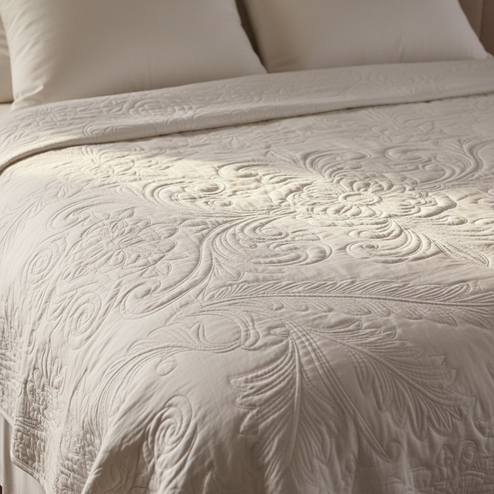

# Trapunto Art 浮雕绗缝艺术

> "Trapunto is quilting that breathes — by stuffing selected areas of a stitched design with extra batting or cord, the quilter creates raised, sculptural surfaces that catch light and cast shadow. What was flat becomes dimensional; what was pattern becomes relief. Trapunto transforms a quilt from a warm covering into a textile bas-relief, where the play of light across padded surfaces reveals hidden depths in the simplest of designs." — Unknown

## 概述

浮雕绗缝艺术（Trapunto Art）是一种通过在绗缝图案的特定区域填充额外的棉絮或绳索来创造浮雕效果的绗缝技法——使平面的绗缝作品产生立体的雕塑感。Trapunto（意大利语意为"绗缝"）起源于意大利，是最具装饰性的绗缝技法之一。

浮雕绗缝艺术的实践包括：1）填充式trapunto——在封闭区域填入额外棉絮；2）绳索式trapunto——在通道中穿入绳索创造线性浮雕；3）意大利式绗缝——传统的双层织物绳索填充；4）全白trapunto——白布白线的纯浮雕效果；5）彩色trapunto——结合色彩和浮雕的现代做法；6）微型trapunto——极小尺度的精细浮雕；7）当代trapunto——将传统技法与现代设计结合的创作。

## 核心特征

| 特征 | 描述 |
|------|------|
| 浮雕 | 立体的浮雕效果 |
| 光影 | 依赖光影表现 |
| 填充 | 局部额外填充 |
| 雕塑 | 纺织品的雕塑感 |
| 精密 | 精密的针法控制 |
| 意大利 | 意大利传统工艺 |

## 视觉特征

- **浮雕**：凸起的立体图案
- **光影**：光影的微妙变化
- **柔软**：柔软的雕塑质感
- **白色**：传统的全白效果
- **精细**：精细的绗缝线条
- **优雅**：极致优雅的美感

## 代表作品

| 作品 | 艺术家/文化 | 年代 | 意义 |
|------|-------------|------|------|
| *Sicilian quilts* | 意大利 | 14世纪 | 西西里绗缝 |
| *Tristan Quilt* | 意大利 | 14世纪 | 特里斯坦绗缝 |
| *Marseilles quilts* | 法国 | 18世纪 | 马赛绗缝 |
| *American whole-cloth quilts* | 美国 | 18-19世纪 | 美国全布绗缝 |
| *Contemporary trapunto* | 当代 | 当代 | 当代浮雕绗缝 |

## 历史时间线

| 时期 | 事件 |
|------|------|
| 14世纪 | Trapunto在意大利的起源 |
| 17-18世纪 | 在欧洲的传播和发展 |
| 18-19世纪 | 在北美的流行 |
| 20世纪 | 机器绗缝对手工的冲击 |
| 当代 | Trapunto的艺术化复兴 |

## 中国语境

浮雕绗缝艺术在中国有一定的传统基础。中国传统的"绗缝"（纳被子）中有类似trapunto的填充技法——通过在特定区域增加填充物创造立体效果。中国的一些地区传统中有"堆花"技法——将棉花堆成图案再覆盖织物，与trapunto原理相似。中国当代的绗缝艺术家开始探索trapunto技法——将其与中国传统图案结合创造新的表达。中国的家纺设计中，trapunto效果被广泛应用——在床品和靠垫中创造高端的浮雕质感。中国的一些手工艺社区开始教授trapunto技法——将其作为绗缝技能的进阶课程。

## AI生成概念图

## 与其他风格的关系

- **Quilting** → 绗缝艺术
- **Whitework** → 白色刺绣
- **Textile Sculpture** → 纺织雕塑
- **Italian Art** → 意大利艺术
- **Relief Art** → 浮雕艺术
- **Fiber Art** → 纤维艺术

---

*浮光艺志 | Chronicle of Artistry*
