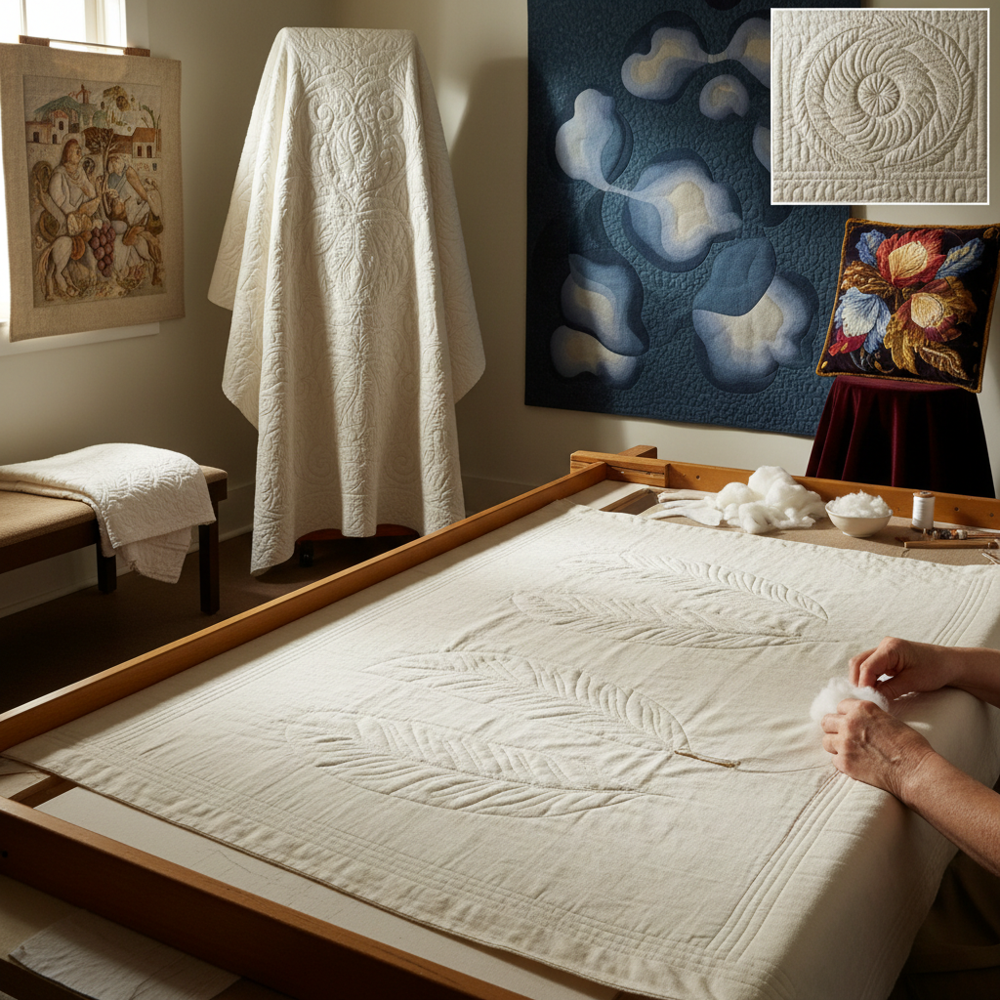

# Trapunto Quilting 浮雕绗缝

> "Trapunto is sculpture in cloth — areas of a quilt stuffed from behind to rise above the surface like bas-relief, creating shadows and highlights that transform flat fabric into a landscape of light, where the quilting line becomes a sculptor's chisel carving dimension from softness." — Unknown

## 概述

浮雕绗缝（Trapunto），也称为填充绗缝（Stuffed Quilting），是一种通过在绗缝图案的特定区域从背面填充额外的填充物（棉花、毛线或聚酯纤维），使这些区域凸起于表面，形成浮雕效果的绗缝技法。Trapunto一词来自意大利语"to quilt"（绗缝）。

浮雕绗缝的历史可以追溯到14世纪的意大利——西西里岛的Tristan Quilt（约1360年）是现存最早的浮雕绗缝作品之一。这种技法在17-18世纪的欧洲（特别是意大利、法国和英国）达到鼎盛——用于床罩、婴儿毯和服装。浮雕绗缝通常使用白色或浅色织物，依靠光影效果而非颜色来创造视觉效果。当代浮雕绗缝结合了传统技法和现代缝纫机技术。

## 核心特征

| 特征 | 描述 |
|------|------|
| 浮雕 | 凸起的浮雕效果 |
| 填充 | 背面填充技法 |
| 光影 | 依靠光影表现 |
| 白色 | 传统白色织物 |
| 精细 | 精细的绗缝线条 |
| 雕塑 | 织物的雕塑感 |

## 视觉特征

- **浮雕**：凸起的立体浮雕
- **光影**：光影的戏剧效果
- **白色**：纯白的优雅
- **线条**：精细的绗缝线条
- **柔软**：柔软的雕塑质感
- **典雅**：古典的典雅气质

## 代表作品

| 作品 | 艺术家 | 年代 | 意义 |
|------|--------|------|------|
| *Tristan Quilt* | Unknown | 约1360年 | 最早的浮雕绗缝 |
| *Sicilian quilts* | 意大利工匠 | 14-15世纪 | 西西里浮雕绗缝 |
| *Whitework trapunto* | 欧洲工匠 | 17-18世纪 | 白色浮雕绗缝 |
| *Bridal quilts* | Various | 传统 | 新娘浮雕绗缝 |
| *Contemporary trapunto art* | Various | 当代 | 当代浮雕绗缝艺术 |

## 历史时间线

| 时期 | 事件 |
|------|------|
| 14世纪 | 意大利浮雕绗缝的起源 |
| 17-18世纪 | 欧洲浮雕绗缝的鼎盛 |
| 18-19世纪 | 美国殖民地的浮雕绗缝 |
| 20世纪 | 浮雕绗缝的衰落和复兴 |
| 当代 | 机器辅助浮雕绗缝的发展 |

## 中国语境

浮雕绗缝在中国的传统纺织中有类似的技法——中国传统的"绗缝"（quilting）技法用于制作棉被和棉衣。虽然中国传统绗缝不强调浮雕效果，但当代中国的拼布（patchwork）和绗缝社区开始学习和实践trapunto技法。中国的一些高端家纺品牌在产品中使用浮雕绗缝效果。中国的手工绗缝爱好者通过网络课程和工作坊学习这种技法。

## AI生成概念图

## 与其他风格的关系

- **Quilting** → 绗缝
- **Whitework** → 白色刺绣
- **Bas-Relief** → 浅浮雕
- **Textile Sculpture** → 纺织雕塑
- **Patchwork** → 拼布
- **Embroidery** → 刺绣

---

*浮光艺志 | Chronicle of Artistry*
