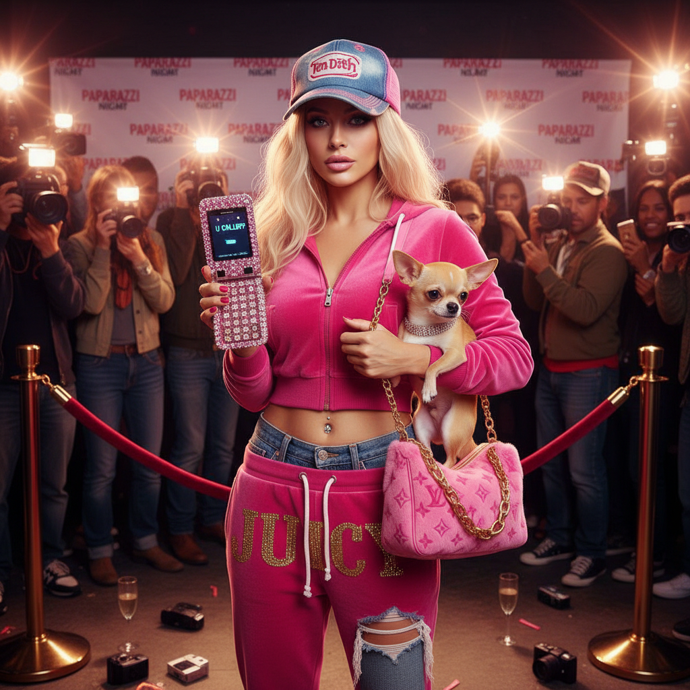

# Trashy Y2K 垃圾千禧



> **"低腰牛仔裤、亮片手机壳、Von Dutch 卡车帽——2000年代最不体面也最自由的时刻。"**

## 概述

| 维度 | 描述 |
|------|------|
| 时期 | 2000–2007 |
| 别名 | Trashy Y2K, Paris Hilton Era, Celebutante, Bimbocore |
| 核心色彩 | 粉色、金色、豹纹、水钻银、晒黑棕 |
| 关键元素 | 低腰裤、Juicy Couture 天鹅绒套装、Von Dutch、翻盖手机 |
| 代表人物 | Paris Hilton、Nicole Richie、Lindsay Lohan、Britney Spears |
| 关联风格 | McBling, Coquette Y2K, Barbiecore, Indie Sleaze |

---

## 历史脉络

### 2000–2007：名媛时代

Trashy Y2K 是 2000 年代中期**真人秀名媛文化**的视觉产物：

| 年份 | 事件 |
|------|------|
| 2003 | 《The Simple Life》首播，Paris & Nicole 成为文化符号 |
| 2004 | Von Dutch 卡车帽达到巅峰 |
| 2005 | Juicy Couture 天鹅绒套装无处不在 |
| 2006 | Lindsay/Paris/Britney "三人组"狗仔文化巅峰 |
| 2007 | Britney 剃头事件，时代终结的象征 |

### 文化基因

| 来源 | 贡献 |
|------|------|
| 真人秀 | 将"有钱但没品味"变成美学 |
| 狗仔文化 | TMZ、Perez Hilton 的兴起 |
| 翻盖手机 | Sidekick、Razr 作为时尚配件 |
| 快时尚 | Forever 21、Charlotte Russe |
| 八卦杂志 | Us Weekly、Star Magazine |

### 核心哲学

Trashy Y2K 的精神是**"有钱、不在乎、享乐"**：
- "That's hot" — Paris Hilton 的口头禅
- 越闪越好、越露越好、越粉越好
- 品味是可选的，态度是必须的
- 这是一种"故意的坏品味"——知道它俗，但就是要这样

---

## 视觉语法

### 色彩系统

```
主色：
  芭比粉 (#FF69B4) — 一切都是粉色的
  金色 (#FFD700) — 珠宝、logo
  豹纹 (图案) — 动物纹理
  水钻银 (#C0C0C0) — 闪闪发光
  晒黑棕 (#D2691E) — 美黑文化

辅色：
  白色 (#FFFFFF) — Juicy 套装
  黑色 (#000000) — 墨镜、limo
  紫色 (#800080) — 夜店

质感：
  天鹅绒 — Juicy Couture
  水钻/亮片 — 一切都要闪
  豹纹/斑马纹 — 动物纹
  PVC/漆皮 — 夜店风
  logo 满印 — 品牌崇拜
```

### 标志性元素

| 类别 | 元素 |
|------|------|
| 服装 | 低腰牛仔裤、Juicy 天鹅绒套装、迷你裙、crop top |
| 配饰 | Von Dutch 帽、大号太阳镜、水钻手机壳、小狗包 |
| 科技 | T-Mobile Sidekick、Motorola Razr、iPod Mini |
| 美容 | 美黑、法式美甲、唇彩、直发 |
| 宠物 | 吉娃娃（放在包里） |
| 场所 | 夜店VIP、红毯、购物中心、tanning salon |

---

## 与千禧怀旧的关系

### 2020s 的 Bimbocore 复兴
- TikTok 上的 "bimbo" 正名运动
- Paris Hilton 的形象重塑（从"蠢金发"到"商业天才"）
- 低腰裤的回归
- "Trashy" 不再是贬义——它是一种选择

### 与 McBling 的区别
- McBling = 更广泛的 2000s 闪亮文化
- Trashy Y2K = 特指名媛/真人秀的"坏品味"美学
- McBling 可以是 Beyoncé 的优雅闪亮
- Trashy Y2K 是 Paris Hilton 的"故意俗气"

---

## 中国语境

- "辣妹风"/"Y2K辣妹"穿搭
- 2000年代港台明星的类似风格
- 蔡依林早期的"舞娘"造型
- 小红书上的"千禧辣妹"标签
- 与当下"多巴胺穿搭"的交叉

---

## 设计应用

| 场景 | 应用方式 |
|------|----------|
| 品牌 | 粉色+金色+水钻+手写logo+豹纹 |
| 包装 | 亮片+粉色+透明PVC+闪光 |
| 摄影 | 闪光灯+粉色滤镜+狗仔风格 |
| 数字 | 闪光效果+粉色渐变+Y2K字体 |

---

## 相关风格

← [McBling 千禧闪耀](mcbling.md) | [Coquette Y2K 千禧风情](coquette-y2k.md) →

↑ [返回千禧怀旧目录](README.md) | [返回总目录](../README.md)
