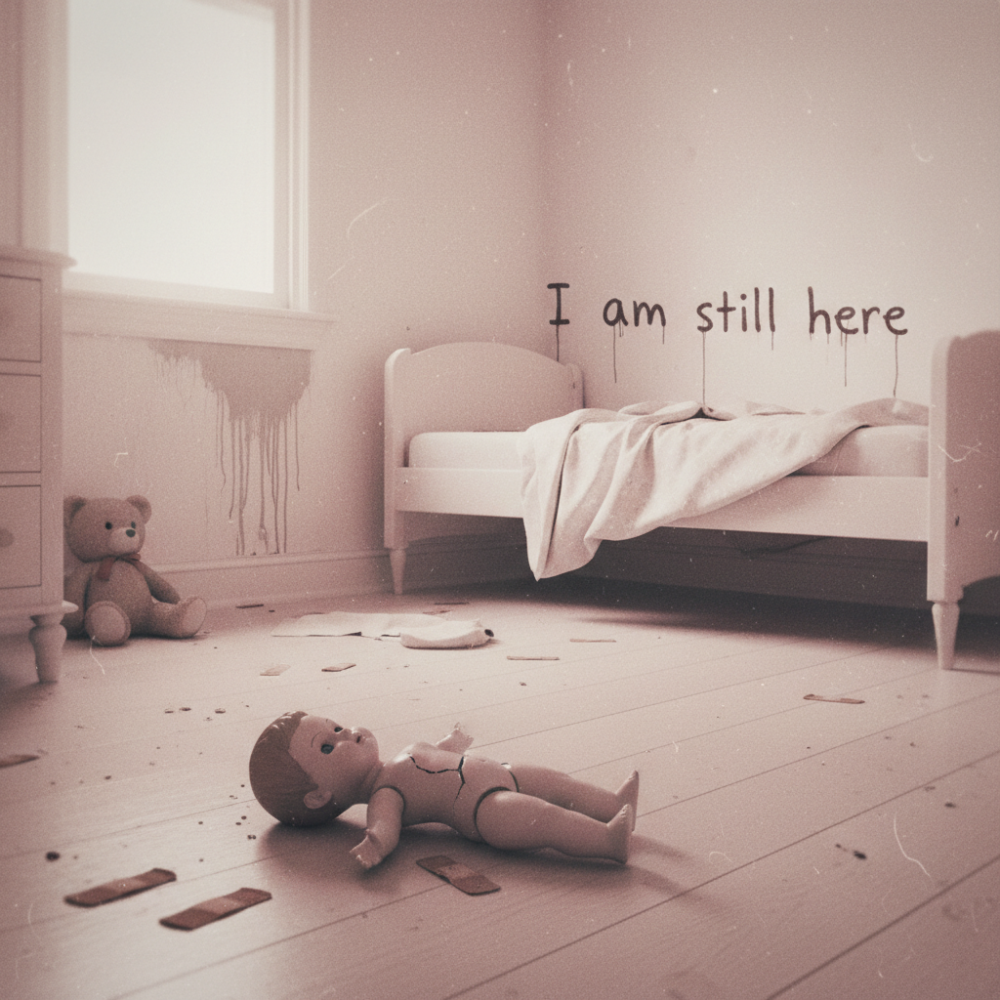

# Traumacore 创伤核



> **"破碎的娃娃、模糊的童年照片、墙上的涂鸦文字——用美学语言说出无法开口的痛。"**

## 概述

| 维度 | 描述 |
|------|------|
| 时期 | 2019–至今 |
| 别名 | Traumacore, Vent Art, Hurt/Comfort Aesthetic |
| 核心色彩 | 粉色（被污染的）、白色（过曝的）、红色（血/伤） |
| 关键元素 | 破碎娃娃、模糊照片、手写文字、童年物品 |
| 代表人物 | 匿名 Tumblr/Pinterest 创作者 |
| 关联风格 | Weirdcore, Dreamcore, Kidcore (暗面), Liminal Space |

---

## 历史脉络

### 2019：Tumblr/Pinterest 的情绪出口

Traumacore 在 2019 年左右作为一种视觉表达方式出现，是**用美学拼贴处理创伤经历**的尝试：

- 将童年创伤视觉化
- 用"可爱"的元素（娃娃、粉色）包裹痛苦
- 手写文字表达无法说出口的话
- 模糊/过曝的照片 = 被压抑的记忆

### 核心特征

| 元素 | 含义 |
|------|------|
| 破碎的娃娃 | 被损坏的童年/纯真 |
| 粉色+血红 | 甜美与暴力的并存 |
| 模糊照片 | 被压抑/扭曲的记忆 |
| 手写文字 | 私密的、未经修饰的表达 |
| 过曝/褪色 | 记忆的不可靠性 |
| 空房间 | 孤独、被遗弃 |

### 争议与关怀

Traumacore 是一个**有争议的美学**：
- **支持者**：它提供了一种安全的方式来处理和表达创伤
- **批评者**：它可能美化痛苦、触发他人、或阻碍真正的治愈
- **共识**：它反映了一代人对心理健康的关注和去污名化

---

## 视觉语法

### 色彩系统

```
主色（全部带有"被污染"的质感）：
  粉色 (#FFB6C1) — 但被弄脏/褪色
  白色 (#FFFFFF) — 过曝、刺眼
  红色 (#FF0000) — 血、伤口、愤怒
  黑色 (#000000) — 涂抹、遮挡

辅色：
  肤色 (#FFDAB9) — 身体
  灰色 (#808080) — 灰尘、遗忘
  黄色 (#FFFF00 褪色) — 旧照片

质感：
  模糊/失焦 — 被压抑的记忆
  过曝/褪色 — 时间的侵蚀
  撕裂/破碎 — 创伤
  手写/涂鸦 — 私密表达
  颗粒/噪点 — 旧照片、VHS
```

### 标志性元素

| 类别 | 元素 |
|------|------|
| 物品 | 破碎娃娃、旧玩具、创可贴、药瓶 |
| 照片 | 模糊童年照、过曝自拍、空房间 |
| 文字 | 手写日记、墙上涂鸦、便签纸 |
| 身体 | 创可贴、绷带、拥抱、蜷缩 |
| 空间 | 空荡的儿童房、医院、浴室 |
| 情绪 | 孤独、恐惧、渴望被爱、愤怒 |

---

## 与千禧怀旧的关系

### 童年的暗面
- 千禧怀旧通常是"快乐的童年回忆"
- Traumacore 是"不快乐的童年回忆"
- 它提醒我们：不是所有人的童年都是美好的
- 用千禧时代的视觉符号（娃娃、粉色）表达创伤

### 与 Kidcore 的对比
- Kidcore = 童年是快乐的，我想回去
- Traumacore = 童年是痛苦的，但我需要面对它

---

## 中国语境

- "emo"/"丧"文化中的视觉表达
- 心理健康话题的去污名化
- 小红书/微博上的"情绪出口"内容
- 与"发疯文学"的情绪共振
- 对"完美童年叙事"的质疑

---

## ⚠️ 内容提醒

Traumacore 内容可能涉及创伤、心理健康等敏感话题。如果你正在经历困难，请寻求专业帮助。

---

## 相关风格

← [Weirdcore 怪核](dreamcore-weirdcore.md) | [Liminal Space 阈限空间](liminal-space.md) →

↑ [返回千禧怀旧目录](README.md) | [返回总目录](../README.md)
