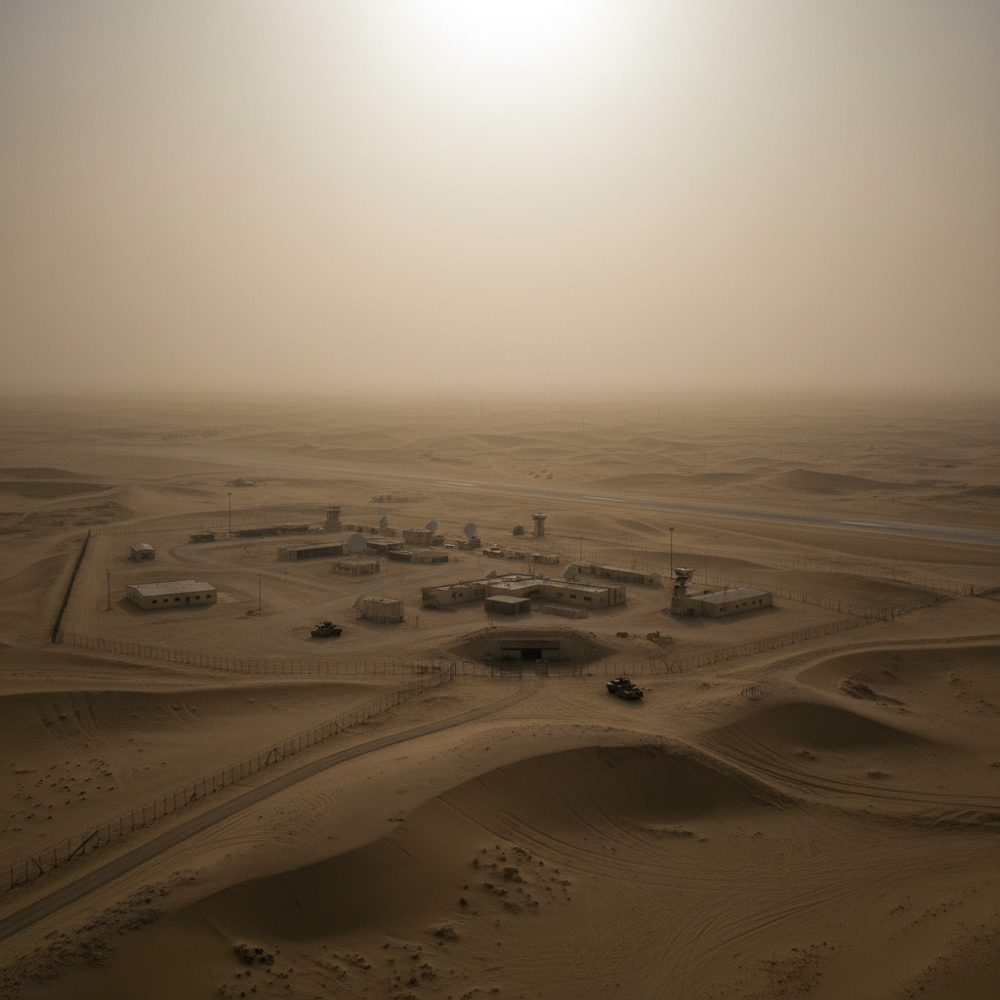

# Trevor Paglen 特雷弗·帕格伦

> **时期：** 1974–至今  
> **关键词：** 监控美学、机器视觉、隐秘地理、AI训练集

## 概述

Trevor Paglen 是美国艺术家和地理学家，以揭示隐秘的监控基础设施而闻名。他用长焦镜头拍摄秘密军事基地、追踪间谍卫星的轨迹、潜入海底拍摄光纤电缆、研究AI面部识别的训练数据集——将不可见的权力结构转化为可见的图像。

## 风格特征

- **极限摄影**：用天文望远镜拍摄数十公里外的秘密设施
- **机器视觉**：展示AI和算法"看到"的世界
- **隐秘基础设施**：海底电缆、数据中心、卫星等不可见网络
- **美学与政治**：美丽的图像背后是监控和权力
- **数据可视化**：将抽象的数据集转化为视觉体验

## 代表作品

- *Limit Telephotography*系列（2005–至今）
- *The Other Night Sky*（2007–至今）
- *ImageNet Roulette*（2019）
- *Orbital Reflector*（2018）

## 概念图

