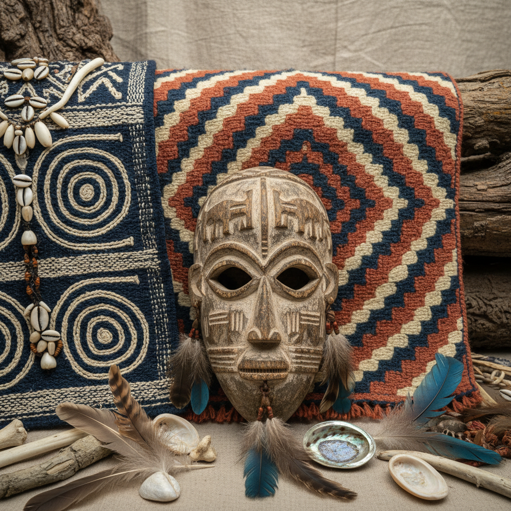

# Tribal Aesthetic 部落美学



> **"几何纹身、大地色编织、图腾面具——人类最古老的视觉语言。"**

## 概述

| 维度 | 描述 |
|------|------|
| 时期 | 史前起源 / 1990s 流行文化 / 2010s 争议 |
| 别名 | Tribal, Ethnic, Indigenous Art, Global South Aesthetic |
| 核心色彩 | 赭石、黑色、白色、深红、靛蓝 |
| 关键元素 | 几何图案、图腾、编织、面具、羽毛 |
| 代表人物 | 非洲面具、毛利纹身、纳瓦霍编织 |
| 关联风格 | Boho Chic, Afrofuturism, Dark Folk, Maximalism |

---

## 历史脉络

### 从原住民文化到全球设计

| 年份 | 事件 |
|------|------|
| 史前 | 人类最早的装饰——身体彩绘、洞穴壁画 |
| 1907 | 毕加索看到非洲面具——立体主义诞生 |
| 1990s | "Tribal" 纹身在西方流行 |
| 2000s | 部落图案进入快时尚 |
| 2015 | 文化挪用争议爆发 |
| 2020s | 从"Tribal"到"Indigenous Art"的话语转变 |

### 核心哲学

Tribal Aesthetic 的精神是**"每一个图案都有意义——它不是装饰，是身份"**：
- 图案 = 故事（家族、部落、精神）
- 手工 = 神圣（制作过程本身是仪式）
- 自然 = 材料来源和灵感
- "这不是'风格'——这是文化"
- 当代语境：尊重来源 vs 文化挪用

---

## 视觉语法

### 色彩系统

```
主色：
  赭石 (#CC7722) — 大地、泥土
  黑色 (#000000) — 炭、力量
  白色 (#FFFFFF) — 骨、贝壳
  深红 (#8B0000) — 血、生命
  靛蓝 (#1B3A5C) — 天空、深邃

辅色：
  金色 (#B8860B) — 太阳、装饰
  绿色 (#2E7D32) — 植物、生命
  棕色 (#5D4037) — 木材、皮革

质感：
  编织 — 纺织、篮子
  雕刻 — 木材、骨头
  泥土 — 陶器、建筑
  皮革 — 服装、鼓面
  羽毛 — 装饰、仪式
```

### 标志性元素

| 类别 | 元素 |
|------|------|
| 图案 | 几何重复、锯齿形、螺旋、同心圆 |
| 物件 | 面具、图腾柱、鼓、编织品 |
| 身体 | 纹身、身体彩绘、穿孔、疤痕 |
| 材料 | 木材、骨头、贝壳、羽毛、泥土 |
| 符号 | 太阳、蛇、鹰、生命之树 |
| 传统 | 非洲、大洋洲、美洲原住民、东南亚 |

---

## 与千禧怀旧的关系

### 文化挪用的觉醒
- 1990s–2000s：无意识地使用"Tribal"元素
- 2015+：文化挪用争议改变了话语
- 从"Tribal print"到"Indigenous-inspired"
- 当代设计：合作 > 挪用

### 对现代设计的影响
- 非洲图案在当代时尚中的合法化
- 原住民艺术家获得更多话语权
- "全球南方"美学的重新评价
- 从"原始"到"经典"的认知转变

---

## 中国语境

- 中国少数民族纺织/图案的丰富传统
- 苗族银饰、藏族唐卡、彝族漆器
- 与"民族风"/"非遗"的关系
- 中国版文化挪用讨论
- 少数民族设计师的当代实践

---

## 设计应用

| 场景 | 应用方式 |
|------|----------|
| 时尚 | 合作+尊重来源+手工+天然材质 |
| 空间 | 编织品+天然材料+几何图案+手工 |
| 品牌 | 与原住民社区合作+故事+传承 |
| 数字 | 几何图案+大地色+文化叙事 |

---

## 相关风格

← [Boho Chic 波西米亚时尚](boho-chic.md) | [Afrofuturism 非洲未来主义](afrofuturism.md) →

↑ [返回千禧怀旧目录](README.md) | [返回总目录](../README.md)
