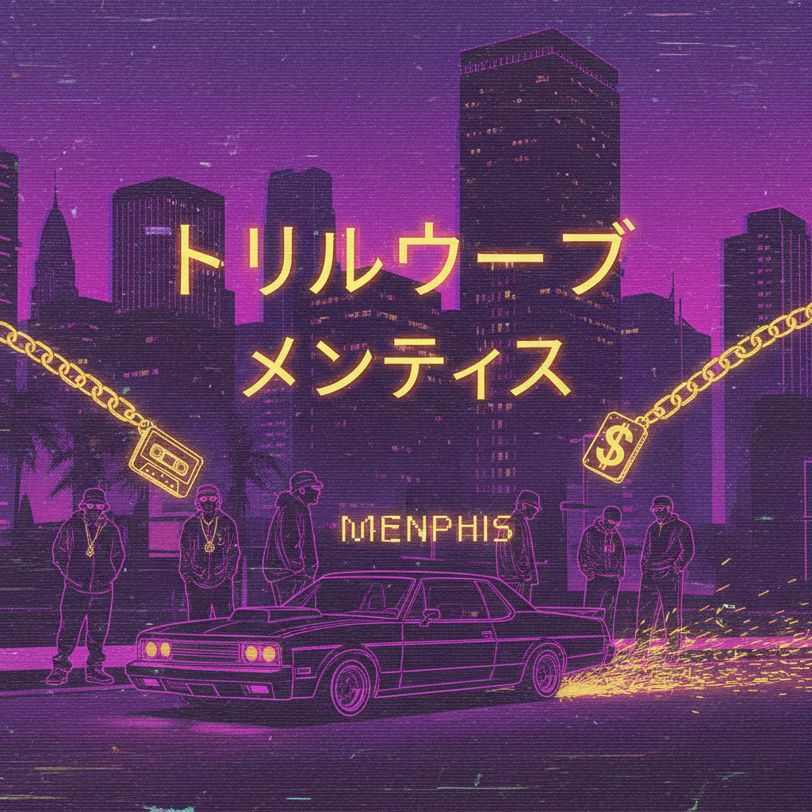

# Trillwave

> **别名**：Vaportrap, Memphis Rap Revival, Phonk, Swag Era  
> **活跃年代**：2012 – 至今  
> **起源**：SoundCloud / YouTube 地下嘻哈社区

---

## 一句话定义

Trillwave 是 Vaporwave 与南方嘻哈（Trap/Memphis Rap）的混血产物——将 90 年代 Three 6 Mafia 式的暗黑节拍与 Vaporwave 的怀旧视觉滤镜融合，创造出一种**紫色迷雾中的街头幻觉**。

---

## 视觉语言

| 元素 | 描述 |
|------|------|
| 色彩 | 紫色、深蓝、品红、金色——"紫药水"色调 |
| 滤镜 | VHS 噪点、扫描线、色彩偏移、低分辨率 |
| 图像 | 90s 嘻哈明星照片、豪车、金链、紫色饮料（Lean） |
| 品牌 | Nike、PlayStation、Windows 95、日本动漫截图 |
| 字体 | 日文片假名混搭英文、全角字符、Gothic 字体 |
| 空间 | 夜间城市街道、霓虹灯、停车场、便利店 |

---

## 历史时间线

| 时期 | 事件 |
|------|------|
| 2011-2012 | Vaporwave 和 Seapunk 在 Tumblr 兴起 |
| 2012-2013 | SoundCloud 上出现 Vaporwave + Trap 的混合实验 |
| 2013-2015 | "Phonk" 作为子流派确立，DJ Smokey、SpaceGhostPurrp 等 |
| 2015-2018 | Trillwave 视觉在 YouTube 混音频道中标准化 |
| 2019-2022 | Drift Phonk 爆发，TikTok 上 Phonk 音乐病毒式传播 |
| 2023+ | 风格成熟，影响主流嘻哈 MV 视觉 |

---

## 文化内核

### Vaporwave 的街头兄弟

如果 Vaporwave 是对白领消费主义的讽刺性怀旧，Trillwave 则是对**街头文化黄金时代**的同类操作：
- Vaporwave 怀念商场 → Trillwave 怀念街角
- Vaporwave 采样 Muzak → Trillwave 采样 Memphis Rap
- Vaporwave 用希腊雕像 → Trillwave 用 90s 嘻哈明星

### Chopped & Screwed 的数字化

Trillwave 的音乐手法直接继承了休斯顿 DJ Screw 的"减速+切碎"技术，但将其从物理磁带转移到了数字领域，并叠加了 Vaporwave 的混响和失真处理。

### 紫色的含义

紫色在 Trillwave 中不仅是审美选择，更是文化符号：
- **Lean/Purple Drank**：南方嘻哈文化中的标志性饮品
- **Prince**：紫色作为音乐传奇的象征
- **夜晚**：街头文化的活跃时段
- **迷幻**：介于清醒和梦境之间的状态

---

## 与其他风格的关系

- **Vaporwave**：直接母体，共享怀旧手法和 VHS 美学
- **Synthwave**：共享霓虹夜景，但 Trillwave 更"脏"更街头
- **McBling**：共享对 2000s 嘻哈黄金时代的怀念
- **Acid Graphics**：共享扭曲视觉和极端色彩处理

---

## 代表性视觉参考

- DJ Smokey 混音带封面
- YouTube "Phonk Mix" 频道缩略图
- SpaceGhostPurrp 视觉美术
- Ryan Celsius 频道视觉风格

---

## 延伸阅读

- [Aesthetics Wiki - Trillwave](https://aesthetics.fandom.com/wiki/Trillwave)
- 本项目相关：[Vaporwave](vaporwave.md) | [Synthwave](synthwave.md) | [McBling](mcbling.md)
