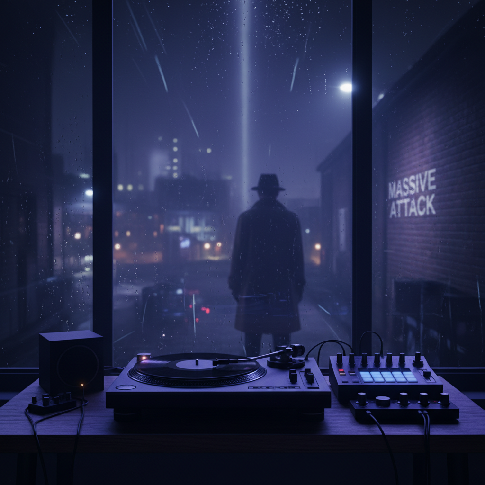

# Trip-Hop 神游舞曲



> **"慢拍鼓机、采样黑胶、午夜布里斯托——电子音乐学会了忧郁。"**

## 概述

| 维度 | 描述 |
|------|------|
| 时期 | 1991–2000s/影响至今 |
| 别名 | Trip-Hop, Bristol Sound, Downtempo |
| 核心色彩 | 深蓝、烟灰、暗紫、黑色、琥珀 |
| 关键元素 | 慢拍节奏、采样、烟雾感、电影化氛围 |
| 代表人物 | Massive Attack, Portishead, Tricky, DJ Shadow |
| 关联风格 | Downtempo, Ambient, Post-Punk, Film Noir |

---

## 历史脉络

| 年份 | 事件 |
|------|------|
| 1991 | Massive Attack "Blue Lines"——Trip-Hop 诞生 |
| 1994 | Portishead "Dummy" / Tricky "Maxinquaye" |
| 1996 | DJ Shadow "Endtroducing....."——纯采样专辑 |
| 1998 | Massive Attack "Mezzanine"——巅峰之作 |
| 2000s | Trip-Hop 影响扩散到电影配乐、广告 |
| 2010s | 作为"氛围音乐"继续影响新一代 |

### 核心哲学

Trip-Hop 的精神是**"电子音乐不需要快——慢下来，让你感受每一个声音"**：
- 慢 = 深度（"BPM 不是一切"）
- 采样 = 考古（"从旧唱片里挖出新灵魂"）
- 氛围 = 目的（"音乐是一种空间"）
- 布里斯托 = 身份（"我们不是伦敦"）
- "如果 Acid House 让你跳舞，Trip-Hop 让你思考"

---

## 视觉语法

### 色彩系统

```
主色：
  深蓝 (#191970) — 午夜、深邃
  烟灰 (#696969) — 烟雾、城市
  暗紫 (#301934) — 神秘、忧郁
  黑色 (#000000) — 阴影

辅色：
  琥珀 (#FFBF00) — 路灯、温暖
  暗红 (#8B0000) — 情感
  银色 (#C0C0C0) — 金属、冷

规则：
  - 暗色调为主
  - 低对比度
  - 电影感（Film Noir）
  - 烟雾/颗粒感

质感：
  烟雾 — 氛围
  胶片颗粒 — 复古
  金属 — 冷感
  丝绒 — 深度
```

### 标志性元素

| 类别 | 元素 |
|------|------|
| 视觉 | 暗色调、烟雾、城市夜景、Film Noir |
| 封面 | 3D渲染(Massive Attack)、暗色摄影、极简 |
| 设备 | 采样器、黑胶唱片、MPC |
| 场景 | 午夜城市、雨天、空旷空间 |
| 音乐 | 慢拍(60-90BPM)、采样、女声、弦乐 |
| 态度 | 忧郁、深邃、电影化、内省 |

---

## 与千禧怀旧的关系

### 90s 英国文化的暗面
- Britpop = 90s 英国的"阳面"（自信、快乐）
- Trip-Hop = 90s 英国的"阴面"（忧郁、内省）
- 两者共同定义了90s英国音乐的全貌
- "如果 Oasis 是周六晚上，Massive Attack 是周日凌晨3点"

### 对视觉文化的影响
- Trip-Hop 的视觉 = 现代"氛围摄影"的起源
- Massive Attack 的封面设计 = 极简主义经典
- 影响了无数电影配乐的视觉语言
- "Trip-Hop 教会了设计师：黑暗也可以是美的"

---

## 中国语境

- Trip-Hop 在中国独立音乐圈的影响
- 与中国"氛围电子"的交叉
- 窦唯后期作品中的 Trip-Hop 元素
- 中国城市夜景摄影中的 Trip-Hop 美学

---

## 设计应用

| 场景 | 应用方式 |
|------|----------|
| 音乐 | 暗色封面+极简+采样+氛围 |
| 摄影 | 暗色调+烟雾+城市夜景+胶片 |
| 电影 | 配乐+Film Noir+氛围+慢节奏 |
| 品牌 | 深邃+神秘+高端+夜间+氛围 |

---

## 相关风格

← [Post-Punk 后朋克](post-punk.md) | [Shoegaze 自赏](shoegaze.md) →

↑ [返回千禧怀旧目录](README.md) | [返回总目录](../README.md)
