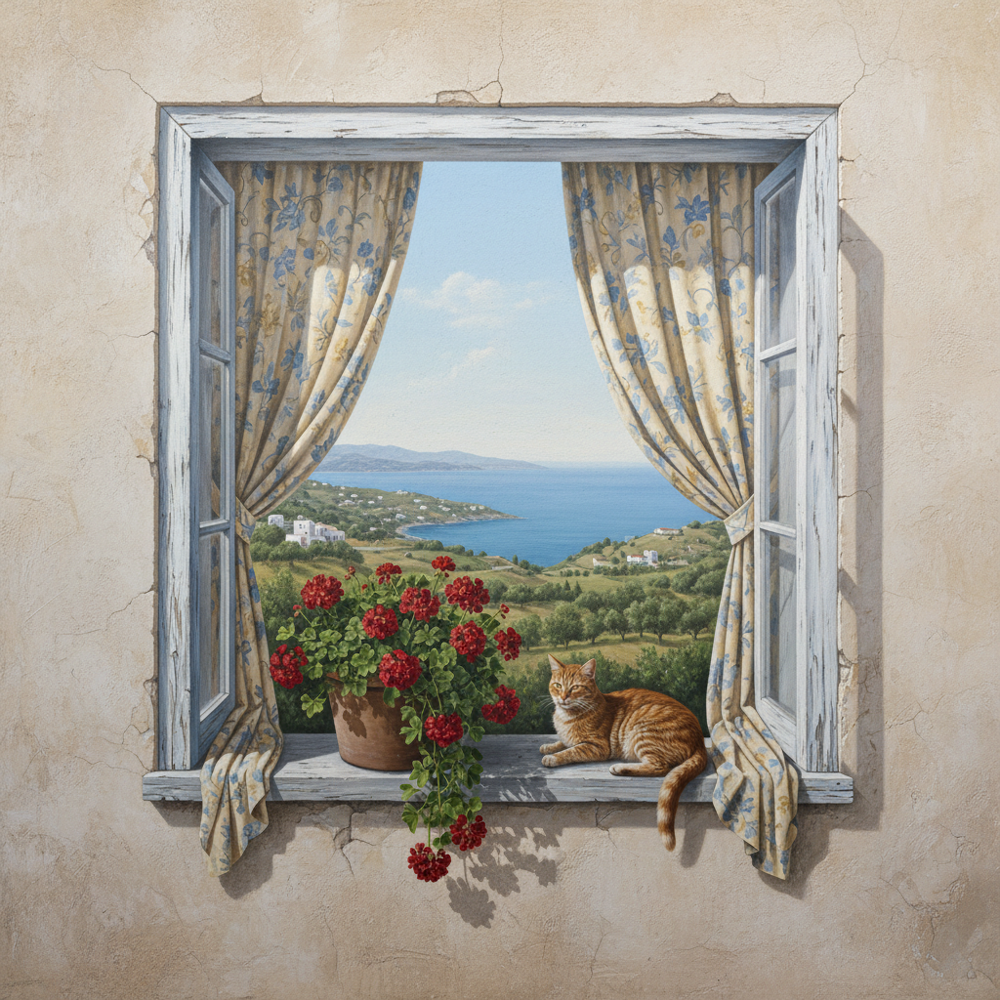

# Trompe-l'œil Art 错视画艺术

> "Trompe-l'œil is the ultimate compliment to the viewer's eye — a painting so convincingly realistic that it deceives the brain into believing the flat surface is three-dimensional. A painted door that invites you to open it, a shelf of books that tempts you to pull one out, a fly on a canvas that you want to brush away. It is art that plays with perception itself, reminding us that seeing is not always believing, and that the boundary between image and reality is thinner than we think." — Unknown

## 概述

错视画艺术（Trompe-l'œil Art）是一种通过极其逼真的绘画技法在平面上创造三维空间错觉的艺术形式——法语"trompe-l'œil"意为"欺骗眼睛"。错视画利用透视法、光影和精确的细节描绘使观者产生真实空间的错觉，是西方绘画中最具技术挑战性的传统之一。

错视画艺术的实践包括：1）建筑错视——在平面墙上画出建筑空间；2）天顶画——在天花板上画出开放天空的错觉；3）静物错视——极其逼真的静物画；4）窗户和门——画出虚假的窗户和门；5）壁龛错视——画出虚假的壁龛和雕塑；6）街头错视——在地面或墙面创造3D错觉；7）当代错视画——将传统技法与现代设计结合的创作。

## 核心特征

| 特征 | 描述 |
|------|------|
| 欺骗 | 欺骗视觉的效果 |
| 逼真 | 极其逼真的描绘 |
| 空间 | 创造虚假的空间 |
| 透视 | 精确的透视法 |
| 技术 | 极高的技术要求 |
| 趣味 | 视觉游戏的趣味 |

## 视觉特征

- **逼真**：照片般的逼真效果
- **空间**：虚假的三维空间
- **光影**：精确的光影描绘
- **细节**：极其精细的细节
- **错觉**：强烈的视觉错觉
- **惊喜**：发现真相时的惊喜

## 代表作品

| 作品 | 艺术家/文化 | 年代 | 意义 |
|------|-------------|------|------|
| *Camera degli Sposi* | Mantegna | 1474年 | 曼特尼亚天顶画 |
| *Escaping Criticism* | Pere Borrell | 1874年 | 逃避批评 |
| *Violin and Bow* | William Harnett | 1886年 | 小提琴与弓 |
| *3D street art* | Julian Beever | 当代 | 街头3D错视 |
| *Contemporary trompe-l'œil* | 当代 | 当代 | 当代错视画 |

## 历史时间线

| 时期 | 事件 |
|------|------|
| 古希腊 | Zeuxis和Parrhasius的传说 |
| 古罗马 | 庞贝壁画中的错视效果 |
| 文艺复兴 | 透视法与错视画的发展 |
| 巴洛克 | 天顶画错视的巅峰 |
| 当代 | 街头3D错视画的流行 |

## 中国语境

错视画艺术在中国有广泛的当代应用。中国传统绘画虽然不追求西方式的透视错觉，但"界画"（建筑画）中有精确的透视表现。中国当代的3D地画和墙画非常流行——在商业空间和旅游景点广泛应用。中国的一些城市有专门的3D错视画展览馆——作为互动娱乐和拍照打卡的场所。中国的壁画艺术家开始将错视画技法应用于城市更新——在老旧建筑上创造虚假的窗户和场景。中国的室内设计中，错视画被用于扩大空间感——在小空间中创造开阔的视觉效果。中国的一些美术院校教授错视画技法——作为写实绘画的高级课程。

## AI生成概念图

## 与其他风格的关系

- **Hyperrealism** → 超写实主义
- **Fresco** → 湿壁画
- **Op Art** → 光学艺术
- **Street Art** → 街头艺术
- **Illusionism** → 幻觉主义
- **Perspective Art** → 透视艺术

---

*浮光艺志 | Chronicle of Artistry*
