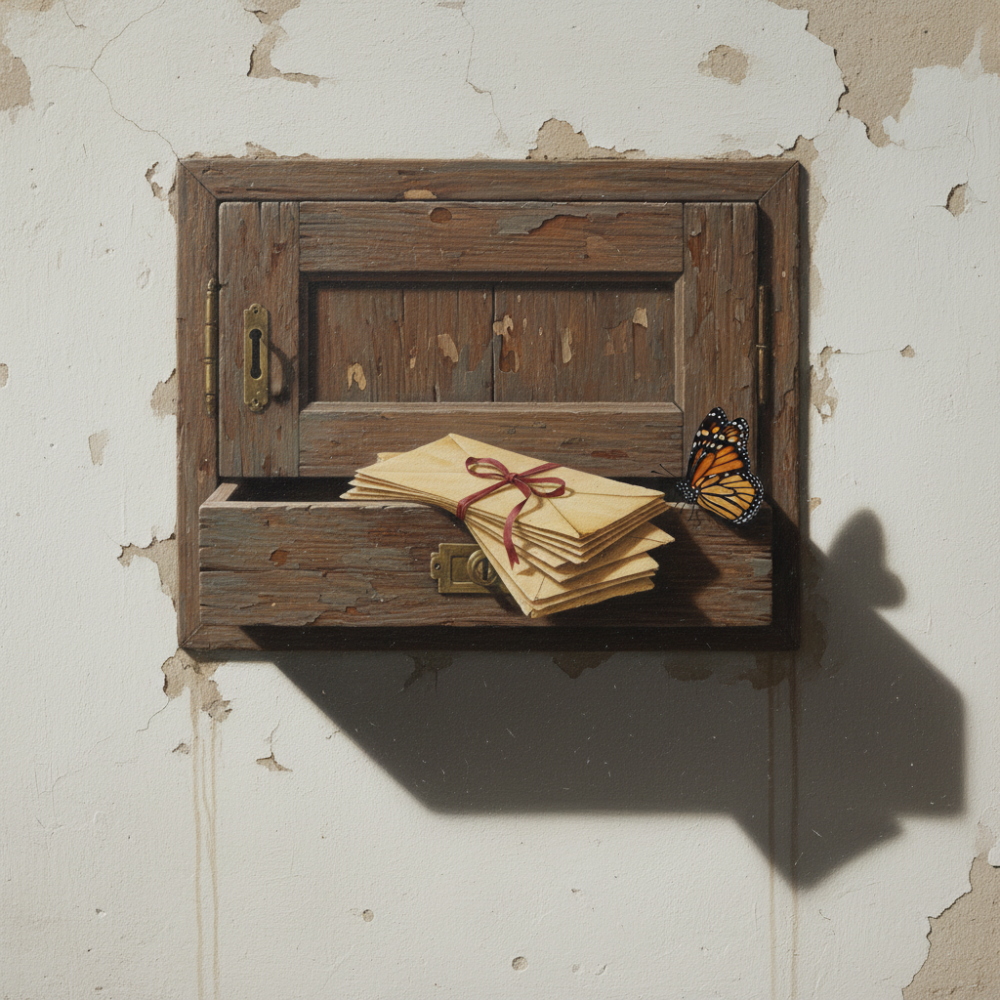

# Trompe-l'oeil Painting 错视画

> **时期：** 古罗马–至今  
> **关键词：** 视觉欺骗、三维幻觉、极致写实、建筑装饰、观者互动

## 概述

Trompe-l'oeil（错视画，法语"欺骗眼睛"）是一种通过极致写实技法在平面上创造三维幻觉的绘画传统。从庞贝古城墙上的假窗户到巴洛克教堂天顶的无限天空，从17世纪荷兰的信件架到当代街头3D地画——错视画的目标只有一个：让你的眼睛相信不存在的空间。

## 风格特征

- **三维幻觉**：在平面上创造深度
- **精确透视**：数学计算的消失点
- **真实光影**：模拟自然光源的投射
- **日常物件**：书信、昆虫、裂缝、帘幕
- **观者互动**：邀请触摸和验证

## 代表人物与作品

- 安德烈亚·波佐 罗马教堂天顶
- 科内利斯·吉斯布雷赫茨 信件架
- 佩雷·博雷尔·德尔·卡索《逃离批评》
- 朱利安·比弗 街头3D地画

## 概念图

