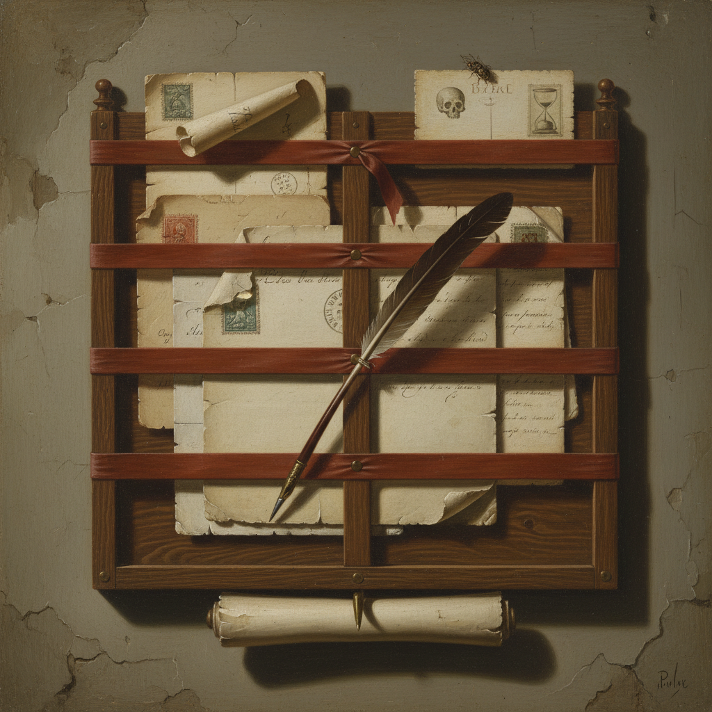

# Trompe-l'œil 错视画

> "The art of deceiving the eye." — 错视画的本质

## 概述

错视画（Trompe-l'œil，法语"欺骗眼睛"之意）是一种通过极端精确的写实技法制造三维幻觉的绘画传统——让观者在一瞬间相信画中的物体是真实的。从古罗马的壁画到文艺复兴的天花板，从荷兰静物画到当代街头艺术，错视画是人类对"以假乱真"的永恒追求。

这不仅是一种技法，更是一种关于"什么是真实"的哲学游戏——它质疑我们对视觉感知的信任。

## 核心特征

| 特征 | 描述 |
|------|------|
| 极端写实 | 超越写实——达到以假乱真的程度 |
| 三维幻觉 | 在二维表面创造完美的三维错觉 |
| 实物尺寸 | 物体通常以1:1实际大小描绘 |
| 光影精确 | 极其精确的光影和反射 |
| 质感模拟 | 完美模拟木纹、大理石、金属等质感 |
| 观者互动 | 邀请观者伸手触摸——然后发现是画 |

## 视觉特征

- **尺寸**：1:1 实物大小
- **光影**：精确的投射阴影
- **质感**：完美的材质模拟
- **深度**：精确的透视和前缩法
- **边缘**：物体"突出"画面边框
- **细节**：显微镜般的精确细节

## 应用场景

| 场景 | 时期 | 代表 |
|------|------|------|
| 古罗马壁画 | 1世纪 | 庞贝壁画中的假窗户和假柱子 |
| 文艺复兴天花板 | 15-17世纪 | Mantegna 的 Camera degli Sposi |
| 荷兰静物画 | 17世纪 | 信件、小提琴、书架的错视 |
| 巴洛克天花板 | 17-18世纪 | Andrea Pozzo 的教堂穹顶 |
| 当代街头艺术 | 21世纪 | 3D 街头粉笔画 |

## 代表人物

| 画家 | 代表作 | 时期 |
|------|--------|------|
| Zeuxis | 传说中骗过鸟的葡萄 | 古希腊 |
| Andrea Mantegna | Camera degli Sposi 天花板 | 文艺复兴 |
| Andrea Pozzo | Sant'Ignazio 教堂穹顶 | 巴洛克 |
| Samuel van Hoogstraten | 透视箱和信件架 | 荷兰黄金时代 |
| William Harnett | 美国静物错视画 | 19世纪美国 |
| Julian Beever | 3D 街头粉笔画 | 当代 |

## 与其他技法的关系

- **Grisaille** → 灰色画法常用于模仿石雕的错视
- **Perspective** → 精确透视是错视画的数学基础
- **Hyperrealism** → 当代超写实主义是错视画的延续
- **Anamorphosis** → 变形画是错视画的特殊分支
- **Sfumato** → 柔和过渡增强三维幻觉
- **Street Art** → 当代3D街头艺术是错视画的新形式

## 概念图

---

*浮光艺志 | Chronicle of Artistry*
