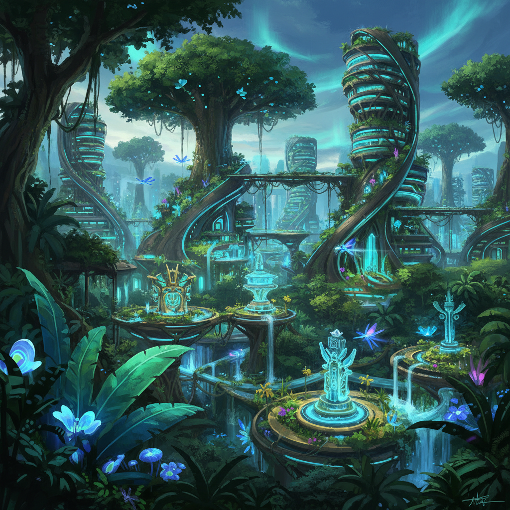

# Tropical Futurism 热带未来主义

> **时期：** 2010年代–至今  
> **关键词：** 热带生态+科技、拉美想象、丛林赛博格、殖民后未来、生物多样性

## 概述

热带未来主义（Tropical Futurism）是拉丁美洲和东南亚艺术家对西方主导的科幻想象的回应。它将热带雨林的生物多样性、原住民知识体系和殖民后身份与未来技术融合——想象一种不是钢铁灰色而是翠绿色的未来，不是征服自然而是与自然共生的技术文明。

## 风格特征

- **丛林+科技**：热带植物与数字界面的融合
- **生物多样性**：将生态系统视为技术模型
- **鲜艳色彩**：热带色调取代赛博朋克的霓虹
- **殖民后视角**：重新想象被殖民地区的未来
- **有机建筑**：模仿自然生长的结构

## 代表人物与作品

- Tabita Rezaire 数字疗愈装置
- Josan Gonzalez 热带赛博朋克插画
- Tropicália运动的当代延伸
- 拉美科幻文学视觉化

## 概念图

