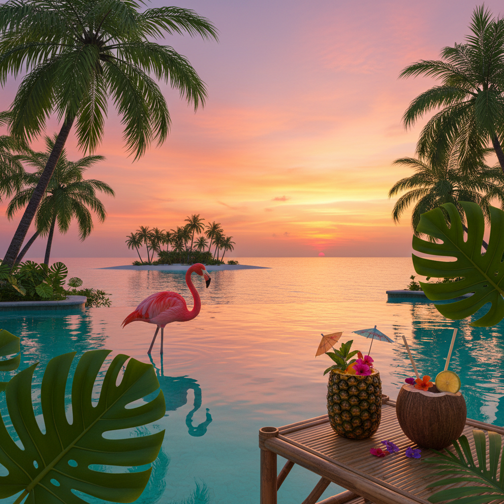

# Tropical 热带风



> **"棕榈叶、火烈鸟、日落鸡尾酒——永远是夏天，永远在度假。"**

## 概述

| 维度 | 描述 |
|------|------|
| 时期 | 持续存在 / 2015–至今 社交媒体爆发 |
| 别名 | Tropical, Paradise Aesthetic, Palm Tree Vibes |
| 核心色彩 | 棕榈绿、日落橙、火烈鸟粉、海洋蓝、金色 |
| 关键元素 | 棕榈叶、火烈鸟、菠萝、日落、泳池 |
| 代表人物 | Versace (丛林印花)、Miami Vice、Tiki 文化 |
| 关联风格 | Surf Crush, Vaporwave, Boho, Vintage Americana |

---

## 历史脉络

### 热带想象的演变

| 时代 | 热带美学表现 |
|------|-------------|
| 1940s–50s | Tiki 文化、夏威夷衬衫 |
| 1980s | Miami Vice、霓虹棕榈 |
| 1990s | Versace 丛林印花 |
| 2010s | Instagram "paradise" 美学 |
| 2015–至今 | 火烈鸟+棕榈叶+菠萝的三件套 |

### 文化基因

| 来源 | 贡献 |
|------|------|
| 殖民想象 | "热带天堂"的西方建构 |
| Tiki 文化 | 波利尼西亚的美国化 |
| Miami Vice | 霓虹+棕榈的视觉公式 |
| Instagram | 旅行打卡+泳池照 |
| Vaporwave | 棕榈树作为怀旧符号 |

### 核心吸引力

Tropical 美学的永恒魅力在于**"逃离"**：
- 逃离寒冷 → 永远是夏天
- 逃离工作 → 永远在度假
- 逃离日常 → 异域风情
- 逃离现实 → 天堂存在

---

## 视觉语法

### 色彩系统

```
主色：
  棕榈绿 (#228B22) — 热带植物
  日落橙 (#FF6347) — 黄昏天空
  火烈鸟粉 (#FF69B4) — 标志性动物
  海洋蓝 (#00CED1) — 清澈海水
  金色 (#FFD700) — 阳光、沙滩

辅色：
  芒果黄 (#FFCC00) — 热带水果
  珊瑚色 (#FF7F50) — 珊瑚礁
  深绿 (#006400) — 丛林深处

质感：
  热带叶片 — 龟背竹、棕榈
  水面 — 泳池、海洋
  沙滩 — 细沙、贝壳
  竹/藤 — 家具、装饰
  印花 — 夏威夷衬衫图案
```

### 标志性元素

| 类别 | 元素 |
|------|------|
| 植物 | 棕榈树、龟背竹、芭蕉叶、鸡蛋花 |
| 动物 | 火烈鸟、鹦鹉、海龟、热带鱼 |
| 水果 | 菠萝、椰子、芒果、西瓜 |
| 场景 | 泳池、海滩、日落、丛林 |
| 饮品 | 鸡尾酒、椰子水、冰沙 |
| 服装 | 夏威夷衬衫、比基尼、草帽 |

---

## 与千禧怀旧的关系

### 2015–2019 的 Instagram 热带热
- 火烈鸟泳池浮床 = Instagram 时代的标志
- 棕榈叶壁纸 = 千禧一代的家居选择
- 菠萝图案 = 无处不在的装饰元素
- 这些已经成为"2010s中期"的怀旧符号

### 与 Vaporwave 的交叉
- Vaporwave 中的棕榈树 = 虚假天堂
- 两者都使用"热带"作为逃避现实的符号
- 但 Vaporwave 是讽刺的，Tropical 是真诚的

---

## 中国语境

- "热带风"/"度假风"家居装饰
- 三亚/海南的旅游美学
- 小红书上的"海岛穿搭"标签
- 奶茶店/咖啡馆的热带主题装修
- 与"东南亚风"的交叉

---

## 设计应用

| 场景 | 应用方式 |
|------|----------|
| 品牌 | 棕榈绿+粉色+热带印花+手写字体 |
| 空间 | 绿植+藤编+粉色+热带壁纸 |
| 包装 | 热带水果图案+鲜艳色彩+金色 |
| 数字 | 棕榈叶边框+日落渐变+热带图标 |

---

## 相关风格

← [Surf Crush 冲浪甜心](surf-crush.md) | [Boho 波西米亚](boho.md) →

↑ [返回千禧怀旧目录](README.md) | [返回总目录](../README.md)
