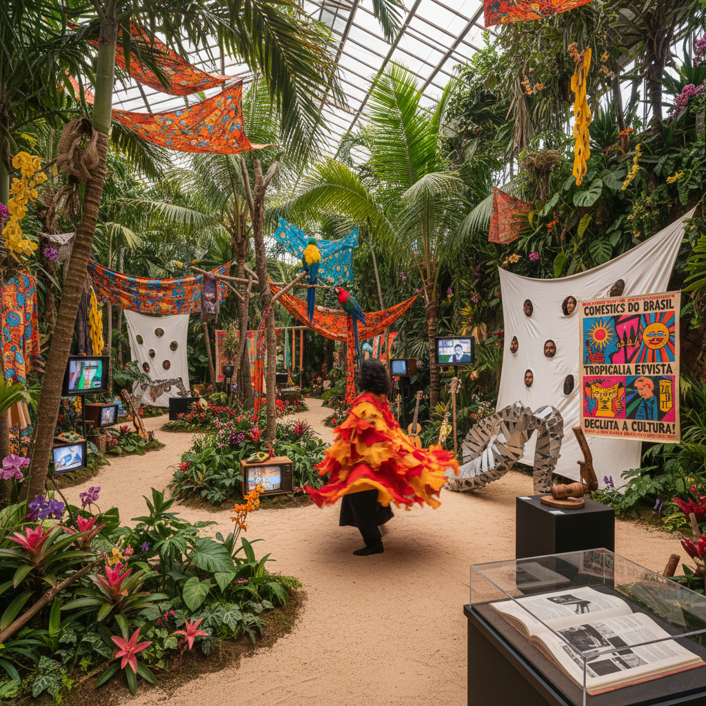

# Tropicália Art 热带主义艺术

> "Tropicália devoured the world and spat it back as Brazil — cannibalizing rock and roll, concrete poetry, pop art, and psychedelia through the lens of tropical exuberance, mixing the sophisticated and the popular, the local and the global, the political and the sensual into a cultural explosion that was simultaneously a celebration of Brazilian identity and a refusal to be defined by anyone else's categories." — Unknown

## 概述

热带主义（Tropicália / Tropicalismo）是1960年代末巴西兴起的一场跨学科文化运动，融合了音乐、视觉艺术、戏剧、电影和文学。热带主义以"文化食人主义"（Antropofagia Cultural）为核心理念——吞噬和消化来自世界各地的文化影响，将其转化为独特的巴西表达。

热带主义的名称来自艺术家埃利奥·奥伊蒂西卡（Hélio Oiticica）1967年的装置作品《Tropicália》——一个由热带植物、沙子、鹦鹉和电视机组成的沉浸式环境。在音乐领域，卡埃塔诺·维洛索（Caetano Veloso）和吉尔伯托·吉尔（Gilberto Gil）是热带主义的核心人物。在视觉艺术领域，除了奥伊蒂西卡，莉吉亚·克拉克（Lygia Clark）和莉吉亚·帕佩（Lygia Pape）也是重要的相关艺术家。

## 核心特征

| 特征 | 描述 |
|------|------|
| 食人 | 文化食人主义 |
| 混合 | 高雅与通俗的混合 |
| 热带 | 热带的感性和色彩 |
| 跨界 | 跨学科的实践 |
| 政治 | 政治性的反抗 |
| 巴西 | 巴西身份的重塑 |

## 视觉特征

- **色彩**：热带的鲜艳色彩
- **混合**：多种材料的混合
- **感官**：多感官的体验
- **参与**：观众的身体参与
- **自然**：热带自然元素
- **流行**：流行文化的引用

## 代表作品

| 作品 | 艺术家 | 年代 | 意义 |
|------|--------|------|------|
| *Tropicália* | Hélio Oiticica | 1967 | 奥伊蒂西卡的热带装置 |
| *Parangolés* | Hélio Oiticica | 1964起 | 可穿戴的艺术斗篷 |
| *Bichos* | Lygia Clark | 1960年代 | 克拉克的互动雕塑 |
| *Divisor* | Lygia Pape | 1968 | 帕佩的集体布幕 |
| *Tropicália album* | Various | 1968 | 热带主义音乐专辑 |

## 历史时间线

| 时期 | 事件 |
|------|------|
| 1928 | Oswald de Andrade的《食人宣言》 |
| 1967 | Oiticica的《Tropicália》装置 |
| 1968 | 热带主义音乐运动高峰 |
| 1968-69 | 军政府镇压，运动被迫转入地下 |
| 当代 | 热带主义的全球影响 |

## 中国语境

热带主义在中国当代艺术中的直接影响有限，但其"文化食人主义"的理念与中国当代艺术面临的文化身份问题有深层共鸣。中国当代艺术也面临如何"消化"西方现代艺术影响并创造独特中国表达的挑战。热带主义的"混合"策略——将本土传统与国际前卫融合——为中国艺术家提供了一种可能的参照模式。中国的一些当代艺术家（如黄永砅的"中西合璧"实验）在方法论上与热带主义有相似之处。热带主义对"第三世界现代性"的探索也与中国的现代化经验有对话空间。

## AI生成概念图

## 与其他风格的关系

- **Neo-Concretism** → 新具体主义
- **Pop Art** → 波普艺术
- **Participatory Art** → 参与式艺术
- **Installation Art** → 装置艺术
- **Psychedelic Art** → 迷幻艺术
- **Postcolonial Art** → 后殖民艺术

---

*浮光艺志 | Chronicle of Artistry*
