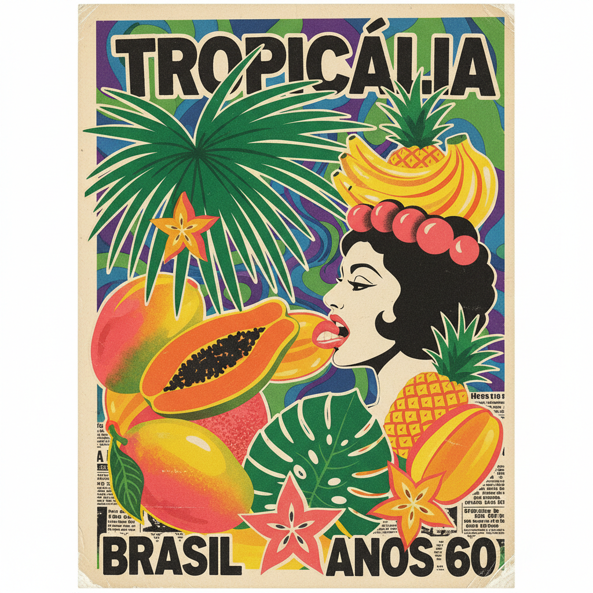

# Tropicália 热带主义



> **"吞噬一切外来文化，消化后吐出独属巴西的新物种。"**

## 概述

Tropicália（热带主义）是1960年代末兴起于巴西的跨媒介文艺运动，涵盖音乐、视觉艺术、电影、戏剧和诗歌。它以"文化食人主义"（Antropofagia）为核心理念——像食人族一样吞噬外来文化影响，消化后创造出独特的巴西新艺术。

## 时代背景

| 维度 | 内容 |
|------|------|
| 时间 | 1967–1972（核心期） |
| 地点 | 巴西（巴伊亚→圣保罗→里约热内卢） |
| 政治背景 | 1964年军事政变后的独裁统治 |
| 文化语境 | 反抗军政府审查，同时拒绝左翼民族主义的保守审美 |

## 视觉特征

- **高饱和热带色彩**：芒果黄、棕榈绿、火烈鸟粉、海洋蓝
- **拼贴与混搭**：将巴西民间元素与国际波普艺术并置
- **Carmen Miranda 符号**：水果头饰、夸张装饰作为反讽工具
- **装置艺术**：Hélio Oiticica 的迷宫式互动装置
- **Parangolés**：可穿戴的彩色布料雕塑，源自桑巴游行服饰
- **手工质感**：粗糙材料、回收物品、非工业化美学

## 核心理念

### 文化食人主义（Antropofagia）
源自诗人 Oswald de Andrade 1928年《食人宣言》：鼓励"吞食"不同时间、地理、类别的文化影响，从中创造出巴西独有的新事物。模糊高雅与低俗、主流与边缘的界限。

### 反二元对立
热带主义者同时拒绝：
- 军政府的保守爱国主义
- 左翼学生的反帝国主义民族纯粹论

## 代表人物

| 人物 | 领域 | 贡献 |
|------|------|------|
| Caetano Veloso | 音乐 | 运动核心发起人，融合桑巴与迷幻摇滚 |
| Gilberto Gil | 音乐 | 将非洲节奏与电子实验结合 |
| Hélio Oiticica | 视觉艺术 | 创造"Tropicália"装置（1967），命名整个运动 |
| Os Mutantes | 音乐 | 巴西迷幻摇滚先驱 |
| Gal Costa | 音乐 | 热带主义女声代表 |
| Tom Zé | 音乐 | 极端实验派 |
| Rogério Duprat | 编曲 | 前卫古典与流行的桥梁 |
| Lygia Clark | 视觉艺术 | 互动雕塑与身体艺术 |

## 代表作品

- **音乐宣言**：《Tropicália: ou Panis et Circencis》（1968）
- **装置艺术**：Hélio Oiticica《Tropicália》（1967，里约热内卢）
- **电影**：Cinema Novo 运动（巴西新电影）

## 与其他风格的关系

```
巴西现代主义(1922) → 食人宣言(1928) → Bossa Nova(1950s)
                                              ↓
波普艺术 + 迷幻摇滚 ──────────────→ Tropicália(1967-72)
                                              ↓
                                    MPB(巴西流行音乐) → 后热带主义
```

## 当代影响

- 巴西当代设计中的混搭美学
- 全球化语境下"文化食人主义"作为创作方法论的复兴
- 拉丁美洲独立音乐场景
- 后殖民艺术理论中的重要参照

## 多语言名称

| 语言 | 名称 |
|------|------|
| 葡萄牙语 | Tropicália / Tropicalismo |
| 英语 | Tropicalism |
| 日语 | トロピカリア |
| 西班牙语 | Tropicalismo |

## 延伸阅读

- Caetano Veloso《Tropical Truth》（自传）
- Christopher Dunn《Brutality Garden: Tropicália and the Emergence of a Brazilian Counterculture》
- 纪录片《Tropicália》（2012，Marcelo Machado 导演）

---

*最后更新：2026-07-26*
