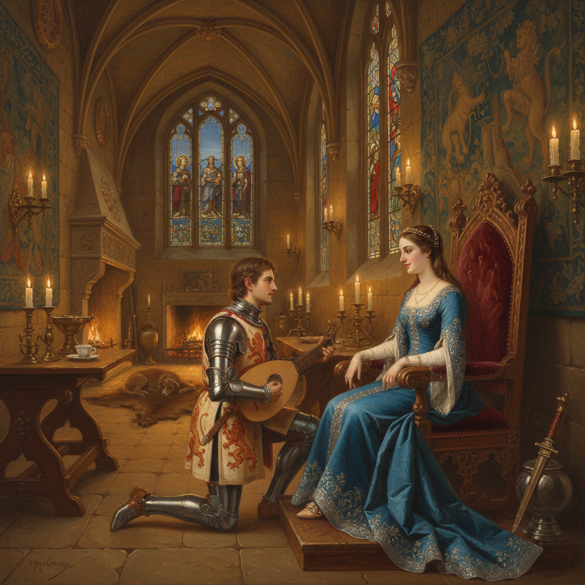

# Troubadour Style 吟游诗人风格

> **时期：** 1800年代–1850年代  
> **关键词：** 中世纪浪漫、骑士传奇、历史轶事、精细描绘、法国复辟

## 概述

Troubadour Style（吟游诗人风格）是19世纪初法国出现的绘画流派，以中世纪和文艺复兴时期的浪漫轶事为题材——骑士的爱情、王后的秘密、修道院的静谧。它用精细的笔触和考古般的细节重建一个理想化的过去，满足了拿破仑之后法国社会对旧时代的怀旧情绪。

## 风格特征

- **中世纪题材**：骑士、贵妇、修道士的故事
- **精细笔触**：荷兰小画派般的细腻描绘
- **考古细节**：对历史服饰和建筑的精确还原
- **小尺幅**：适合私人收藏的亲密画面
- **感伤情调**：温柔、忧郁、浪漫的氛围

## 代表人物与作品

- 弗勒里-理查德《蒙特莫朗西的瓦伦丁》
- 皮埃尔·雷沃伊尔 中世纪场景
- 安格尔 早期历史画
- 保罗·德拉罗什《简·格雷的处刑》

## 概念图

