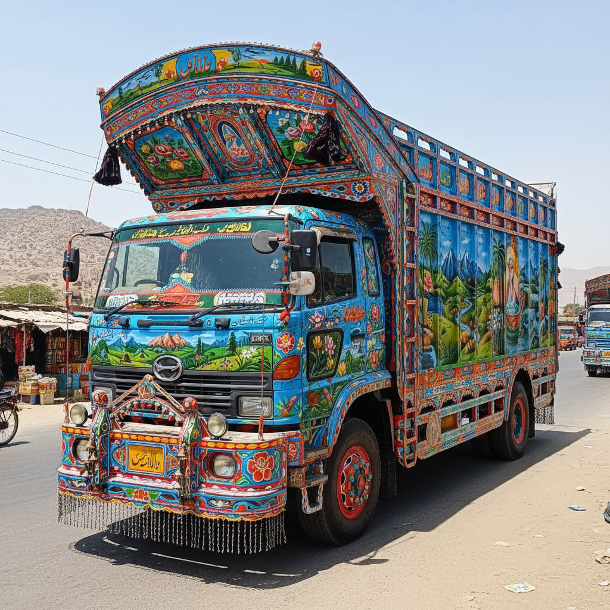

# Truck Art 巴基斯坦卡车彩绘 | ٹرک آرٹ

> **"公路上的移动画廊——巴基斯坦卡车司机把每一辆卡车变成流动的宫殿。"**

## 概述

巴基斯坦卡车彩绘（Truck Art / ٹرک آرٹ）是巴基斯坦独特的民间装饰艺术，将货运卡车、公共汽车和三轮车装饰成色彩斑斓的移动艺术品。每辆卡车都覆盖着手绘的风景、花卉、鸟类、诗歌、宗教文字和几何图案，配以金属浮雕、木雕、反光贴纸和铃铛。这种传统始于1940年代，最初是简单的车身广告，逐渐发展为一种完整的视觉文化。一辆完整装饰的卡车需要数周到数月的工作，花费数千美元。卡车彩绘是巴基斯坦最具辨识度的文化符号之一。

## 核心特征

- **全车覆盖**：车身每一寸都有装饰
- **多种媒介**：绘画+金属+木雕+贴纸
- **鲜艳色彩**：极度饱和的色彩
- **混合题材**：风景+花卉+文字+几何
- **诗歌文字**：乌尔都语诗歌和格言
- **铃铛和链条**：声音装饰

## 常见题材

| 题材 | 特征 |
|------|------|
| 风景 | 理想化的山水湖泊 |
| 花卉 | 玫瑰、莲花 |
| 鸟类 | 孔雀、鹰 |
| 清真寺 | 宗教建筑 |
| 飞机/导弹 | 国家力量 |
| 乌尔都诗歌 | 爱情和哲理 |
| 眼睛 | 辟邪 |

## 视觉特征

- 极度饱和的鲜艳色彩
- 密集的图案填充
- 金属浮雕的闪亮
- 混合媒介的层次感
- 乌尔都书法的优美
- 移动中的视觉冲击

## 与其他风格的关系

| 风格 | 关系 |
|------|------|
| Fileteado阿根廷 | 共享车辆装饰传统 |
| Jingle Truck | 阿富汗的类似传统 |
| 印度卡车彩绘 | 南亚共享传统 |
| 民间艺术 | 非学院派的大众创作 |
| 当代波普 | Truck Art的全球影响 |

## 概念图

---

*浮光艺志 | Chronicle of Artistry*
