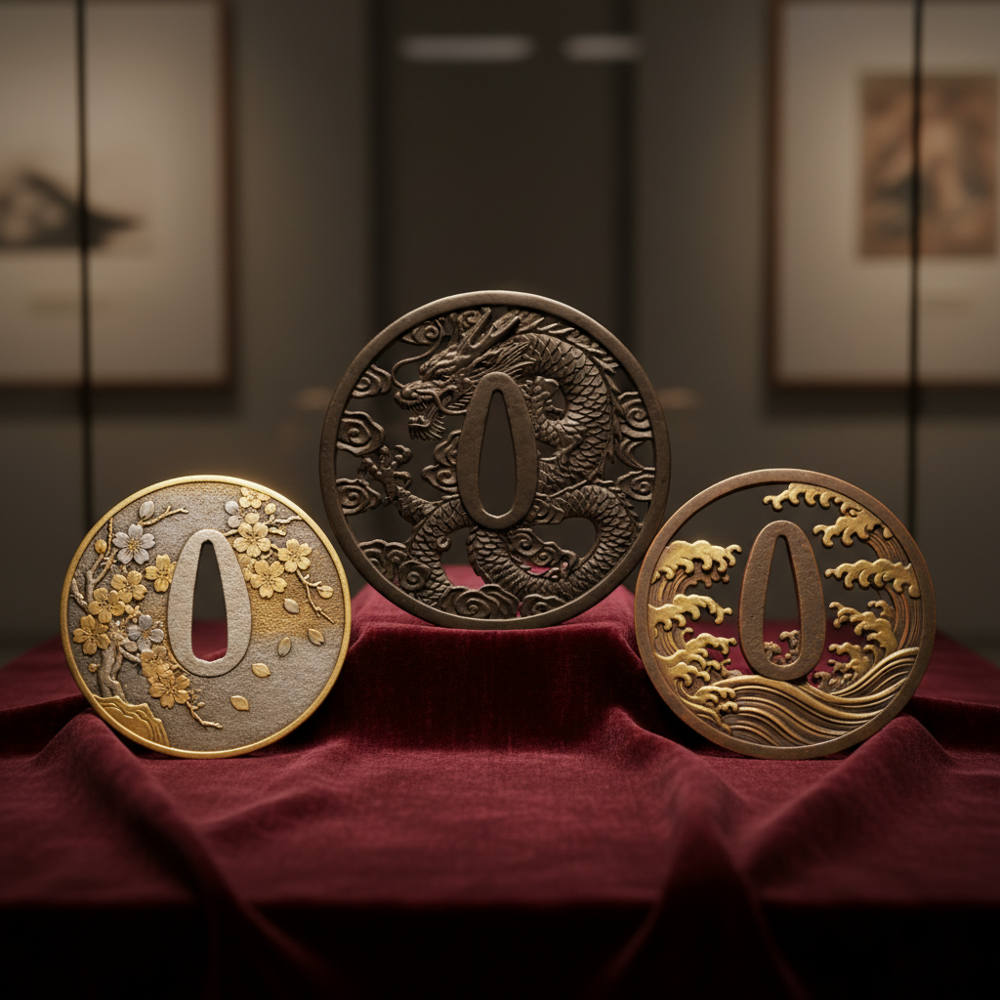

# Tsuba 刀镡艺术

> "A tsuba is a universe in the palm of your hand — philosophy, nature, and craft compressed into a disc of metal." — Unknown

## 概述

刀镡（Tsuba/鍔）是日本刀剑的护手——位于刀刃与刀柄之间的金属盘，既有保护手部的实用功能，也是日本金属工艺最精华的展示平台。从室町时代到江户时代，刀镡从简单的铁板发展为极其精细的微型艺术品，融合了雕刻、镶嵌、铸造、锻造等多种技法。题材涵盖自然、神话、文学、禅宗——在一个直径仅7-8厘米的圆盘上，浓缩了日本美学的全部精华。

刀镡的魅力在于：极限中的自由——在极小的空间和严格的功能约束中，创造出无限的艺术可能。

## 核心特征

| 特征 | 描述 |
|------|------|
| 微型 | 极小空间中的精细艺术 |
| 功能 | 兼具实用和装饰功能 |
| 多技法 | 融合多种金属工艺 |
| 题材 | 丰富的文化题材 |
| 流派 | 众多工匠流派 |
| 收藏 | 独立的收藏品类 |

## 视觉特征

- **圆形**：通常为圆形或椭圆形
- **镂空**：精美的镂空雕刻
- **镶嵌**：金银铜的镶嵌装饰
- **浮雕**：精细的浮雕图案
- **铁色**：铁的深沉底色
- **细节**：令人惊叹的微小细节

## 代表作品

| 作品 | 艺术家 | 年代 | 意义 |
|------|--------|------|------|
| *Goto school tsuba* | 后藤家 | 15-19世纪 | 后藤流派 |
| *Nara school works* | 奈良派 | 17-18世纪 | 奈良三作 |
| *Yokoya Somin* | 横谷宗珉 | 17世纪 | 町彫的开创者 |
| *Akasaka tsuba* | 赤�的派 | 17-18世纪 | 铁地镂空 |
| *Kinai school* | 畿内派 | 16-17世纪 | 早期铁镡 |

## 历史时间线

| 时期 | 事件 |
|------|------|
| 古坟时代 | 最早的刀镡 |
| 室町时代 | 刀镡工艺的发展 |
| 桃山时代 | 装饰性刀镡的兴起 |
| 江户时代 | 刀镡艺术的黄金时代 |
| 1876 | 废刀令——刀镡制作衰落 |
| 明治-当代 | 作为收藏品和艺术品 |

## 中国语境

中国古代剑器也有护手（格），但未发展出如日本刀镡般独立的艺术品类。中国剑格多为玉质或青铜，装饰相对简约。日本刀镡的工艺传统深受中国金属工艺的影响——许多早期刀镡的纹样来自中国。当代中国的刀剑收藏界对日本刀镡有很高的关注度，也有中国工匠在学习和创作刀镡风格的金属艺术品。

## AI生成概念图

## 与其他风格的关系

- **Mokume-gane** → 木目金用于刀镡装饰
- **Damascening** → 镶嵌技法
- **Japanese Metalwork** → 日本金属工艺
- **Miniature Art** → 微型艺术
- **Relief Sculpture** → 微型浮雕
- **Shakudo** → 赤铜合金的应用

---

*浮光艺志 | Chronicle of Artistry*
