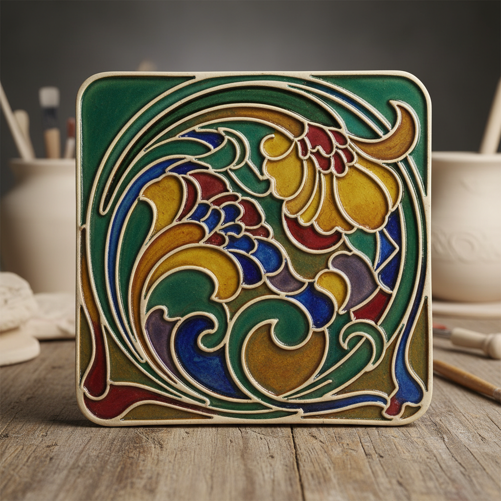

# Tube Lining Art 管线装饰艺术

> "Tube lining is drawing with clay itself — a thin trail of liquid slip squeezed through a nozzle onto the surface of a tile or pot, building up raised lines that act as tiny dams to contain pools of colored glaze within their borders, each cell filling with a different hue like a stained glass window laid flat, the technique that gave Art Nouveau tiles their characteristic flowing outlines and jewel-bright compartments." — Unknown

## 概述

管线装饰艺术（Tube Lining Art）是一种用细管（或挤压袋）将泥浆挤出形成凸起线条的陶瓷装饰技法。这些凸起的泥浆线条在器物表面形成"堤坝"，将不同颜色的釉料隔开——类似于景泰蓝中金属丝分隔珐琅的原理。管线装饰在新艺术运动时期的瓷砖装饰中达到巅峰，以其流畅的线条和宝石般的色彩分区著称。

管线装饰艺术的核心要素包括：1）泥浆挤出——用细管挤出泥浆形成线条；2）凸起线条——线条凸起于表面形成"堤坝"；3）色彩分区——线条将不同颜色的釉隔开；4）流畅线条——连续流畅的装饰线条；5）填色——在线条围成的区域内填入彩釉；6）平面装饰——主要用于平面或浅浮雕装饰；7）新艺术风格——与新艺术运动的密切关联。

## 核心特征

| 特征 | 描述 |
|------|------|
| 泥浆线条 | 挤出的凸起泥浆线 |
| 色彩分区 | 线条隔开不同颜色 |
| 流畅曲线 | 连续流动的线条 |
| 宝石色彩 | 鲜艳的分区色彩 |
| 平面装饰 | 主要用于瓷砖等平面 |
| 新艺术风格 | 与Art Nouveau的关联 |

## 视觉特征

- **凸起线条**：清晰的凸起轮廓线
- **色彩分区**：如彩色玻璃的色块
- **流畅曲线**：新艺术风格的有机曲线
- **宝石光泽**：鲜艳釉色的光泽
- **浮雕效果**：线条的微浮雕质感
- **装饰性强**：高度装饰性的视觉效果

## 代表作品

| 作品 | 艺术家/文化 | 年代 | 意义 |
|------|-------------|------|------|
| *Pilkington瓷砖* | Pilkington | 1900年代 | 英国管线瓷砖 |
| *Minton管线瓷砖* | Minton | 19世纪末 | 维多利亚管线装饰 |
| *Moorcroft陶器* | William Moorcroft | 20世纪初 | 管线装饰陶器 |
| *新艺术瓷砖* | 欧洲各厂 | 1890-1910 | 新艺术管线瓷砖 |
| *当代管线装饰* | 当代陶艺家 | 当代 | 管线技法的现代应用 |

## 历史时间线

| 时期 | 事件 |
|------|------|
| 19世纪中期 | 管线装饰技法的发展 |
| 1890-1910年 | 新艺术运动中管线装饰的巅峰 |
| 20世纪初 | Moorcroft等品牌的管线陶器 |
| 20世纪中期 | 管线装饰的衰落 |
| 当代 | 管线装饰的复兴和现代应用 |

## 中国语境

管线装饰技法与中国传统的景泰蓝（掐丝珐琅）有异曲同工之妙——都是用凸起的线条分隔不同颜色的填充物。中国的景泰蓝用金属丝分隔珐琅，管线装饰用泥浆线条分隔彩釉，原理相同。中国当代陶艺中，管线装饰作为一种装饰性强的技法被应用于瓷砖设计和器物装饰。中国的建筑陶瓷行业中，管线装饰技法被用于制作装饰性瓷砖和壁画。这一技法的"分区填色"特点也与中国传统的"填彩"工艺有相通之处。

## AI生成概念图

## 与其他风格的关系

- **Cloisonne** → 景泰蓝
- **Art Nouveau** → 新艺术运动
- **Slip Trailing** → 泥浆拖线
- **Stained Glass** → 彩色玻璃
- **Tile Art** → 瓷砖艺术
- **Moorcroft** → 穆尔克罗夫特陶器

---

*浮光艺志 | Chronicle of Artistry*
