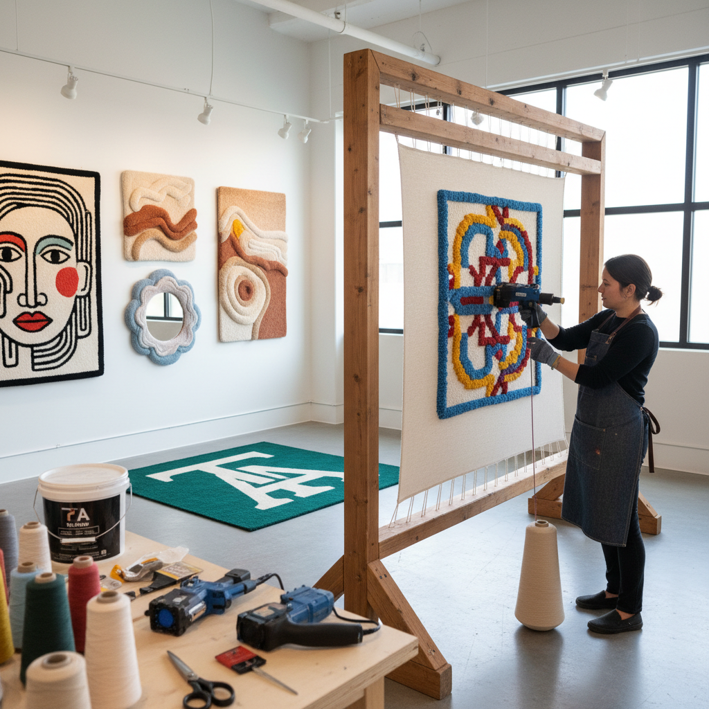

# Tufting 簇绒

> "Tufting is painting with a gun — yarn shot through backing cloth at speed, building up a plush surface that transforms flat fabric into sculptural texture in minutes rather than months." — Unknown

## 概述

簇绒（Tufting）是使用簇绒枪（tufting gun）或手工簇绒工具将纱线快速插入底布中形成绒面的纺织技法。簇绒枪是一种电动或气动工具，可以高速将纱线刺入底布——每秒可以插入数十个绒圈或绒头。簇绒分为两种：圈绒（loop pile，纱线形成未剪断的环圈）和割绒（cut pile，纱线被剪断形成直立的绒头）。

簇绒是现代地毯工业的主要生产方式——全球大部分机制地毯都是簇绒生产的。但在当代，手工簇绒（使用手持簇绒枪）已成为一种极其流行的创意活动——艺术家和爱好者用簇绒枪在几小时内就能创作出大型的地毯、壁挂和纤维艺术作品。

## 核心特征

| 特征 | 描述 |
|------|------|
| 簇绒枪 | 使用电动簇绒枪 |
| 快速 | 极其快速的创作 |
| 绒面 | 形成绒面质感 |
| 大型 | 适合大型作品 |
| 圈/割 | 圈绒或割绒 |
| 当代 | 当代流行的创意活动 |

## 视觉特征

- **绒面**：密集的绒面
- **厚实**：厚实的质感
- **色彩**：鲜艳的色彩
- **图案**：大胆的图案
- **雕塑**：可创造雕塑性效果
- **柔软**：柔软的触感

## 代表作品

| 作品 | 艺术家 | 年代 | 意义 |
|------|--------|------|------|
| *Industrial tufted carpets* | Various | 20世纪 | 工业簇绒地毯 |
| *Tufted art rugs* | Various | 当代 | 艺术簇绒地毯 |
| *Tufted wall hangings* | Various | 当代 | 簇绒壁挂 |
| *Sculptural tufting* | Various | 当代 | 雕塑性簇绒 |
| *Brand collaborations* | Various | 当代 | 品牌合作簇绒 |

## 历史时间线

| 时期 | 事件 |
|------|------|
| 1930s | 簇绒机的发明 |
| 1950s | 簇绒地毯工业的兴起 |
| 1970s | 手持簇绒枪的出现 |
| 2010s | 手工簇绒的社交媒体热潮 |
| 当代 | 簇绒工作室的全球普及 |
| 当代 | 簇绒作为当代艺术形式 |

## 中国语境

簇绒在中国经历了爆发式增长——2020年代以来，手工簇绒成为中国最热门的手工活动之一。中国的社交媒体（小红书、抖音、B站）上充斥着簇绒教程和作品。大量的簇绒工作室在中国各大城市开设，提供体验课程。中国的电商平台上有丰富的簇绒枪和材料供应。一些中国的年轻艺术家和设计师将簇绒作为创作媒介，制作定制地毯、品牌合作作品和艺术装置。中国的簇绒社区非常活跃。

## AI生成概念图

## 与其他风格的关系

- **Punch Needle** → 戳针绣
- **Rug Making** → 织毯
- **Textile Art** → 纺织艺术
- **Fiber Art** → 纤维艺术
- **Carpet Design** → 地毯设计
- **Contemporary Craft** → 当代工艺

---

*浮光艺志 | Chronicle of Artistry*
